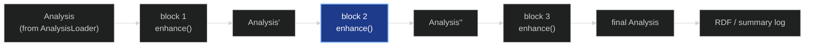

# Adding a New Block to the Pipeline

*A start-to-finish guide for contributors.*

> A **block** is one selectable stage of the pipeline: a checkbox in the GUI, a
> section in the config YAML, one step in the run, and one section in the run
> summary. This document is the how-to. For how the GUI as a whole is wired,
> see [../enpkg/monolith/gui/ARCHITECTURE.md](../enpkg/monolith/gui/ARCHITECTURE.md);
> for what individual blocks actually do, see the walkthroughs
> ([MS1_GRAPH_ENHANCER.md](MS1_GRAPH_ENHANCER.md), [MS1_ENHANCER.md](MS1_ENHANCER.md),
> [MS2_ENHANCER.md](MS2_ENHANCER.md), [SIRIUS_ENHANCER.md](SIRIUS_ENHANCER.md),
> [NETWORK_ENHANCER.md](NETWORK_ENHANCER.md), [WEIGHTS_ENHANCER.md](WEIGHTS_ENHANCER.md)).

---

## 1. What a block is

A block is described by exactly one `BlockSpec` entry in
[`enpkg/monolith/pipeline/blocks.py`](../enpkg/monolith/pipeline/blocks.py). That entry is the
**single source of truth**: the sidebar checkbox, the config tab, the YAML section, the
execution order, and the summary report are all derived from it by iterating `BLOCKS`.
There is no per-block step class and no `if block_id == ...` branch in the runner.

The pipeline itself is a fold over `Analysis`:



Every block honours the same contract — `enhance(analysis) -> Analysis` — so the runner
can treat them uniformly. Your job when adding a block is to supply three things and
register them:

| Piece | Where it lives | Base class |
|---|---|---|
| **Config** — the block's parameters | `enpkg/monolith/configuration/<name>_config.py` | `EnhancerConfig` (Pydantic) |
| **Enhancer** — the actual work | `enpkg/monolith/enhancers/<name>_enhancer.py` | `Enhancer` (ABC) |
| **BlockSpec** — the registration | `enpkg/monolith/pipeline/blocks.py` | frozen dataclass |

---

## 2. The short version

If your block needs no new data-model fields, no database access and no RDF output, adding
it is three files and roughly forty lines. The running example below is a hypothetical
`blank_removal` block that flags features also present in solvent blanks.

**1. Config** — `enpkg/monolith/configuration/blank_removal_config.py`:

```python
"""Configuration for the blank-removal enhancer."""

from pydantic import Field

from enpkg.monolith.configuration.config import EnhancerConfig


class BlankRemovalConfig(EnhancerConfig):
    """Parameters for flagging features that also appear in solvent blanks."""

    intensity_ratio_threshold: float = Field(
        default=5.0,
        gt=0,
        description="A feature is kept when its sample intensity is at least this "
        "many times its mean blank intensity.",
    )
```

**2. Enhancer** — `enpkg/monolith/enhancers/blank_removal_enhancer.py`:

```python
"""Blank-removal enhancer: flag features indistinguishable from solvent blanks."""

from logging import Logger

from enpkg.monolith.configuration.blank_removal_config import BlankRemovalConfig
from enpkg.monolith.data.analysis import Analysis
from enpkg.monolith.enhancers.enhancer import Enhancer


class BlankRemovalEnhancer(Enhancer):
    """Enhancer that stamps a blank-contamination flag onto each spectrum."""

    def __init__(self, configuration: BlankRemovalConfig, logger: Logger):
        if not isinstance(configuration, BlankRemovalConfig):
            raise TypeError(
                f"Expected configuration of type BlankRemovalConfig, got {type(configuration)}"
            )
        self.configuration = configuration
        self.logger = logger

    def name(self) -> str:
        """Returns the name of the enhancer."""
        return "Blank Removal Enhancer"

    def enhance(self, analysis: Analysis) -> Analysis:
        """Stamp ``is_blank`` on every spectrum and return the analysis."""
        threshold = self.configuration.intensity_ratio_threshold
        n_flagged = 0
        for spectrum in analysis.spectra:
            spectrum.is_blank = self._looks_like_blank(spectrum, threshold)
            n_flagged += bool(spectrum.is_blank)
        self.logger.info(
            "Blank removal: %d / %d features flagged", n_flagged, len(analysis.spectra)
        )
        return analysis
```

**3. Registration** — in [`blocks.py`](../enpkg/monolith/pipeline/blocks.py), add the import, a
build factory, a log summary, and one `_BUILTIN_BLOCKS` entry declaring where it runs:

```python
def _build_blank_removal(config: Any, ctx: BuildContext) -> Enhancer:
    return BlankRemovalEnhancer(config, ctx.logger)


def _log_blank_removal(logger: logging.Logger, analysis: Analysis) -> None:
    """Summarise how many features were flagged as blank-derived.

    Reads the per-spectrum ``is_blank`` stamp written by the blank-removal step.
    """
    n_flagged = sum(1 for s in analysis.spectra if s.is_blank)
    logger.info("    Features flagged as blank : %d / %d", n_flagged, len(analysis.spectra))


_BUILTIN_BLOCKS: list[BlockSpec] = [
    ...,
    BlockSpec(
        id="blank_removal",
        label="Blank removal",
        build_enhancer=_build_blank_removal,
        can_run=_has_spectra,
        config_cls=BlankRemovalConfig,
        log_summary=_log_blank_removal,
        description="Flags features whose intensity is not meaningfully above the "
                    "solvent blanks. Runs before annotation.",
        # Annotating a blank-derived feature wastes a database lookup, so this
        # has to happen before the annotation blocks — stated, not positional.
        before=("ms1", "ms2"),
    ),
    ...,
]
```

That is the whole integration. The checkbox, the tab with a bounded numeric widget and its
tooltip, the `blank_removal:` YAML section, the run slot, its place in the execution order
and the summary section all appear on their own.

---

## 3. Step by step

### Step 1 — Write the config

Subclass `EnhancerConfig` from
[`configuration/config.py`](../enpkg/monolith/configuration/config.py). You inherit
`general_params` (`recompute`, `ionization_mode`), `from_yaml` / `from_dict`, and
`model_config = ConfigDict(extra='forbid')`.

Rules that matter here:

- **`extra='forbid'` is inherited.** An unknown key in the YAML section raises a
  `ValidationError` rather than being ignored. This is what makes a saved config an exact
  description of a run — but it also means renaming a field breaks every config file on
  disk. Rename deliberately, and if you must, accept the old key with a
  `@model_validator(mode="before")` the way `GeneralParams` accepts the legacy `polarity`
  key.
- **Put the constraint in `Field(...)`, not in your code.** `gt`/`ge`/`lt`/`le` become
  widget bounds in the GUI, and a `^(a|b|c)$` string pattern becomes a dropdown. The form
  builder never re-implements a rule that Pydantic already owns.
- **Write a real `description=`.** It is the only tooltip the user gets, and it is also
  the documentation of that parameter. Say what the number means and, where it matters,
  how to pick it — compare `MS1GraphEnhancerConfig.rt_tolerance_min`.
- **Cross-field rules go in a `@model_validator(mode='after')`**, like
  `NetworkEnhancerConfig`'s check that `mn_top_n > mn_max_links`.
- **Read `ionization_mode` from `general_params`**, never from a field of your own. It is
  edited once, above the tabs, and injected into every section.

If your block takes no parameters at all, skip this step and set `config_cls=None` in the
registry (as the taxonomical block does).

### Step 2 — Write the enhancer

Subclass `Enhancer` from
[`enhancers/enhancer.py`](../enpkg/monolith/enhancers/enhancer.py) and implement the two
abstract methods:

- `name(self) -> str` — a human-readable name.
- `enhance(self, analysis: Analysis) -> Analysis` — the work. **It must return an
  `Analysis`**, because the runner reassigns its working analysis from the return value.
  Returning `None` silently destroys the pipeline state for every later block.

Type-check the config in `__init__` (`raise TypeError` — see `MS1GraphEnhancer`; the
older enhancers use a bare `assert`, which vanishes under `python -O`).

**Mutating vs. copying.** `Analysis` is an immutable Pydantic model, but the
`AnnotatedSpectrum` objects it holds are ordinary Python objects. This gives two distinct
patterns, and both are in use:

| You are writing… | Do this |
|---|---|
| Per-feature results (a stamp on each spectrum) | Mutate `spectrum.<field>` in place, then `return analysis` |
| An analysis-level object (a graph, a match list) | `return analysis.model_copy(update={"my_field": value})` |

`model_copy(update=...)` re-runs the model validators, which is exactly what you want:
`Analysis.validate_network_integrity` and `validate_adduct_graph_integrity` will reject a
graph whose nodes do not line up with `analysis.feature_ids`. If you attach a graph, build
it in feature-id order — `NetworkEnhancer` rebuilds `matchms`' graph node-by-node
specifically to satisfy this.

**Log as you go.** `ctx.logger` is threaded through to the GUI's live log pane, the
run log file and the console. Log the shape of what you produced (counts, not payloads);
the pretty end-of-run report is a separate concern handled by `log_summary`.

### Step 3 — Extend the data model (only if you produce new output)

If your block writes something nothing else in the codebase has a home for:

- **Per-feature output** → [`data/annotated_spectra_class.py`](../enpkg/monolith/data/annotated_spectra_class.py).
  Add `self._my_field: Optional[T] = None` in `__init__` plus a `@property` and a matching
  `.setter`, following the `ms1_cluster_role` pattern. Give the property a docstring
  naming the block that fills it.
- **Analysis-level output** → [`data/analysis.py`](../enpkg/monolith/data/analysis.py).
  Add an `Optional[...] = None` field with a comment naming the block that attaches it. If
  the object must stay consistent with the spectra (any per-feature collection, graph or
  matrix), add a `@model_validator(mode='after')` next to the two existing integrity
  validators.

Defaulting to `None`/empty is not optional: every field must be readable when your block
was *not* selected, because `log_summary`, the RDF serializer and downstream blocks all
run against analyses your block never touched.

### Step 4 — Register the block

In [`blocks.py`](../enpkg/monolith/pipeline/blocks.py), add:

1. The imports for your config and enhancer.
2. A `_build_<name>(config, ctx) -> Enhancer` factory. It receives the validated config and
   a `BuildContext` (`logger`, `db_loader`, `lotus_store`) and reads only what it needs.
   Construction is lazy — the factory runs at execution time, not at form-render time.
3. A `can_run` predicate. Reuse `_has_spectra`, `_has_source_taxon` or
   `_has_spectra_and_network` if one fits; otherwise write a small named predicate beside
   them. **`can_run` returning `False` is a skip, not an error** — the block is logged as
   skipped and the run continues. Use it for "this analysis lacks the inputs I need", not
   for "the user configured me wrongly" (that belongs in Pydantic validation).
4. The `BlockSpec` entry in `_BUILTIN_BLOCKS`, declaring the ordering constraints your
   block genuinely has. Do **not** rely on where you put the entry: `BLOCKS` is computed
   from the constraints by `order_blocks`, and the list position is only the tie-break
   between blocks nothing separates.

`BlockSpec` fields:

| Field | Required | Meaning |
|---|---|---|
| `id` | yes | Short key used in YAML, session state and widget keys. Treat it as public API: it appears in saved config files. |
| `label` | yes | Shown on the checkbox, the tab and the summary heading. |
| `build_enhancer` | yes | `(config, BuildContext) -> Enhancer`. |
| `can_run` | yes | `(Analysis) -> bool` applicability guard. |
| `config_cls` | yes | Pydantic config class, or `None` for a parameterless block. |
| `log_summary` | yes | `(Logger, Analysis) -> None`; see step 5. |
| `description` | no | Checkbox tooltip. Worth writing — it is where a user learns when to tick the box. |
| `depends_on` | no | Tuple of block ids that must also be **selected**. |
| `after` / `before` | no | Tuples of block ids this must run later / earlier than. |
| `requires` | no | Frozenset of shared resources the enhancer needs: `"db_loader"`, `"lotus_store"`. |

**`depends_on` and `after`/`before` are not the same question.** `depends_on` is about
*selection* — "these must also be ticked, or I cannot run at all"; a missing entry skips
your block. `after`/`before` are about *order* — "whatever else is selected, I run
later/earlier than these". A block that consumes another's output usually needs both, which
is why `weights` declares `depends_on=("network",)` *and* `after=("network", "ms1", "ms2")`.

Neither is checked against success: a dependency that was selected but then skipped by its
own `can_run` still lets your block be attempted. Guard the real precondition in your own
`can_run` too — that is why `weights` also uses `_has_spectra_and_network`.

**Declaring resources.** `BuildContext.db_loader` and `.lotus_store` are only built when
some selected block asks for them through `requires`. A block that reads
`ctx.lotus_store` without declaring it will find `None` there. Requiring `"lotus_store"`
implies `"db_loader"` — declare both, as `ms1`/`ms2`/`weights` do.

If your block must share one config instance with an existing block, add both ids to a
shared-key constant at the bottom of `blocks.py` (the `MS_SHARED_BLOCKS` / `MS_SHARED_KEY`
pattern) — but note that `config_io` and `app.py` special-case the MS pair by name, so a
second shared pair needs a small amount of work in both.

### Step 5 — Write the log summary

`log_summary` is a **required** field, deliberately: it forces you to decide what your
block's visible outcome is. It runs only for blocks that actually executed, and its output
lands in `summary_*.log` next to the run log.

```python
def _log_blank_removal(logger: logging.Logger, analysis: Analysis) -> None:
    """One-line docstring naming the fields this reads."""
    ...
```

Conventions:

- Read only the fields your block owns.
- Log at `INFO` with four-space indentation and aligned labels
  (`logger.info("    %-34s : %d", ...)`) so the report stays scannable.
- **Handle the empty case.** The block may have run and produced nothing; say so
  (`"    (no molecular network on analysis)"`) rather than raising.
- **Never let a summary crash a run.** If you compute anything that can throw — a
  reranking, a lookup — wrap it and log at DEBUG on failure, the way `_log_weights` does.
- Reusable helpers go in [`log_utils.py`](../enpkg/monolith/pipeline/log_utils.py), not in
  `blocks.py`.

If your block does not yet expose its outputs on `Analysis`, a minimal stub that says so is
acceptable — but it is a placeholder, not a destination.

### Step 6 — Test it

The registry tests in
[`enpkg/tests/test_pipeline/`](../enpkg/tests/test_pipeline/) already cover your block the
moment you register it: unique ids, `BLOCKS_BY_ID` consistency, dependencies pointing at
real blocks, a callable `log_summary`, and `_build_step` binding every registry entry
(`test_every_registry_block_binds`). Run them first — they catch a malformed entry
immediately:

```bash
poetry run pytest enpkg/tests/test_pipeline -q
```

Then add an enhancer test under `enpkg/tests/test_enhancers/`, modelled on
`test_network_enhancer.py`. The `make_analysis` fixture in
[`enpkg/tests/conftest.py`](../enpkg/tests/conftest.py) builds a synthetic `Analysis`
(`make_analysis(n_spectra=..., source_taxon=..., ionization_mode=...)`), so a test needs no
data files. Cover at least:

- the happy path — given a known analysis, the expected stamps/fields come out;
- `can_run` returning `False` on an analysis missing your inputs;
- an invalid config raising `ValidationError`.

### Step 7 — Serialize to RDF (if the output belongs in the graph)

Pipeline output only reaches the knowledge graph if
[`rdf/serializer.py`](../enpkg/monolith/rdf/serializer.py) emits it. This is the one step
the registry cannot do for you, and it is the step with lasting consequences:

> **The `enpkg:` vocabulary is the constant across every graph this tool builds.** Adding a
> term is a commitment, not an implementation detail — see [PROJECT_CONTEXT.md](PROJECT_CONTEXT.md) and
> [SCHEMA_REVIEW_AND_VOCABULARY_PLAN.md](SCHEMA_REVIEW_AND_VOCABULARY_PLAN.md). Settle the
> term's label, domain and range before you emit it; reuse an existing term wherever one
> fits.

Practically: add URI minting to [`rdf/uris.py`](../enpkg/monolith/rdf/uris.py), the terms to
[`rdf/namespaces.py`](../enpkg/monolith/rdf/namespaces.py), an `_add_*` method to the
serializer, and document the shape in [RDF_DATA_MODEL.md](RDF_DATA_MODEL.md). If the output
should only be emitted when your block actually ran, follow the network layer's pattern —
the runners pass `include_network="network" in result.executed` into `serialize_to_turtle`,
so a conditional layer needs a flag threaded from both
[`runner.py`](../enpkg/monolith/pipeline/runner.py) and
[`batch_runner.py`](../enpkg/monolith/pipeline/batch_runner.py).

### Step 8 — Write the walkthrough doc

Every pipeline component gets a conceptual walkthrough under `docs/`, matching the house
style of [MS1_ENHANCER.md](MS1_ENHANCER.md) / [MS2_ENHANCER.md](MS2_ENHANCER.md) /
[SIRIUS_ENHANCER.md](SIRIUS_ENHANCER.md):

- header `# The X — How It Works` plus *"A conceptual walkthrough for presentations and
  onboarding."*;
- numbered sections: what problem it solves → how it works → what comes out → why it is
  built this way;
- dark-theme Mermaid diagrams (`%%{init: {'theme':'dark'}}%%`), comparison tables, and a
  bolded one-line summary;
- a cross-link line to the sibling docs, and a link back from them.

---

## 4. What you get for free

Registering the `BlockSpec` is enough for all of this:

| You get | Because |
|---|---|
| Sidebar checkbox with tooltip | `app.py` iterates `BLOCKS` |
| A config tab with one widget per field, bounds and tooltips | `form_builder.render_model` walks `config_cls.model_fields` |
| Validation with errors surfaced verbatim | `config_io.build_configs` → `model_validate` |
| A `<id>:` section in the saved YAML, and correct reload | `config_io.save_unified_yaml` / `load_unified_yaml` |
| Membership in `selected_blocks`, so a config file reproduces the run | `save_unified_yaml` derives it from the validated configs |
| Execution in the computed order, dependency and `can_run` skipping | `blocks.order_blocks`, `runner._run_analysis` |
| A section in the end-of-run summary | `runner._log_analysis_summary` calls `block.log_summary` |
| Batch mode across many experiments | `batch_runner` reuses `build_shared_steps` |
| The registry integrity tests | `test_blocks_registry.py`, `test_build_step.py` |

---

## 5. What you do **not** get for free

The registry covers the common case. These are the three places where a block still needs
hand-written wiring — check them against your block before assuming "one entry" is enough:

**1. Extra input files need GUI work.** Blocks whose config points at a file the sidebar
does not already list need their own picker. Sirius is the precedent: `app.py` adds a
"Spectra for Sirius" selectbox when the block is ticked, excludes
`sirius_params.path_to_input_spectra` from the rendered form, and writes the resolved path
into the config just before the run.

**2. Per-experiment config in batch mode.** `build_shared_steps` builds each step **once**
and reuses it for every experiment. If your config carries per-experiment paths, it must be
excluded via the `skip=` argument and rebuilt inside the batch loop — again, see how
`batch_runner` handles `sirius` (`skip={"sirius"}` plus `_sirius_config_for(...)` per run).

**3. Exotic field types fall back to a text box.** `form_builder._render_field` handles
`bool`, `int`, `float`, `str`, `list`/`tuple`, `Optional[T]` and nested `BaseModel`.
Anything else renders as free-form text and is validated only by Pydantic afterwards. Keep
config fields to those types, or extend `_render_field` — it is a single function.

---

## 6. Checklist

```
[ ] Config class under configuration/, subclassing EnhancerConfig
    [ ] constraints in Field(...), not in code
    [ ] a real description= on every field
    [ ] cross-field rules in @model_validator(mode='after')
[ ] Enhancer under enhancers/, subclassing Enhancer
    [ ] name() and enhance() implemented
    [ ] enhance() RETURNS an Analysis
    [ ] config type-checked in __init__
    [ ] mutate spectra in place / model_copy() for analysis-level fields
[ ] Data-model fields added (if any), defaulting to None/empty
    [ ] integrity validator if it must stay in step with the spectra
[ ] BlockSpec entry in blocks.py
    [ ] after/before declare the real ordering constraints (never rely on
        where the entry sits in the list)
    [ ] requires declares any shared resource the enhancer reads from ctx
    [ ] build_enhancer factory + can_run predicate
    [ ] depends_on set for co-selection, AND the precondition guarded in can_run
[ ] log_summary written, handling the empty case and never raising
[ ] Tests: registry tests pass, plus an enhancer test using make_analysis
[ ] RDF serialization + vocabulary terms (if the output belongs in the graph)
[ ] Walkthrough doc under docs/, cross-linked with its siblings
[ ] Section 5 reviewed: shared resources, input files, batch mode, field types
```
