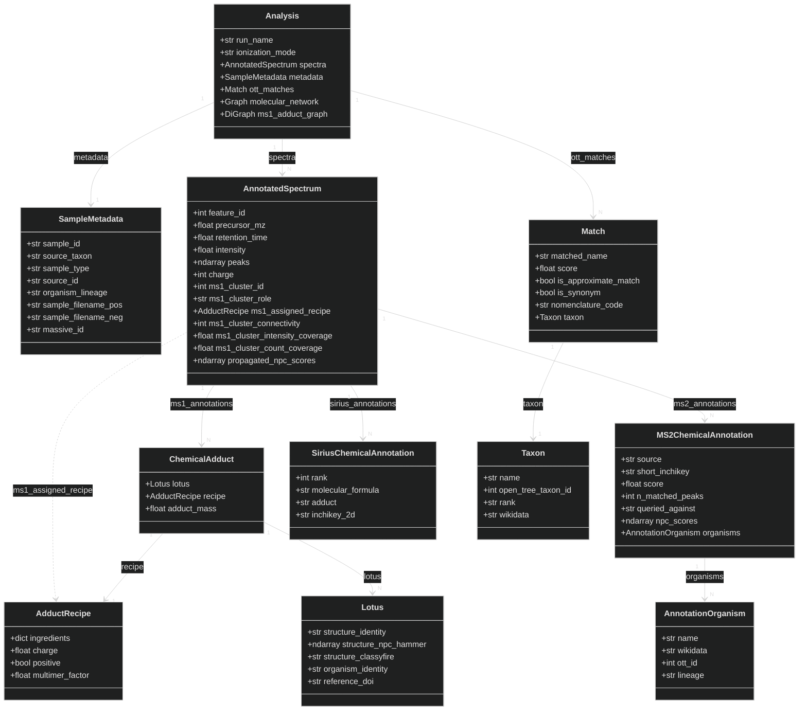
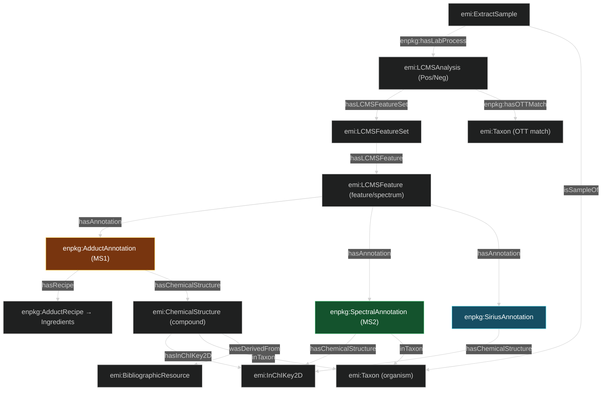
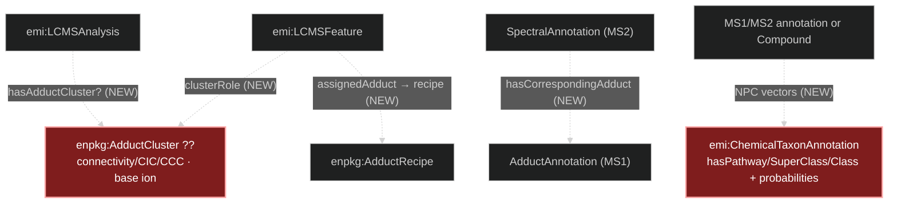

# Data Model, Vocabulary & Serialization Gap

*The state of play before finishing serialization & export. Three parts:*
1. **[Part A](#part-a--the-in-memory-data-model)** — the current in-memory data model (what an `Analysis` holds).
2. **[Part B](#part-b--ontologies--vocabulary)** — the ontologies and vocabulary the serializer maps onto.
3. **[Part C](#part-c--whats-already-mapped)** — what the serializer already emits, and **[Part D](#part-d--what-needs-to-be-mapped-now-the-gap)** — **what still needs mapping now**.

> **Companion docs.** The detailed term-by-term worksheet is
> [RDF_DATA_MODEL_mapped.md](RDF_DATA_MODEL_mapped.md); the current emitted graph is drawn in
> [RDF_KG_DATA_MODEL.md](RDF_KG_DATA_MODEL.md); the original design rationale is
> [RDF_SERIALIZATION_PLAN.md](RDF_SERIALIZATION_PLAN.md). This document is the **current-state +
> gap** view — it is the only one that accounts for the newest additions (the MS1 adduct graph,
> the MS2 adduct gate). Where they disagree, the code wins.

---

## Part A — The in-memory data model

Everything produced for one LC-MS² run is aggregated in a single immutable
[`Analysis`](../enpkg/monolith/data/analysis.py) (a Pydantic model; `model_copy(update=…)` to
change it). Enhancers run in sequence, each reading the analysis and returning an enriched copy;
the serializer walks the final object.

**Key structural facts** (these shape the mapping):

- **One molecule → several features.** The upstream peak picker emits each ionization form
  (`[M+H]+`, `[M+Na]+`, a water-loss, a dimer) as its own feature. The **MS1 adduct graph** is
  what relates them: `analysis.ms1_adduct_graph` (a `networkx.DiGraph`, nodes = feature ids) plus
  the per-feature resolution stamped on each spectrum (`ms1_cluster_*`, `ms1_assigned_recipe`).
  See [MS1_GRAPH_ENHANCER.md](MS1_GRAPH_ENHANCER.md). **None of this is serialized yet** (Part D).
- **Three annotation channels per feature.** MS1 adducts (mass), MS2 spectral matches
  (fragmentation), SIRIUS candidates (in-silico). Each is a distinct in-memory list.
- **`ChemicalAdduct.lotus` is a formula group** — a *list* of `Lotus` sharing a molecular formula
  but possibly different 2D structures (isobars). One adduct hypothesis therefore proposes several
  candidate compounds.
- **`Lotus` bundles three things** — a chemical structure, its source organism, and a literature
  reference — which the serializer splits into three nodes.
- **MS2 and SIRIUS are "slim"** — they carry only a **short (2D) InChIKey**, not full `Lotus`
  objects; MS1 carries the full structure. The 2D InChIKey is the join key between channels.
- **NPC score vectors live in two places**: the *reference* structure's own classification
  (`Lotus.structure_taxonomy_hammer_*`, `MS2ChemicalAnnotation.*_scores`) and the *feature's*
  propagated distribution (`AnnotatedSpectrum.ms1_/ms2_*_scores`, written by the WeightsEnhancer).
  Both are large `np.ndarray`s and are currently **used only for ranking, never emitted**.

---

## Part B — Ontologies & vocabulary

The serializer reuses established ontologies wherever a term exists and **mints under `enpkg:`**
only where none does. Namespaces are declared in
[rdf/namespaces.py](../enpkg/monolith/rdf/namespaces.py); local copies of the reused ontologies
sit in [docs/vocab/](vocab/).

| Prefix | IRI | Role | Covers | Local file |
|---|---|---|---|---|
| `emi:` | `w3id.org/emi#` | **vocabulary (backbone)** | Earth Metabolome Ontology: analysis/feature/sample spine, annotations, structures, taxa, networks | `vocab/EMI-vocab.owl` |
| `enpkg:` | `w3id.org/enpkg#` | **vocabulary (minted)** | our own terms where EMI/others have none (see below) | — |
| `ms:` | `purl.obolibrary.org/obo/MS_` | vocabulary | PSI-MS: adduct-ion classes, charge state, product-ion m/z (as **classes**, linked by `skos:exactMatch`) | `vocab/ms-vocab.owl` |
| `chemrof:` | `w3id.org/chemrof/` | vocabulary | ChEBI/ChemROF structural annotation properties: InChI(Key), SMILES, formula, mass | `vocab/chebi-vocab.owl` |
| `ncbitaxon:` / `taxon:` | `…/obo/ncbitaxon#` / `NCBITaxon_` | vocabulary | organism rank + lineage classes | `vocab/NCBITaxon_slim-vocab.owl` |
| `sosa:` | `w3.org/ns/sosa/` | vocabulary | sample ↔ organism (`isSampleOf`) | — |
| `prov:` | `w3.org/ns/prov#` | vocabulary | provenance / derivation (`wasDerivedFrom`) | — |
| `dcterms:` | `purl.org/dc/terms/` | vocabulary | `identifier`, `source` | — |
| `skos:` | `…/skos/core#` | vocabulary | `prefLabel`/`altLabel`, `exactMatch` (to PSI-MS classes) | — |
| `emi-res:` | `w3id.org/emi/resource/` | **resource (minted IRIs)** | every instance node we mint (see [rdf/uris.py](../enpkg/monolith/rdf/uris.py)) | — |
| `wd:` `inchikey:` `pubchem:` `gbif:` `doi:` | various | **external identifier authorities** | `owl:sameAs` targets / compound & taxon identity | — |

### Minted `enpkg:` terms today

- **Annotation subclasses** (of `emi:StructuralAnnotation`): `AdductAnnotation` (MS1),
  `SpectralAnnotation` (MS2), `SiriusAnnotation`.
- **Recipe**: `AdductRecipe`, `hasRecipe`, `hasIngredient`, `ingredientName`, `ingredientCount`,
  `multimerFactor`, `charge`, `isPositive`.
- **Ranking**: `annotationRank`, `annotationScore`.
- **Numeric value properties** (each `owl:DatatypeProperty` + `skos:exactMatch` to a PSI-MS class,
  because PSI-MS terms are classes not predicates): `adductMass`, `charge`, `productIonMz`,
  `productIonIntensity`, `lowIntensityThreshold`.
- **OTT match quality**: `hasOTTMatch`, `matchScore`, `isApproximateMatch`, `isSynonym`,
  `nomenclatureCode`, `searchString`.
- **Compound scalars**: `xlogp`, `stereocentersTotal`, `stereocentersUnspecified`,
  `manualValidation`, `classyfireKingdom/Superclass/Class/DirectParent`.
- **Sample / MS2 / ions**: `sourceId`, `sampleFilenamePos`, `sampleFilenameNeg`, `nMatchedPeaks`,
  `hasIon`, `maxIonsPerSpectrum`, `hasLabProcess`.

> `enpkg:` resolves to `w3id.org/enpkg#`. Name and redirect target are decided
> ([SCHEMA_REVIEW_AND_VOCABULARY_PLAN.md](SCHEMA_REVIEW_AND_VOCABULARY_PLAN.md) Part 5 Group F) —
> the `perma-id/w3id.org` PR itself is still pending, deferred until `docs/vocab/enpkg.ttl` exists.

---

## Part C — What's already mapped

The [`AnalysisSerializer`](../enpkg/monolith/rdf/serializer.py) already emits a substantial graph.
The full node/edge picture is in [RDF_KG_DATA_MODEL.md](RDF_KG_DATA_MODEL.md); here is the compact
spine and the coverage checklist.

| In-memory element | Mapped? | Notes |
|---|:--:|---|
| Analysis spine (Analysis→Sample / FeatureSet→Feature) | ✅ | incl. Pos/Neg subclass, `massive_id` |
| Feature core (id, parent mass, RT, area) | ✅ | `charge` **not** emitted (see D4) |
| Feature peaks (mz/intensities → `enpkg:hasIon`) | ⏸️ | gated `include_ions`, intensity-filtered |
| MS1 `ChemicalAdduct` (+recipe, +ingredients, +compounds) | ✅ | full; polarity PSI-MS class; rank/score |
| `Lotus` → Compound / Organism / Reference | ✅ | structure, sameAs, DOI, 2D-InChIKey bridge |
| MS2 `MS2ChemicalAnnotation` (+organisms) | ✅ | slim; attaches at 2D InChIKey; rank/score |
| SIRIUS `SiriusChemicalAnnotation` | ✅ | formula, adduct, rank; 2D InChIKey |
| OTT `Match` / shared `Taxon` nodes | ✅ | match-quality literals; `owl:sameAs` externals |
| Molecular network (`emi:LFpair` edges + `emi:FBMNComponent`) | ✅ | edges gated `include_network` (off); components gated `include_fbmn_components` (on). Named URIs, `hasCosine` + `hasMassDifference` |
| Per-channel top-k ranking (`annotationRank/Score`) | ✅ | reweighted NPC-alignment, MS2 falls back to cosine |

Export entrypoints: `serialize_to_turtle(analysis, "out.ttl")` and the batch smoke test
[`smoke_serialize.py`](../enpkg/monolith/rdf/smoke_serialize.py) (`python -m
enpkg.monolith.rdf.smoke_serialize`), which serializes every `analysis.pkl` in a batch and runs
round-trip / URI-hygiene / count checks.

---

## Part D — What needs to be mapped now (the gap)

Four things were produced in memory but not in the RDF. **D1** (Option A — the `enpkg:AdductCluster`
node) **and D2** (MS2↔MS1 `enpkg:hasCorrespondingAdduct` coupling) **are now implemented**, as is
the `FBMNComponent` row of D4. **D3** and the rest of D4 (`charge`, `sample_type` subclassing, the
organism-lineage rows, consensus spectra) remain, listed by priority.

### D1. MS1 adduct graph / cluster resolution — ✅ IMPLEMENTED (Option A)

> **Done.** Each resolved molecule is serialized as an `enpkg:AdductCluster` node
> (`enpkg:hasAdductCluster` off the `LCMSFeatureSet`) with `enpkg:hasAnchor` / `enpkg:hasClusterMember`, the
> CGC/CIC/CCC indices, and per-feature `enpkg:clusterRole` + `enpkg:resolvedAdduct` (the resolved
> form as a `"[M+Na]+"` literal). Singletons produce no cluster. See `_add_adduct_clusters` in
> [serializer.py](../enpkg/monolith/rdf/serializer.py), the diagram in
> [RDF_KG_DATA_MODEL.md](RDF_KG_DATA_MODEL.md), and tests in
> [test_serializer.py](../enpkg/tests/test_data/test_serializer.py). The design record below is kept
> for context.

The whole mzAdan-style stage was invisible in the KG. In memory each feature carries:

| In-memory field (`AnnotatedSpectrum`) | Meaning | mzAdan name |
|---|---|---|
| `ms1_cluster_id` | which adduct cluster (molecule) the feature belongs to | — |
| `ms1_cluster_role` | `anchor` (base ion) / `satellite` (a non-base adduct) / `singleton` | — |
| `ms1_assigned_recipe` | the resolved ionization form (an `AdductRecipe`) | — |
| `ms1_cluster_connectivity` | features in the cluster | CGC |
| `ms1_cluster_intensity_coverage` | cluster intensity ÷ run intensity | CIC |
| `ms1_cluster_count_coverage` | cluster size ÷ run feature count | CCC |

Plus `analysis.ms1_adduct_graph` — the directed graph of adduct relationships between features.

**What to decide (ontology design — your call):**
1. **A cluster node or just feature properties?** Either mint an **`enpkg:AdductCluster`** node
   (one per resolved molecule) carrying CGC/CIC/CCC + a link to its anchor feature and members
   (`enpkg:hasClusterMember`, `enpkg:hasAnchor`, `enpkg:clusterRole` on the membership); *or* stamp
   `enpkg:clusterRole` / `enpkg:clusterId` / the three indices directly on each `LCMSFeature` and
   skip a cluster node. The node models the molecule explicitly (queryable "give me all adducts of
   one compound"); the flat properties are cheaper.
2. **Link the resolved form to a recipe.** `ms1_assigned_recipe` should reuse the existing
   `enpkg:AdductRecipe` node (the serializer already mints these) via a new predicate, e.g.
   `enpkg:hasResolvedAdduct`/`assignedAdduct`. This is the machine-readable "this feature is the
   `[M+Na]+` of cluster X".
3. **Serialize the raw graph edges, or only the resolution?** The `DiGraph` edges are a means to an
   end; emitting only the *resolved* clusters + roles is far smaller and is probably all a consumer
   needs. Recommend: emit the resolution, not the raw edge soup (revisit if edge-level provenance
   is wanted).
4. **Does EMI already have a term?** Check EMI for an adduct-cluster / feature-group concept before
   minting (`vocab/EMI-vocab.owl`); `emi:FBMNComponent` is the analogous *network* grouping and may
   suggest the modelling pattern.

> An earlier draft plan sketched `enpkg:AdductCluster` + `enpkg:hasCluster` + `enpkg:clusterRole`;
> it was intentionally **not** built, pending exactly this decision.

### D2. MS2 ↔ MS1 adduct coupling (`enpkg:hasCorrespondingAdduct`) — ✅ IMPLEMENTED

> **Done.** On a feature with serialized MS2 match(es), only the MS1 adducts whose candidate
> structures include an MS2-identified compound (shared 2D short InChIKey) are emitted — every such
> form is kept (the `top_k_ms1` cap is bypassed), the mass-coincidence adducts are dropped, and each
> MS2 annotation is linked to its corresponding adduct via `enpkg:hasCorrespondingAdduct`
> (`owl:ObjectProperty`, domain `SpectralAnnotation`, range `AdductAnnotation`). A feature whose MS2
> compound is absent from every MS1 group is serialized with **no** MS1 adduct — intended (see the
> §6 caveat in [MS2_ENHANCER.md](MS2_ENHANCER.md)). Features with no MS2 keep their top-k MS1
> unchanged. See `_emit_ms1_annotations` in [serializer.py](../enpkg/monolith/rdf/serializer.py),
> the plan [MS2_MS1_ADDUCT_COUPLING_PLAN.md](MS2_MS1_ADDUCT_COUPLING_PLAN.md), and tests in
> [test_serializer.py](../enpkg/tests/test_data/test_serializer.py). **Serializer-only**, orthogonal
> to D1. It composes with the **MS2 adduct gate** (MS2 only annotates base-ion anchors/singletons),
> which already narrows which features reach this step.

### D3. NPC classification (`emi:ChemicalTaxonAnnotation`)

**CANOPUS: done.** SIRIUS/CANOPUS class predictions are emitted per feature as
`emi:ChemicalTaxonAnnotation` nodes carrying `emi:hasPathway/hasSuperClass/hasClass` (→ `npc:`
IRIs) and the matching `…Probability` literals — see
[SIRIUS_ENHANCER.md §5.1 and §6.1](SIRIUS_ENHANCER.md). No new `enpkg:` terms were needed; EMI
models this end to end, and its own `vann:example` blocks for these properties are CANOPUS
annotations.

The size concern that put this last did not apply to CANOPUS: it reports one argmax label plus
one probability per rank, not a vector, so it costs a flat **10 triples per classified feature**
(~1.3% growth on a real graph) and needs no gating flag. The serializer additionally inlines the
`npc:` terms it used, with their `rdfs:label` and `skos:broader` ancestry (~590 triples,
+0.065%), without which the emitted IRIs are bare and every class query silently returns nothing.

**Still open — the probability *vectors*.** The MS1/MS2 pathway/superclass/class arrays
(`spectrum.ms1_pathway_scores` and friends, from LOTUS + label propagation) remain computed for
ranking and never emitted. These *are* full vectors, so the original decisions still stand: (a)
emit the *reference structure's* own NPC (on the compound) and/or the *feature's propagated* NPC
(on the feature); (b) gate for size — emit only the argmax per level, or hide behind a flag like
`include_ions`. Note that emitting a feature-level propagated NPC alongside the CANOPUS node
would put two `ChemicalTaxonAnnotation`s on one feature, so it needs a way to tell them apart.

### D4. Smaller gaps

| Gap | Source | Suggested handling |
|---|---|---|
| Feature `charge` | `AnnotatedSpectrum.charge` | `enpkg:charge` (→ PSI-MS `MS:1000041`), already declared |
| `sample_type` as subclass | `SampleMetadata.sample_type` | branch `ExtractSample`/`QCSample`/`Blank` instead of always `ExtractSample` |
| Sample organism lineage | `SampleMetadata.organism_kingdom..genus` | currently unused (source organism comes from the OTT match); decide if the *declared* lineage is worth emitting |
| `AnnotationOrganism` lineage ranks | `MS2ChemicalAnnotation.organisms[].domain..species` | organism node currently gets name + ids only; lineage literals/hierarchy optional |
| ~~`FBMNComponent` cluster nodes~~ | `molecular_network` connected components | ✅ **implemented** — one node per component with ≥2 members, keyed on the minimum member feature id; `enpkg:hasNetworkComponent` off the feature set, `enpkg:hasComponentMember` down, EMI's `emi:hasFBMNComponent` off each feature, `enpkg:componentSize` literal. See `_add_fbmn_components` and [NETWORK_ENHANCER.md](NETWORK_ENHANCER.md) §6.2 |
| Consensus spectrum | (GNPS, if present) | `emi:hasConsensusSpectrum` — only if GNPS consensus is available |

---

## Suggested sequence for the serialization work

1. ~~Decide D1's shape and implement it~~ — **done** (Option A, `enpkg:AdductCluster`).
2. **D2** (MS2↔MS1 coupling) — self-contained, already specced.
3. **D4 quick wins** (`charge`, `sample_type` subclass) — trivial, additive.
4. **D3** (NPC vectors) — last, and gated, because of size. *(The CANOPUS half is done; what
   remains is the MS1/MS2 propagated vectors.)*
5. **Verify** each step with `smoke_serialize.py` on a real batch (round-trip + node-count checks)
   and a couple of SPARQL sanity queries (e.g. "all adducts of one resolved molecule",
   "did MS1/MS2/SIRIUS agree on a 2D structure").

> **Not touched here:** actual code. This document is the map; the serialization changes themselves
> should be planned and approved before implementation.
