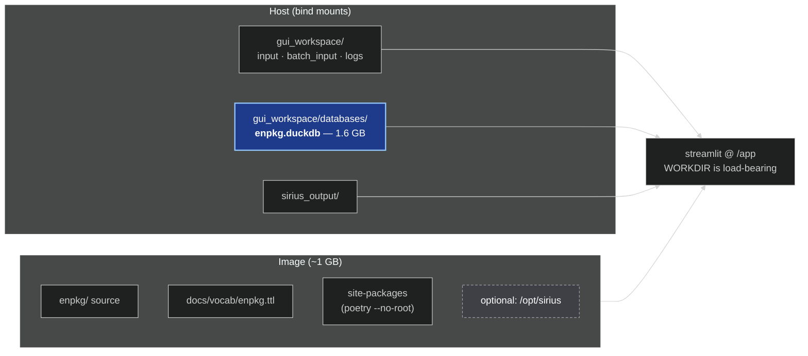

# Containerising ENPKG — What It Takes

*A deployment walkthrough: what has to go into the image, what must stay out, and what
currently blocks a working build.*

---

## 1. The short version

A working image is roughly forty lines of `Dockerfile`. The difficulty is not Docker —
it is that two things in the repository will break the container before Docker becomes
the problem, and that one design decision dominates everything else: **the data must
stay outside the image.**

Three findings, in order of how much they will cost you if ignored:

1. **RDF export is currently broken on the `docker` branch.** The vocabulary file the
   serializer needs was never committed here. Every pipeline run will complete and then
   throw at the final step.
2. **~150 GB of data sits beside the code.** Without a `.dockerignore`, `docker build`
   tries to ship all of it to the daemon as build context.
3. **The package is not installable.** `enpkg` is an implicit namespace package, so the
   image must replicate the `--no-root` + `PYTHONPATH` arrangement that CI already uses.

Everything below expands on these and gives the concrete files.

---

## 2. Blocker: the RDF vocabulary file is missing

`AnalysisSerializer.__init__` calls `_declare_vocabulary()`, which unconditionally parses
a Turtle file resolved relative to the repository root:

```python
# enpkg/monolith/rdf/serializer.py:76
_VOCAB_PATH = Path(__file__).resolve().parents[3] / "docs" / "vocab" / "enpkg.ttl"
```

That file does **not** exist in `HEAD`. It was only ever committed on the `docs` branch,
in commit `0e91f28`. Constructing a serializer therefore fails outright today:

```
FAILS: URLError <urlopen error unknown url type: c>
```

(The error is a `URLError` rather than `FileNotFoundError` only because `rdflib` treats
the missing Windows path as a URI. On Linux it surfaces as a plain missing-file error.
Either way it raises.)

Both `gui/runner.py:236` and `gui/batch_runner.py:407` call `serialize_to_turtle` at the
end of every run, so this is not an edge case — it is the pipeline's main output path.

> **Fix before building.** Cherry-pick `docs/vocab/enpkg.ttl` from `0e91f28` onto the
> deployment branch. Otherwise you ship an image that runs the entire pipeline
> successfully and then fails on the last step.

Note also that `docs/vocab/` currently holds an **823 MB `chebi-vocab.owl`**, which is
untracked and must be kept out of the build context.

---

## 3. The dominant constraint: data volume

| Path | Size | Disposition |
|---|---|---|
| `sirius_output/` | 86 GB | volume |
| `gui_workspace/` | 62 GB | volume |
| `gui_workspace/databases/enpkg.duckdb` | 1.6 GB | volume — the only runtime artifact needed |
| `230106_frozen_metadata.csv` | 735 MB | build input only |
| `classes.csv` | 2.8 GB | build input only |
| `superclasses.csv` | 327 MB | build input only |
| `isdb_pos_cleaned.pkl` | 898 MB | build input only |
| `docs/vocab/chebi-vocab.owl` | 823 MB | exclude entirely |

Two consequences.

**A `.dockerignore` is mandatory, not a nicety.** Docker sends the entire context
directory to the daemon before executing the first instruction. Here that is the
difference between a thirty-second build and one that never completes.

**Only the built DuckDB is needed at runtime.** The LOTUS CSVs and the ISDB pickle are
inputs to `enpkg/scripts/build_duckdb.py`, which is a one-time offline step. They can
stay on the host and never approach the image.



---

## 4. Three code facts that shape the Dockerfile

### 4.1 The package is a namespace package, not an installable distribution

There is no `enpkg/__init__.py`, and `packages = [...]` sits under `[project]` in
`pyproject.toml`, where `poetry-core` ignores it. CI already works around this with
`poetry install --no-root` plus `pythonpath = .` in `pytest.ini`.

The container needs the same arrangement, with one extra trap: **`streamlit run` puts the
*script's* directory on `sys.path`, not the working directory.** So `ENV PYTHONPATH=/app`
is required for the app to import `enpkg.monolith` at all — it is not defensive
boilerplate.

### 4.2 Every path is relative to the working directory

```python
# gui/app.py:34
WORKSPACE_DIR: Path = Path("gui_workspace")
# gui/runner.py:27
LOG_DIR = Path("gui_workspace") / "logs"
# configuration/sirius_enhancer_config.py — default
output_directory: str = "sirius_output"
```

`WORKDIR /app` is therefore load-bearing, and it fixes the mount points at
`/app/gui_workspace` and `/app/sirius_output`.

### 4.3 The whole spectral library is held in memory

`DBLoader._load_spectral_from_duckdb` materialises the library as a Python
`list[Spectrum]`. From a ~900 MB pickle that becomes several GB of Python objects, before
counting numba JIT overhead in the label-propagation step.

> **Size the container at 16 GB.** It will OOM at 4 GB.

---

## 5. SIRIUS: ship it or skip it

SIRIUS is an external Java tool launched as a subprocess
(`enhancers/sirius_enhancer.py:100-105`). Relevant facts for packaging:

- Current release is **v6.3.12**; the Linux asset is `sirius-6.3.12-linux-x64.zip`
  (an `arm64` build also exists).
- It **bundles its own JRE** — you do not need `openjdk` in the image.
- The binary lands at `<SIRIUS_DIR>/bin/sirius`.
- **There is no separate `headless` flavour in SIRIUS 6** — that was a SIRIUS 4/5
  distinction. One zip per architecture now.
- It needs network access and credentials for the Böcker-lab web services.

**A first image without SIRIUS is genuinely viable.** `batch_runner.py:313-317` validates
the executable and, if it is missing or non-executable, logs the reason, drops the SIRIUS
step, and continues with the remaining blocks. Making SIRIUS a separate build stage lets
you get everything else deployed first.

### 5.1 Gotcha: `PATH_TO_SIRIUS` as an environment variable does not work

The batch runner falls back to the environment variable **for validation only**:

```python
# gui/batch_runner.py:288-291
sirius_path_raw = (
    (sirius_shared_cfg.sirius_params.path_to_sirius or "").strip()
    or os.environ.get("PATH_TO_SIRIUS", "")
)
```

But `_sirius_config_for` only rewrites the input and output paths when copying the config
per experiment, and `SiriusEnhancer._run_sirius` execs
`self.config.sirius_params.path_to_sirius` directly — whose default is the *literal
string* `"PATH_TO_SIRIUS"`, not the variable's value. So validation passes and the
execution then fails.

Set the path in `gui_config.yaml`, or add an environment fallback inside `_run_sirius`.

**Credentials are fine**, by contrast: `login()` passes `--user-env SIRIUS_USERNAME
--password-env SIRIUS_PASSWORD`, so SIRIUS reads them itself out of the environment that
`subprocess.run(..., env=os.environ.copy())` propagates.

---

## 6. Secrets

`.env` contains the SIRIUS password in plaintext. It is correctly listed in
`.gitignore`, but it must **also** be in `.dockerignore` — a `COPY` that pulls it in bakes
the password into an image layer readable by anyone who pulls the image.

Docker Compose reads `.env` from the *host* for `${VAR}` substitution, which keeps the
value out of the image entirely. That is the mechanism used in §7.3.

> Given the file has been sitting in a working tree inside a synced OneDrive folder,
> rotating that password is worth considering independently of deployment.

---

## 7. The files

### 7.1 `.dockerignore`

```
.git
data/
gui_workspace/
sirius_output/
docs/vocab/chebi-vocab.owl
enpkg/tests/.databases/
**/__pycache__/
*.pyc
*.duckdb
*.pkl
.env
.venv/
.pytest_cache/
.ruff_cache/
design_diagram.pptx
```

Excluding `docs/vocab/chebi-vocab.owl` by name rather than ignoring `docs/vocab/`
wholesale keeps `enpkg.ttl` available to the `COPY` in the Dockerfile.

### 7.2 `Dockerfile`

```dockerfile
FROM python:3.11-slim AS base

ENV PYTHONUNBUFFERED=1 \
    PYTHONDONTWRITEBYTECODE=1 \
    POETRY_VIRTUALENVS_CREATE=false \
    PYTHONPATH=/app

RUN pip install --no-cache-dir "poetry==2.3.3"
WORKDIR /app

# Dependency layer: cached until pyproject/lock change.
# README.md is copied because pyproject references it.
COPY pyproject.toml poetry.lock README.md ./
RUN poetry install --no-root --with gui --without dev --no-interaction

COPY enpkg/ ./enpkg/
COPY docs/vocab/enpkg.ttl ./docs/vocab/enpkg.ttl
COPY pytest.ini ./

EXPOSE 8501
CMD ["streamlit", "run", "enpkg/monolith/gui/app.py", \
     "--server.port=8501", "--server.address=0.0.0.0", \
     "--server.headless=true", "--server.fileWatcherType=none"]

# --- optional SIRIUS variant: docker build --target with-sirius ---
FROM base AS with-sirius
ARG SIRIUS_VERSION=6.3.12
RUN apt-get update \
 && apt-get install -y --no-install-recommends curl unzip ca-certificates \
 && curl -fsSL -o /tmp/sirius.zip \
      "https://github.com/sirius-ms/sirius/releases/download/v${SIRIUS_VERSION}/sirius-${SIRIUS_VERSION}-linux-x64.zip" \
 && unzip -q /tmp/sirius.zip -d /opt \
 && rm /tmp/sirius.zip \
 && apt-get purge -y curl unzip && apt-get autoremove -y \
 && rm -rf /var/lib/apt/lists/*
```

Notes on the non-obvious lines:

- `--with gui` is **required**: the `gui` group is marked `optional = true`, so Streamlit
  is otherwise not installed.
- `--without dev` drops `pytest`, `ruff`, `lz4`, `joblib`.
- `POETRY_VIRTUALENVS_CREATE=false` installs into the system interpreter, which is what
  you want in a container.
- Python is pinned to 3.11 because `pyproject.toml` requires `>=3.11,<3.12` and
  `poetry.lock` is resolved against exactly that.

### 7.3 `docker-compose.yml`

```yaml
services:
  enpkg:
    build:
      context: .
      target: base          # or: with-sirius
    ports:
      - "8501:8501"
    environment:
      SIRIUS_USERNAME: ${SIRIUS_USERNAME}
      SIRIUS_PASSWORD: ${SIRIUS_PASSWORD}
    volumes:
      - ./gui_workspace:/app/gui_workspace
      - ./sirius_output:/app/sirius_output
    mem_limit: 16g
```

---

## 8. A dependency worth declaring

`utils/label_propagation_algorithm.py:5` imports `numba` directly, but `numba` is not
listed in `pyproject.toml`. It currently resolves transitively (0.63.1, pulled in via
`spec2vec` / `memo-ms`), so the image builds and runs — but a future dependency bump
could silently remove it. Declaring it explicitly costs nothing and removes the
fragility.

---

## 9. Runtime configuration

`duckdb_path` is empty in `gui_workspace/gui_config.yaml`, and `runner.py:300-303` raises
`DBLoaderError` without it. Inside the container it must be the **container-side** path:

```yaml
duckdb_path: /app/gui_workspace/databases/enpkg.duckdb
```

Set it in **both** the `ms_enhancer` and `weights` sections.

The GUI has no `st.file_uploader` — it lists files from `gui_workspace/input` (single
mode) or `gui_workspace/batch_input` (batch mode) on disk. Input therefore reaches the
application only through the bind mount, which is worth stating plainly to anyone
operating the deployment.

---

## 10. Suggested sequence

1. **Get `docs/vocab/enpkg.ttl` onto the deployment branch.** Nothing else matters until
   RDF export works.
2. **Add `.dockerignore` first**, then build the `base` target and confirm the reported
   build context is measured in megabytes, not gigabytes.
3. **Run without SIRIUS**, mounting the existing `gui_workspace`, and verify that a run
   produces a `.ttl` file.
4. **Add the `with-sirius` target**, and fix the `path_to_sirius` fallback (§5.1) if you
   want it configurable per deployment.
5. **Decide on the deployment target.** A single host with 16 GB and bind mounts is a
   very different proposition from a cluster, where the 1.6 GB DuckDB needs a real
   answer — baked into a dedicated data image, or placed on shared storage.

---

## References

- [SIRIUS releases](https://github.com/boecker-lab/sirius/releases)
- [SIRIUS installation documentation](https://boecker-lab.github.io/docs.sirius.github.io/install/)
