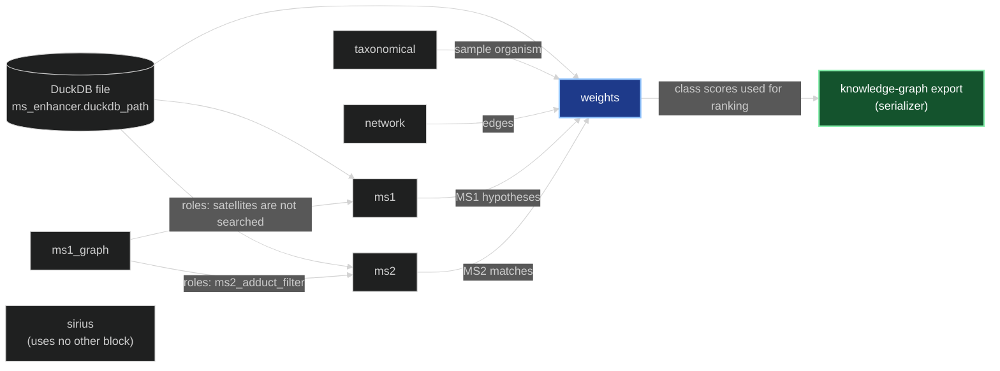

# Enhancer parameters — reference

*Every setting in a run's configuration: what the code does with it, what it interacts with,
and what is known about choosing its value.*

> For researchers setting up a run. How each block works is explained in its walkthrough —
> [network](NETWORK_ENHANCER.md), [MS1 adduct graph](MS1_GRAPH_ENHANCER.md),
> [MS1](MS1_ENHANCER.md), [MS2](MS2_ENHANCER.md), [SIRIUS](SIRIUS_ENHANCER.md) and
> [weights](WEIGHTS_ENHANCER.md) — and the database the annotation blocks read is covered in
> [BUILDING_THE_DATABASE.md](BUILDING_THE_DATABASE.md). This page is the reference for the
> settings.

A run is configured by one YAML file holding 47 settings, spread over five blocks and the
knowledge-graph export. Settings with similar names differ in unit (Da, ppm, minutes) or in
which block reads them, several act across blocks, and some have no effect. Each entry below
therefore states what the code does with the value, down to whether a threshold is inclusive,
and what else the value interacts with.

**How advice on values is labelled.**

| Label | Meaning |
|---|---|
| **Measured** | Measured on data in this repository; the source is named. |
| **Literature** | From a published study, listed in §13. |
| **From the code** | Follows from reading the code; not confirmed by a run. |
| **No evidence** | Nothing in this repository records why the default was chosen. |

Descriptions of what a setting does come from reading the code, unless they are marked as
measured.

## Contents

1. [How a run's settings are organised](#1-how-a-runs-settings-are-organised)
2. [A complete configuration](#2-a-complete-configuration)
3. [Settings for the whole run (`general_params`)](#3-settings-for-the-whole-run-general_params)
4. [Molecular networking (`network`)](#4-molecular-networking-network)
5. [MS1 adduct graph (`ms1_graph`)](#5-ms1-adduct-graph-ms1_graph)
6. [MS1 and MS2 annotation (`ms_enhancer`)](#6-ms1-and-ms2-annotation-ms_enhancer)
7. [SIRIUS (`sirius`)](#7-sirius-sirius)
8. [Reweighting (`weights`)](#8-reweighting-weights)
9. [What reaches the knowledge graph (`serializer`)](#9-what-reaches-the-knowledge-graph-serializer)
10. [Behaviour fixed in code](#10-behaviour-fixed-in-code)
11. [Checklist before a run](#11-checklist-before-a-run)
12. [Settings that currently have no effect](#12-settings-that-currently-have-no-effect)
13. [References](#13-references)

---

## 1. How a run's settings are organised

### 1.1 The configuration file

The GUI writes this file when you click **Save** on the Pipeline page, and writes a copy into the
run's folder each time you start a run. On the command line, `enpkg run --config <file>` and
`enpkg batch --config <file>` read it. Its top-level keys:

| Key | Holds |
|---|---|
| `selected_blocks` | The blocks to run. The order of this list does not change the order blocks run in, which is always `taxonomical`, `network`, `ms1_graph`, `ms1`, `ms2`, `sirius`, `weights`. |
| `network`, `ms1_graph`, `ms_enhancer`, `sirius`, `weights` | One section per block. `ms1` and `ms2` share `ms_enhancer`, because both read the same database. `taxonomical` has no settings. A section whose block is not selected is ignored. |
| `serializer` | What the knowledge-graph file contains. The export runs after the blocks and is not one of them. |

`general_params` is repeated inside every block section but holds one setting for the whole run;
§3 explains which copy is used.

### 1.2 Which block reads what

| Block | Settings it reads | Requires | Uses the results of |
|---|---|---|---|
| `taxonomical` | none | `source_taxon` in the sample metadata; skipped without it | — |
| `network` | `network` | — | — |
| `ms1_graph` | `ms1_graph`; `ionization_mode` | — | — |
| `ms1` | `ms_enhancer`: `duckdb_path`, `ms1_ppm_tol`; `ionization_mode` | the database | `ms1_graph`, when it ran |
| `ms2` | `ms_enhancer`: all keys except `ms1_ppm_tol`; `ionization_mode` | the database | `ms1_graph`, for `ms2_adduct_filter` |
| `sirius` | `sirius`; `ionization_mode` | SIRIUS installed, a SIRIUS account, a SIRIUS spectra file | — |
| `weights` | `ms_enhancer.duckdb_path`; its own section has no effect (§8) | `network` selected; `ms1` or `ms2` selected | `taxonomical`, `network`, `ms1`, `ms2` |
| export | `serializer` | — | every block; `weights` decides the ranking |



Each arrow is a dependency that changes results. The export writes the results of every block
that ran; the arrows into it are omitted except the one that decides ranking.

### 1.3 In the GUI

The **Pipeline** page shows:

- a **General parameters** card holding `general_params` (§3), entered once for the run;
- a **Blocks** card with one tick box per block;
- one settings card per ticked block: *Molecular networking settings*, *MS1 adduct graph
  settings*, *MS1 / MS2 settings (shared)*, *Sirius settings* and *Weights / reranking settings*.

Each field is labelled with its YAML key, underscores replaced by spaces (`mn_score_cutoff`
appears as "mn score cutoff"). Hovering over a field shows the description written in the code.
Some of those descriptions are wrong: `mn_msms_mz_tol` and `mn_max_links` describe a different
behaviour from the one the code has, and most of the settings listed in §12 are described as if
they had an effect. Their entries on this page give the actual behaviour.

The **Serializer** page holds the `serializer` section. The **Imports** page takes the input
files, including the SIRIUS spectra file (§7.1). A run started from the GUI writes the
configuration to `gui_workspace/runs/<run or batch id>/config.yaml` and starts the `enpkg` command
line on it, so a GUI run and a command-line run with the same file behave the same.

### 1.4 Creating and checking a file from the command line

```bash
enpkg config init --out my_run.yaml                    # every block, every default
enpkg config init --out my_run.yaml --blocks network,ms1_graph,ms1,ms2,weights
enpkg config validate my_run.yaml                      # checks types and ranges
enpkg config show my_run.yaml                          # prints the values the run will use
```

`init` writes `duckdb_path: null` and lists it as the setting to fill in before running.

When a file is loaded, each value is checked against its type and allowed range — `min_score`
must lie between 0 and 1, `mn_top_n` must exceed `mn_max_links` — and the run does not start if a
value fails. This check does not detect every mistake. **Measured** with `enpkg config show`:

| Mistake in a hand-edited file | What happens |
|---|---|
| Unknown key directly inside a block section, e.g. `mn_scor_cutoff` under `network` | Rejected with an error. |
| Unknown key inside `general_params`, `spectral_match_params`, `sirius_params` or `reweighting_params` | Ignored without a message; the default is used. |
| Unknown key anywhere in `serializer` | Ignored without a message; the default is used. |
| Misspelled section name, e.g. `netwrk:` | Ignored without a message; the block runs on its defaults. |
| Misspelled block id in `selected_blocks`, e.g. `sirus` | The block is left out of the run without a message, and `validate` reports the file as valid. |

`enpkg config show` prints the selected blocks and every value the run will use, so it reveals
all of the cases without a message. Run it on any file edited by hand.

---

## 2. A complete configuration

Every setting with its default, except the three marked *example*, which have no usable default.
Comments give the unit and, where the name does not make it clear, what the value does.

```yaml
selected_blocks:              # run order is fixed, whatever the order here (§1.1)
  - taxonomical
  - network
  - ms1_graph
  - ms1
  - ms2
  - sirius
  - weights

network:
  general_params: {ionization_mode: pos, recompute: false}   # §3: identical in every section
  mn_msms_mz_tol: 0.01          # Da   fragment tolerance of the modified cosine
  mn_score_cutoff: 0.7          #      minimum modified cosine for an edge (inclusive)
  mn_top_n: 15                  #      candidate partners per spectrum; must exceed mn_max_links
  mn_max_links: 10              #      pairs each spectrum proposes; not a cap on its edges

ms1_graph:
  general_params: {ionization_mode: pos, recompute: false}
  mz_tolerance: 0.01            # Da   between two measured feature m/z values
  rt_tolerance_min: 0.05        # min  maximum retention-time difference of linked features

ms_enhancer:                    # read by ms1, ms2, and (duckdb_path only) weights
  general_params: {ionization_mode: pos, recompute: false}
  duckdb_path: gui_workspace/databases/enpkg.duckdb    # example; required, no default
  spectral_libraries:           # example; omit or leave empty to search every library of the run's mode
    - FragHub_POS_LC_EXP
  spectral_match_params:
    ms1_ppm_tol: 10.0           # ppm  MS1: computed ion m/z against feature m/z
    parent_mz_tol: 0.01         # Da   MS2: library precursor against feature precursor
    msms_mz_tol: 0.01           # Da   MS2: fragment tolerance of the cosine
    method: cosine_greedy       #      cosine_greedy or cosine_hungarian
    min_score: 0.2              #      MS2: the cosine must be above this
    min_peaks: 6                #      MS2: at least this many matched fragment peaks
    library_only_min_score: 0.7 #      MS2: cosine needed when LOTUS lacks the structure (inclusive)
  ms2_adduct_filter: non_satellite   # non_satellite, base_only or all

sirius:
  general_params: {ionization_mode: pos, recompute: false}
  sirius_params:
    path_to_sirius: C:/Program Files/sirius/sirius.exe    # example; the executable, must be set
    output_directory: sirius_output         # relative to the folder the run was started from
    top_k_sirius: 10                        # formula candidates, summary rows and attached structures per feature
    identity_search_precursor_deviation: 20.0   # ppm  SIRIUS's own spectral-library search
    ms2_mass_deviation: 5.0                 # ppm  SIRIUS fragment mass accuracy
    attach_canopus: true
    canopus_source: formula                 # formula or structure
    path_to_input_spectra: ''               # overwritten when the run starts
    recompute: false                        # no effect in practice
    sirius_command_arg: ''                  # no effect
    sirius_user_env: SIRIUS_USER            # no effect
    sirius_password_env: SIRIUS_PASSWORD    # no effect

weights:
  general_params: {ionization_mode: pos, recompute: false}
  reweighting_params:           # checked when loaded, but none has an effect (§8)
    top_to_output: 5
    use_post_taxo: true
    top_N_chemical_consistency: 5
    min_score_taxo_ms1: 0.0
    min_score_chemo_ms1: 0.0
    msms_weight: 1.0
    taxo_weight: 0.5
    chemo_weight: 0.5

serializer:
  top_k_ms1: 5                  # MS1 hypotheses written per feature; null, 0 or negative = all
  top_k_ms2: 5                  # MS2 matches written per feature; null, 0 or negative = all
  ms2_coupling_min_score: 0.7   # cosine from which an MS2 match decides the MS1 hypotheses (inclusive)
  top_k_sirius: null            # SIRIUS candidates written per feature; null = all attached
  include_fbmn_components: true
  include_adduct_clusters: true
  include_ions: false
  min_relative_intensity: 0.0   # fraction of the base peak (0.01 = 1 %); used only with include_ions
  max_ions_per_spectrum: null   # used only with include_ions
```

---

## 3. Settings for the whole run (`general_params`)

`ionization_mode` describes the data, so every block must use the same value. The GUI shows
`general_params` once, at the top of the Pipeline page, and writes the same copy into every
section. When a file is read, the run takes the copy from the first section that has one, in
`selected_blocks` order, and applies it to every block. A file with no `general_params` anywhere
runs in positive mode. If you edit a file by hand, change every copy.

| Key | Allowed | Default |
|---|---|---|
| `ionization_mode` | `pos`, `neg` | `pos` |
| `recompute` | `true`, `false` | `false` |

### `ionization_mode`

Must match the polarity of the acquisition. It determines:

- the metadata column used to find the sample: `sample_filename_pos` or `sample_filename_neg`.
  That column must hold the spectra file's name with one of the extensions `.mzML`, `.mzml`,
  `.mzXML` or `.mzxml` (`sample.mgf` is found under `sample.mzML`); loading fails if it does not;
- the ion forms `ms1` assigns (40 positive, 15 negative) and the ion forms `ms1_graph` relates
  (8 positive, 5 negative), listed in §10.3;
- which libraries `ms2` searches: only those registered with this mode (§6.1);
- the metadata column SIRIUS uses to name its project file (§7.1).

It does not change the adduct fallback passed to SIRIUS, which holds only positive forms
(§10.4).

`enpkg run` and `enpkg batch` accept `--ionization-mode`. It must agree with the file; a
contradiction stops the command. The key `polarity`, used by older files, is read as
`ionization_mode`.

### `recompute`

**No effect.** No code reads it. Nothing is reused from earlier runs: every run computes every
selected block. SIRIUS has a separate `recompute` (§7.4).

---

## 4. Molecular networking (`network`)

The block computes the modified cosine between every pair of MS/MS spectra in the run and keeps
some pairs as edges. The network has two uses: `weights` averages class scores over its edges
(§8), and the export writes its edges and, optionally, its connected components (§9.4). The four
settings decide which pairs become edges. Walkthrough: [NETWORK_ENHANCER.md](NETWORK_ENHANCER.md).

| Key | Allowed | Default | Unit |
|---|---|---|---|
| `mn_msms_mz_tol` | any number; not checked | `0.01` | Da |
| `mn_score_cutoff` | 0 to 1 | `0.7` | — |
| `mn_top_n` | integer > 0, greater than `mn_max_links` | `15` | spectra |
| `mn_max_links` | integer > 0 | `10` | pairs |

**How a pair becomes an edge.** The block uses matchms's `SimilarityNetwork` with its *mutual*
rule. For each spectrum A:

1. rank all other spectra by their modified cosine with A and keep the best `mn_top_n`: this is
   A's candidate list;
2. keep the candidates whose cosine is at least `mn_score_cutoff`;
3. of those, take the `mn_max_links` with the highest cosine;
4. keep a pair from step 3 only if A is also in the partner's candidate list.

The network is the union of the pairs kept for every spectrum. A spectrum with no edge stays in
the network as an unconnected node. Only the cosine is used: unlike GNPS molecular networking,
there is no minimum number of matched fragment peaks for an edge and no limit on the precursor
m/z difference between the two spectra.

Two consequences of this order:

- `mn_max_links` limits the pairs a spectrum *proposes*, not the edges it ends with, because pairs
  proposed by its partners are added too. **Measured** on a five-spectrum test network: one
  spectrum ended with 4 edges at `mn_max_links: 1`. What bounds a spectrum's number of edges is
  `mn_top_n`, since every edge needs each spectrum in the other's candidate list. The description
  in the code, shown as the GUI tooltip, and [NETWORK_ENHANCER.md](NETWORK_ENHANCER.md) §3 call
  `mn_max_links` a cap on edges per node; the code does not apply one.
- Step 3 comes before step 4. A spectrum whose best partners do not list it back spends its
  `mn_max_links` slots on pairs that step 4 then drops, so it can end with fewer edges than
  `mn_max_links`, or none, even when lower-ranked partners that do list it back clear the cutoff.

**Why these settings matter downstream (measured).** `weights` averages class scores over the
network until they stop changing. At that point all features of one connected component — a set
of features linked to each other by edges and to nothing outside the set — carry practically the
same class profile: on the test fixture, profiles within a component differ by at most 0.002, and
the largest component holds 300 of the 660 features
([WEIGHTS_ENHANCER.md](WEIGHTS_ENHANCER.md) §4). Settings that add edges between components make
more features share one class profile.

### `mn_msms_mz_tol`

The tolerance for pairing fragment peaks in the modified cosine. Two peaks pair when their m/z
values differ by at most this value (inclusive), either as measured or after shifting one
spectrum by the difference between the two precursor m/z values. It is a fragment tolerance; the
description in the code calls it a parent-mass tolerance. It is not range-checked, so 0 or a
negative value is accepted. It is set separately from `msms_mz_tol` (§6.4), the fragment
tolerance of library matching, though both default to 0.01 Da.

Choosing a value: **No evidence**.

### `mn_score_cutoff`

Minimum modified cosine for an edge. Inclusive: the matchms documentation says "greater than",
but its code keeps a pair at exactly the cutoff.

Choosing a value: **No evidence** in this repository. 0.7 is also the default of matchms's
`SimilarityNetwork`.

### `mn_top_n`

The length of each spectrum's candidate list (step 1), and therefore the largest number of edges
a spectrum can have. Must be greater than `mn_max_links`; a file where it is not is rejected. A
smaller value makes the mutual rule stricter: a spectrum similar to many others appears in fewer
of their candidate lists, so it keeps fewer edges. **Measured** on the same test network: with
`mn_top_n: 2` and `mn_max_links: 1`, two of the five spectra ended with no edge.

Choosing a value: **No evidence**.

### `mn_max_links`

The number of pairs each spectrum proposes (step 3); see the two consequences above. Must be
smaller than `mn_top_n`.

Choosing a value: **No evidence**.

---

## 5. MS1 adduct graph (`ms1_graph`)

One compound usually gives several features: [M+H]+, [M+Na]+, [M+NH4]+, an in-source water loss,
a dimer. This block links features whose m/z values fit two ion forms of one neutral mass and
that co-elute, separates each linked group into molecules, and gives every feature a role:

| Role | Meaning |
|---|---|
| anchor | the molecule's base ion, [M+H]+ or [M-H]- |
| satellite | another ion form of an anchor's molecule |
| singleton | no relation to any other feature was found |

Two later blocks use the roles. `ms1` searches LOTUS only for anchors and singletons, and gives
each satellite its anchor's candidate formulas under the satellite's own ion form (§6.2). `ms2`
uses them for `ms2_adduct_filter` (§6.6). Without this block, `ms1` searches every feature under
every ion form. Walkthrough: [MS1_GRAPH_ENHANCER.md](MS1_GRAPH_ENHANCER.md).

| Key | Allowed | Default | Unit |
|---|---|---|---|
| `mz_tolerance` | > 0 | `0.01` | Da |
| `rt_tolerance_min` | > 0 | `0.05` | min |

**The test for linking two features.** Features X and Y are linked when, for some pair of ion
forms A and B from the block's short list (§10.3), the m/z predicted for Y — X's neutral mass,
assuming X is form A, ionised as form B — lies within `mz_tolerance` of Y's m/z, and the two
retention times differ by at most `rt_tolerance_min`. Both bounds are inclusive. A feature with no
retention time in the quantification table passes the time condition against every feature, so
it is linked by mass alone.

### `mz_tolerance`

Absolute (Da) rather than relative because it compares two measured m/z values; `ms1_ppm_tol`
(§6.2) is relative because it compares a measured m/z with a computed one. A wider value links
more features through mass coincidences, and the time condition is what limits them.

Choosing a value: **No evidence**. Whether this tolerance should be relative has not been
examined (CHANGELOG, 2026-09-18).

### `rt_tolerance_min`

Maximum retention-time difference between two linked features. It is always applied and cannot
be switched off.

Choosing a value: **Measured** in [MS1_GRAPH_SCALING_ANALYSIS.md](MS1_GRAPH_SCALING_ANALYSIS.md),
on positive-mode *Actaea* extracts of 2,177–5,263 features from gradients of about 8 minutes:

- With no time condition, about 97 % of each dataset's features fall into one linked group, and
  almost nothing is resolved.
- On five datasets, 20.4–23.3 % of features were resolved as adducts at 0.05 min, against
  16.7–18.6 % at 0.02 min. The tighter window misses roughly 15–25 % of the relationships the
  wider one finds and runs faster (worst case 2.44 s against 0.35 s).
- The analysis gives 0.02–0.05 min (about 1–3 s) as the useful range for those gradients and
  suggests about 0.03 min; the default is 0.05 min. It ties the right value to chromatographic
  peak width. No measurement on other chromatography exists in this repository.

---

## 6. MS1 and MS2 annotation (`ms_enhancer`)

`ms1` proposes structures for a feature from its m/z alone: every LOTUS molecular formula that
matches the feature's m/z under one of the ion forms. `ms2` matches the feature's MS/MS spectrum
against registered spectral libraries. Both read one database and share this section, but most
keys are read by only one of them. Walkthroughs: [MS1_ENHANCER.md](MS1_ENHANCER.md),
[MS2_ENHANCER.md](MS2_ENHANCER.md).

| Key | Allowed | Default | Unit | Read by |
|---|---|---|---|---|
| `duckdb_path` | file path | required | — | `ms1`, `ms2`, `weights` |
| `spectral_libraries` | list of registered names | empty: all of the run's mode | — | `ms2` |
| `spectral_match_params.ms1_ppm_tol` | > 0 | `10.0` | ppm | `ms1` |
| `spectral_match_params.parent_mz_tol` | > 0 | `0.01` | Da | `ms2` |
| `spectral_match_params.msms_mz_tol` | > 0 | `0.01` | Da | `ms2` |
| `spectral_match_params.method` | `cosine_greedy`, `cosine_hungarian` | `cosine_greedy` | — | `ms2` |
| `spectral_match_params.min_score` | 0 to 1 | `0.2` | — | `ms2` |
| `spectral_match_params.min_peaks` | integer ≥ 1 | `6` | peaks | `ms2` |
| `spectral_match_params.library_only_min_score` | 0 to 1 | `0.7` | — | `ms2` |
| `ms2_adduct_filter` | `non_satellite`, `base_only`, `all` | `non_satellite` | — | `ms2` |

`spectral_match_params` is not read by the `network` block, which has its own settings (§4).

**When a library spectrum becomes an MS2 annotation.** All of the following must hold:

1. the feature is selected by `ms2_adduct_filter` (§6.6);
2. the library is named in `spectral_libraries`, or the list is empty, and it is registered with
   the run's `ionization_mode` (§6.1);
3. its precursor m/z is within `parent_mz_tol` of the feature's (§6.3);
4. the cosine is above `min_score` and pairs at least `min_peaks` fragment peaks (§6.4);
5. the library entry names a structure (an InChIKey). When LOTUS does not hold that structure,
   the InChIKey must be well formed and the cosine at least `library_only_min_score` (§6.5).

Of the matches that pass, each feature keeps one per library and structure: the one with the
highest cosine, then with the most matched peaks.

### 6.1 `duckdb_path` and `spectral_libraries`

**`duckdb_path`** — the DuckDB file holding the LOTUS tables and every registered spectral
library, built with `enpkg db lotus` and `enpkg db spectral-library`
([BUILDING_THE_DATABASE.md](BUILDING_THE_DATABASE.md)). The run only reads it. A relative path is
resolved against the folder the GUI or the command was started from. `weights` reads the same file
and takes the path from this section, so a run that selects `weights` without `ms1` or `ms2` stops
before any block runs.

**`spectral_libraries`** — the libraries to search, named exactly as this command lists them:

```bash
enpkg db spectral-library --database gui_workspace/databases/enpkg.duckdb --list
```

The registered name is matched, not `name:version`. When `ms2` is selected, a name that is not
registered stops the run before any block runs. Of the libraries named — or of all registered
libraries, when the list is empty or absent — `ms2` searches only those registered with the run's
`ionization_mode`. If none has that mode, `ms2` logs a warning and adds no annotations; the run
does not fail. Each annotation records its library as `name:version`. In the GUI the setting is a
text box taking one name per line. Reasons to restrict the list, such as searching experimental
spectra without the in-silico ones, are in [BUILDING_THE_DATABASE.md](BUILDING_THE_DATABASE.md) §5.

### 6.2 `ms1_ppm_tol` (MS1)

`ms1` attaches to a feature every pair of a LOTUS molecular formula and an ion form whose computed
m/z lies within `ms1_ppm_tol` of the feature's m/z, inclusive. Each pair groups every LOTUS
structure with that formula. The window is relative, so it widens with mass: 10 ppm is ±0.002 Da
at m/z 200 and ±0.010 Da at m/z 1000. Nothing else filters MS1 candidates, so their number per
feature grows with the window; they are ranked and cut to `serializer.top_k_ms1` only at export
(§9.1). When `ms1_graph` ran, satellites are not searched: they receive their anchor's formulas
under their own ion form, and this tolerance does not apply to them.

Choosing a value: **No evidence** for 10 ppm. The window is relative because a fixed 0.01 Da
window is 50 ppm at m/z 200 but 10 ppm at m/z 1000 (CHANGELOG, 2026-09-18).

### 6.3 `parent_mz_tol` (MS2 candidates)

A library spectrum is scored against a feature only if their precursor m/z values differ by at
most `parent_mz_tol`, inclusive. The tolerance is absolute: 0.01 Da is 50 ppm at m/z 200 and
10 ppm at m/z 1000. The feature's precursor m/z is the one in the spectra file, which loading has
checked against the quantification table's `row m/z` to within 0.001.

Choosing a value: **No evidence**. It is in Daltons so that the database query applies the same
test as matchms's `PrecursorMzMatch(tolerance, "Dalton")` (CHANGELOG, 2026-09-18).

### 6.4 Scoring: `method`, `msms_mz_tol`, `min_score`, `min_peaks`

Each candidate is scored with a cosine over fragment peaks, with intensities used linearly and no
m/z weighting (§10.2). Unlike the network's modified cosine, no precursor shift is applied.

- **`msms_mz_tol`** — two fragment peaks can pair when their m/z values differ by at most this
  value.
- **`method`** — how peaks are paired when several pairings are possible. `cosine_greedy` takes
  candidate pairs in decreasing order of their intensity product, using each peak once.
  `cosine_hungarian` finds the pairing that maximises the score and is slower. The matchms
  documentation states that the two rarely differ notably, particularly at small tolerances; no
  comparison has been measured in this repository.
- **`min_score`** — the cosine must be strictly greater than this value.
- **`min_peaks`** — the number of peak pairs the cosine used must be at least this value.

Fragments were already reduced when the spectra were loaded: peaks below 1 % of the base peak and
peaks outside m/z 10–1000 are gone (§10.1) and cannot count towards `min_peaks`.

Choosing values:

- `min_score` 0.2 — **Literature**: Rutz et al. (2019) used 0.2 to admit in-silico (ISDB)
  candidates before re-ranking them taxonomically (CHANGELOG, 2026-10-01). It admits candidates
  and does not express confidence; a confident identification is what
  `serializer.ms2_coupling_min_score` expresses (§9.2). LOTUS-backed matches between the two
  thresholds still reach the graph, within `top_k_ms2`, and are used by `weights`.
- `min_peaks` 6 — **No evidence**.
- `msms_mz_tol` 0.01 Da and `method` — **No evidence**.

### 6.5 `library_only_min_score`

A matched structure that LOTUS holds carries the organisms LOTUS reports for it, and `weights`
uses them. A structure LOTUS does not hold — a drug, a contaminant, or a natural product missing
from LOTUS — carries no organisms, so nothing else weighs the match. Such a *library-only* match
is annotated only if its cosine is at least `library_only_min_score` (inclusive), in addition to
`min_score` and `min_peaks`. Whether LOTUS holds a structure is decided on the first block of its
InChIKey, the 2D skeleton. Setting this value equal to `min_score` annotates every library-only
match that passes the other two thresholds.

Library-only matches have no class scores, so `weights` leaves them out (§8), and when `weights`
ran they rank below LOTUS-backed matches at export (§9.1). A library entry whose InChIKey field
holds something other than an InChIKey is skipped and reported in the log, whatever its score.

Choosing a value: **Measured** on the test fixture (660 features; CHANGELOG, 2026-10-01). At 0.2
there were 91 library-only annotations on 41 features; at 0.7 there were 34 on 21, and 10 features
lost their only MS2 match. LOTUS-backed annotations did not change. High-cosine matches to
compounds that are not natural products remain, such as a plastic additive at 0.849. The default
is provisional and equals `ms2_coupling_min_score`.

### 6.6 `ms2_adduct_filter`

Spectral libraries hold almost only [M+H]+ and [M-H]- spectra. For a feature that is another ion
form of a compound, such as [M+Na]+, the library spectra within `parent_mz_tol` of its m/z are
therefore mostly [M+H]+ spectra of other compounds, and a match to them is spurious. This setting
uses the roles from `ms1_graph` (§5) to choose which features `ms2` matches:

| Value | Features matched |
|---|---|
| `non_satellite` | anchors and singletons: every feature except those resolved as another ion form |
| `base_only` | anchors only; singletons, whose ion form is unknown, are skipped |
| `all` | every feature |

When `ms1_graph` is not in the run, every feature is matched whatever the value, and the log
shows a warning.

Choosing a value: **No evidence**; no comparison of the three values is recorded.

---

## 7. SIRIUS (`sirius`)

The block runs SIRIUS as a separate program on a dedicated spectra file, reads the summary tables
SIRIUS writes, and attaches to each feature up to `top_k_sirius` ranked structure candidates and
one CANOPUS class prediction. Walkthrough: [SIRIUS_ENHANCER.md](SIRIUS_ENHANCER.md). **Measured**:
SIRIUS took about 85 % of an experiment's wall time (CHANGELOG, 2026-09-10).

All keys are under `sirius_params`. None of the numbers is range-checked.

| Key | Allowed | Default | Unit |
|---|---|---|---|
| `path_to_sirius` | file path | `PATH_TO_SIRIUS`, a placeholder | — |
| `output_directory` | folder path | `sirius_output` | — |
| `top_k_sirius` | integer; use ≥ 1 | `10` | per feature |
| `identity_search_precursor_deviation` | number | `20.0` | ppm |
| `ms2_mass_deviation` | number | `5.0` | ppm |
| `attach_canopus` | `true`, `false` | `true` | — |
| `canopus_source` | `formula`, `structure` | `formula` | — |
| `path_to_input_spectra` | file path | `''` | — |
| `recompute` | `true`, `false` | `false` | — |
| `sirius_command_arg` | text | `''` | — |
| `sirius_user_env` | text | `SIRIUS_USER` | — |
| `sirius_password_env` | text | `SIRIUS_PASSWORD` | — |

The last five have no effect in practice (§7.4).

### 7.1 Running SIRIUS: executable, account, folders, input

**`path_to_sirius`** — the full path to the SIRIUS executable, such as
`C:/Program Files/sirius/sirius.exe`. The run executes exactly this path. The default, the text
`PATH_TO_SIRIUS`, is a placeholder: it does not refer to an environment variable, and setting an
environment variable called `PATH_TO_SIRIUS` does not make SIRIUS run ([DOCKER.md](DOCKER.md)
§5.1). A batch checks the path before its first experiment; if the file does not exist or cannot
be executed, SIRIUS is removed from the batch and the other blocks run. In a single run, a wrong
path makes the SIRIUS step fail (§7.5).

**Account.** Every SIRIUS step starts by logging in with two environment variables,
`SIRIUS_USERNAME` and `SIRIUS_PASSWORD`. An environment variable is a named value set in a shell
session, which every program started from that session can read. Set both in the session that
starts the GUI or the `enpkg` command; the GUI passes its own environment to the runs it starts.
A `.env` file is not read. In PowerShell, for the current session:

```powershell
$env:SIRIUS_USERNAME = "you@example.org"
$env:SIRIUS_PASSWORD = "..."
```

In bash: `export SIRIUS_USERNAME=you@example.org` and `export SIRIUS_PASSWORD=...`. These two
names are fixed; `sirius_user_env` and `sirius_password_env` do not change them (§7.4).

**`output_directory`** — the folder SIRIUS projects are written to. A relative path is resolved
against the folder the GUI or the command was started from. Each SIRIUS step creates a new
subfolder named by date and time:

- single run: `<output_directory>/<YYYYMMDD_HHMMSS>/<sample>.sirius`, with the summary tables in
  `<output_directory>/<YYYYMMDD_HHMMSS>/summaries/`;
- batch: `<output_directory>/<run name>/<YYYYMMDD_HHMMSS>/…`, laid out the same way.

`<sample>` is the sample's file name from the metadata column `sample_filename_pos` or
`sample_filename_neg`, up to its first `.`. Nothing is overwritten or deleted, so the folder grows
with every run.

**`path_to_input_spectra`** — replaced when the run starts, so the value in the file is never
used, and the Pipeline page does not show it. SIRIUS reads a separate spectra file, named after
the main one with `_sirius` added before the extension (`sample.mgf` → `sample_sirius.mgf`):

- GUI, single run: the Imports page field *Spectra for SIRIUS*, which must be filled in when the
  block is ticked;
- `enpkg run`: `--sirius-spectra <file>`, otherwise the `_sirius` file next to the spectra file;
- batch: the `_sirius` file in each experiment folder. An experiment without one fails when
  SIRIUS is selected; the other experiments still run.

### 7.2 What SIRIUS computes: `top_k_sirius`, `ms2_mass_deviation`, `identity_search_precursor_deviation`

**`top_k_sirius`** is used three times:

1. passed to SIRIUS as `--NumberOfCandidates`, which SIRIUS's help describes in terms of
   molecular-formula candidates — how many are computed exactly and kept — so it changes SIRIUS's
   own search, not only its output;
2. passed as `--top-k-summary`, the number of hits per feature written to the summary tables;
3. when the results are attached, structure candidates ranked below it are dropped.

Use a positive integer. 0 or a negative value is accepted, and step 3 then drops every structure
candidate while SIRIUS still runs in full; how SIRIUS itself treats such values was not checked.
`serializer.top_k_sirius` is a different setting, which can only remove more candidates (§9.3).

Choosing a value: **No evidence**. 10 is also SIRIUS's own default for `NumberOfCandidates`.

**`ms2_mass_deviation`** — passed as `--MS2MassDeviation.allowedMassDeviation=<value>ppm`, the mass
accuracy SIRIUS allows for fragment peaks when it computes fragmentation trees to rank molecular
formulas. SIRIUS's own default is 10 ppm. The MS1 mass deviation is not set by the pipeline, so
SIRIUS uses its own value.

Choosing a value: **No evidence** for 5 ppm.

**`identity_search_precursor_deviation`** — passed as
`--IdentitySearchSettings.precursorDeviation=<value>ppm`, the precursor tolerance of SIRIUS's own
spectral-library search: its `spectra-search` step, over the databases listed in §10.4. The hits
of that search are not written to the graph. With SIRIUS's default settings, however, the
formulas of sufficiently similar library hits are kept among the formula candidates whatever
their SIRIUS score (SIRIUS option `InjectSpectralLibraryMatchFormulas`), so this tolerance can
change formula and structure results.

Choosing a value: **No evidence**. 20 ppm is also SIRIUS's default.

### 7.3 CANOPUS: `attach_canopus`, `canopus_source`

SIRIUS always computes CANOPUS class predictions (its `classes` step). These two settings only
decide what is read back.

- **`attach_canopus`** — whether to attach one prediction per feature: NPClassifier pathway,
  superclass and class, each with a probability. The export writes it as its own class-annotation
  node ([SIRIUS_ENHANCER.md](SIRIUS_ENHANCER.md) §6.1). Setting it to `false` removes CANOPUS from
  the graph but saves no SIRIUS time.
- **`canopus_source`** — which SIRIUS table to read. `formula` classifies the top-ranked molecular
  formula and covers every feature SIRIUS assigned a formula to. `structure` classifies the
  formula behind the best structure hit: it agrees with the structure annotations, but skips
  features with no database hit. **Measured** ([SIRIUS_ENHANCER.md](SIRIUS_ENHANCER.md) §5.1): on
  real data the two disagree on the pathway for about a fifth of the features they share, and
  CANOPUS classifies around 85 % of features.

CANOPUS predictions are not used by `weights`.

### 7.4 Settings with no effect

- **`sirius_command_arg`** — never read. There is no way to pass extra arguments to SIRIUS.
- **`sirius_user_env`, `sirius_password_env`** — never read during a run. Their description in the
  code says a value given here takes priority; it does not. The login always uses
  `SIRIUS_USERNAME` and `SIRIUS_PASSWORD` (§7.1).
- **`recompute`** — passes SIRIUS's `--recompute`, which recomputes results already present in a
  project. Every SIRIUS step writes into a new, empty project folder (§7.1), so there are never
  results to recompute. **From the code**; not tested.
- **`path_to_input_spectra`** — replaced when the run starts (§7.1).

### 7.5 When the SIRIUS step fails

SIRIUS runs after `ms2` and before `weights`. If the login fails or SIRIUS exits with an error —
or, in a single run, the executable is missing — the blocks after it do not run for that
analysis:

- single run: the run ends with an error and writes no knowledge graph;
- batch: the experiment is marked failed, its graph is still written from the blocks that ran
  before SIRIUS — so without `weights` — and the batch continues. A missing executable does not
  reach this point in a batch: SIRIUS is removed before the first experiment (§7.1).

SIRIUS can also finish without an error but write no summary tables. The run then succeeds without
SIRIUS results, and the only sign is the warning `No SIRIUS summaries parsed; analysis left
unchanged.` in the log (CHANGELOG, 2026-09-17).

---

## 8. Reweighting (`weights`)

**Its settings have no effect.** `reweighting_params` holds eight settings. They are checked when
the file is loaded — the two counts must be at least 1, the two minimum scores and three weights
at least 0, and `msms_weight`, `taxo_weight` and `chemo_weight` cannot all be 0 — but no code
reads them, so changing them does not change any result. The code reserves them for a final
ranking step that does not exist yet.

| Key | Allowed | Default |
|---|---|---|
| `top_to_output` | integer ≥ 1 | `5` |
| `use_post_taxo` | `true`, `false` | `true` |
| `top_N_chemical_consistency` | integer ≥ 1 | `5` |
| `min_score_taxo_ms1` | ≥ 0 | `0.0` |
| `min_score_chemo_ms1` | ≥ 0 | `0.0` |
| `msms_weight` | ≥ 0 | `1.0` |
| `taxo_weight` | ≥ 0 | `0.5` |
| `chemo_weight` | ≥ 0 | `0.5` |

**What the block does, with fixed settings** ([WEIGHTS_ENHANCER.md](WEIGHTS_ENHANCER.md)).
Separately for MS1 and for MS2:

1. For each feature, it builds one class-score vector per NPClassifier level — pathway,
   superclass, class — as a weighted average of its candidates' classifications. An MS1 candidate
   is weighted by how closely the organisms LOTUS reports for its structures match the sample's
   organism taxonomically. An MS2 match is weighted by its cosine times that closeness;
   library-only matches, which have no organisms, are left out.
2. It replaces each feature's vectors with a weighted average of its own vectors (weight 1) and
   those of its network neighbours (weight: the modified cosine of the edge), and repeats until
   the change between two rounds falls below 10⁻⁵. This is label propagation. A feature with no
   candidates of its own receives vectors from its neighbours.
3. It stores the result on each feature. The export ranks MS1 and MS2 candidates by how well
   their classes agree with it (§9.1).

**Requirements.**

- `network` must be selected; without it the block is skipped with a warning.
- `ms1` or `ms2` must be selected. The block reads the database named by
  `ms_enhancer.duckdb_path`, and without either block the run stops before any block runs.
- The `taxonomical` block supplies the sample's organism, from `source_taxon` in the metadata.
  Without it every candidate gets the same taxonomic weight: MS1 candidates count equally, and
  MS2 matches count by cosine alone.

---

## 9. What reaches the knowledge graph (`serializer`)

After the blocks, the run writes a knowledge-graph file for each analysis, in RDF's Turtle format
(`.ttl`). These settings change no computation; they decide how much of each result is written.
In the GUI they are on the Serializer page.

| Key | Allowed | Default | Unit |
|---|---|---|---|
| `top_k_ms1` | integer, or `null` | `5` | per feature |
| `top_k_ms2` | integer, or `null` | `5` | per feature |
| `ms2_coupling_min_score` | 0 to 1 | `0.7` | cosine |
| `top_k_sirius` | integer, or `null` | `null` | per feature |
| `include_fbmn_components` | `true`, `false` | `true` | — |
| `include_adduct_clusters` | `true`, `false` | `true` | — |
| `include_ions` | `true`, `false` | `false` | — |
| `min_relative_intensity` | 0 to 1 | `0.0` | fraction of the base peak |
| `max_ions_per_spectrum` | integer > 0, or `null` | `null` | peaks |

### 9.1 `top_k_ms1`, `top_k_ms2`

Each feature's MS1 hypotheses and MS2 matches are ranked, and the first k of each are written with
their rank and score. `null`, 0 or a negative value writes all of them. The ranking depends on
whether `weights` ran:

| | `weights` ran | `weights` did not run |
|---|---|---|
| MS2 matches | agreement of the match's classes with the feature's propagated MS2 class scores; ties broken by cosine | cosine |
| MS1 hypotheses | agreement of the hypothesis's classes with the feature's propagated MS1 class scores | the order `ms1` produced them in: ascending computed m/z, which does not reflect plausibility |

The agreement score is computed per level — pathway, superclass, class — as the mean of the
element-wise product of the candidate's class vector and the feature's propagated vector; the
three means are multiplied. Two consequences, **from the code**:

- Without `weights`, `top_k_ms1` keeps the first k hypotheses by mass, not the k most plausible.
  To keep every MS1 hypothesis in that case, set `top_k_ms1: 0`.
- With `weights`, a library-only MS2 match has an agreement of 0, because it has no class scores,
  so it ranks below every LOTUS-backed match with a positive agreement, whatever its cosine.

`top_k_ms1` is not applied to a feature with a confident MS2 match (§9.2).

### 9.2 `ms2_coupling_min_score`

MS1 proposes structures from mass alone, so most of a feature's MS1 hypotheses are mass
coincidences. A confident MS2 match identifies the compound, and the MS1 hypotheses that do not
explain how that compound ionised can be dropped. For each feature, among the MS2 matches written
after `top_k_ms2`:

- If at least one has a cosine of at least `ms2_coupling_min_score` (inclusive), only the MS1
  hypotheses that explain that compound's ionisation are written: those containing the same
  structure, by 2D InChIKey, for a LOTUS-backed match, or those with the same molecular formula
  for a library-only match. All such hypotheses are written, whatever `top_k_ms1` is, and the
  rest are dropped. Each confident match is linked to its hypotheses by
  `enpkg:hasCorrespondingAdduct`. If no hypothesis corresponds, the feature is written with no
  MS1 hypotheses.
- Otherwise the MS1 hypotheses are written as in §9.1.

Matches below the threshold are written either way; they leave the MS1 hypotheses unchanged.
`0` lets every written match decide.

Choosing a value: **Literature**, provisional (CHANGELOG, 2026-10-01). 0.7 follows the GNPS
convention for library search. In Scheubert et al. (2017), most of 70 public datasets reached a
1 % false discovery rate at a cosine of 0.6–0.65, with the value needed depending on how many
peaks must match. Li et al. (2021) recommend scores above 0.75 for dot-product similarity.

### 9.3 `top_k_sirius`

Caps the SIRIUS structure candidates written per feature, by SIRIUS's rank. `null`, 0 or a
negative value writes every attached candidate. The block's own `sirius_params.top_k_sirius`
(default 10) already limits what is attached (§7.2), so a value at or above it changes nothing.

### 9.4 Optional parts of the graph

- **`include_fbmn_components`** — one node per connected component of the molecular network (a
  molecular family), linked to its features. Applies only when `network` ran. The network's edges
  are always written when `network` ran; they are not a setting.
- **`include_adduct_clusters`** — one node per molecule resolved by `ms1_graph`, linked to its
  anchor and satellites; singletons get none. Applies only when `ms1_graph` ran.
- **`include_ions`** — one node per fragment peak of every spectrum. Its description in the code
  calls it the largest single contributor to graph size; no measurement of that is recorded.
- **`min_relative_intensity`** — with `include_ions`, peaks below this **fraction** of the
  spectrum's most intense peak are not written: `0.05` means 5 %, and `1.0` keeps only the most
  intense peak. Loading already removed peaks below 1 % of the base peak (§10.1), so values of
  0.01 or less remove nothing further, unless the base peak lay outside m/z 10–1000. Ignored
  without `include_ions`.
- **`max_ions_per_spectrum`** — with `include_ions`, at most this many peaks per spectrum, the
  most intense first. Ignored without `include_ions`.

With `include_ions` on, each of the last two is also recorded on every spectrum's node when it is
set, so a reader of the graph can tell that the written peak list is a subset.

---

## 10. Behaviour fixed in code

These are not settings, but they decide what the settings act on.

### 10.1 Loading the spectra

Before any block runs, every spectrum in the spectra file is processed in this order:

1. intensities are scaled so the most intense peak is 1;
2. peaks below 0.01, that is 1 % of that peak, are removed;
3. fragment peaks outside m/z 10–1000 are removed, bounds included;
4. a spectrum with no peak left is dropped, and its feature is then absent from every block and
   from the graph.

Fragment peaks above m/z 1000 therefore never count in any cosine, in `min_peaks` or in the
network. The precursor m/z comes from the spectra file and must agree with the quantification
table's `row m/z` to within 0.001, or loading fails. Retention time, in minutes, comes from
`row retention time`, and feature intensity from the first column whose name contains
`Peak height` or `Peak area`.

### 10.2 Similarity scores

- `network`: matchms `ModifiedCosine`, mutual linking, unconnected spectra kept.
- `ms2`: matchms `CosineGreedy` or `CosineHungarian`.
- Both use intensities linearly (intensity power 1) and do not weight peaks by m/z (m/z power 0).

### 10.3 Ion forms

`ms1` tries 40 forms in positive mode: [M+3H]3+, [M+2H+Na]3+, [M+H+2Na]3+, [M+3Na]3+, [M+2H]2+,
[M+NH4+H]2+, [M+H+Na]2+, [M+Mg]2+, [M+K+H]2+, [M+Ca]2+, [M+ACN+2H]2+, [M+2Na]2+, [M+Fe]2+,
[M+2ACN+2H]2+, [M+3ACN+2H]2+, [M+H]+, [M+NH4]+, [M+Na]+, [M+Mg-H]+, [M+CH3OH+H]+, [M+K]+,
[M+Ca-H]+, [M+ACN+H]+, [M-H+2Na]+, [M+EtNH2+H]+, [M+Fe-H]+, [M+IsoProp+H]+, [M+ACN+Na]+,
[M+2K-H]+, [M+DMSO+H]+, [M+2ACN+H]+, [2M+Mg]2+, [2M+Ca]2+, [2M+Fe]2+, [2M+H]+, [2M+NH4]+,
[2M+Na]+, [2M+K]+, [2M+ACN+H]+, [2M+ACN+Na]+.

In negative mode, 15: [M-3H]3-, [M-2H]2-, [M-H]-, [M-2H+Na]-, [M+Cl]-, [M+K-2H]-, [M+FA-H]-,
[M+Hac-H]-, [M+FA-2H+Na]-, [M+Br]-, [M-H+TFA]-, [2M-H]-, [2M+FA-H]-, [2M+Hac-H]-, [3M-H]-.

`ms1_graph` relates a shorter list, without multiply charged ions, whose first entry is the base
ion:

- positive: [M+H]+, [M+NH4]+, [M+Na]+, [M+K]+, [M+H-H2O]+, [M-NH3+H]+, [2M+H]+, [3M+H]+;
- negative: [M-H]-, [M+Cl]-, [M+FA-H]-, [2M-H]-, [3M-H]-.

Labels are written as the knowledge graph writes them. The lists are defined in
`enpkg/monolith/enhancers/adducts.py` and `enpkg/monolith/enhancers/graph_adducts.py`.

### 10.4 SIRIUS options

Passed on every run. The *SIRIUS default* column comes from `sirius config --help` of
SIRIUS 6.3.4.

| SIRIUS option | Value used | SIRIUS default |
|---|---|---|
| `--AlgorithmProfile` | `orbitrap` | `default` |
| `--AdductSettings.fallback` | [M+H]+, [M+Na]+, [M+K]+ | [M+H]+, [M-H]-, [M+Na]+, [M+K]+ |
| `--FormulaSettings.enforced` | H, C, N, O, P | C, H, N, O, P |
| `--FormulaSearchDB` | empty | `none` |
| `--FormulaSearchSettings.performBottomUpAboveMz` | `0` | `0` |
| `--ExpansiveSearchConfidenceMode.confidenceScoreSimilarityMode` | `EXACT` | `APPROXIMATE` |
| `--StructureSearchDB` and `--SpectralSearchDB` | the 25 databases below | `BIO` and `ALL` |
| `--SpectralSearchLog` | `0` | `0` |

Databases: public_spectra_2506, METACYC, BloodExposome, CHEBI, COCONUT, FooDB, GNPS, HMDB, HSDB,
KEGG, KNAPSACK, LOTUS, LIPIDMAPS, MACONDA, MESH, MiMeDB, NORMAN, PLANTCYC, PUBCHEMANNOTATIONBIO,
PUBCHEMANNOTATIONDRUG, PUBCHEMANNOTATIONFOOD, PUBCHEMANNOTATIONSAFETYANDTOXIC, SUPERNATURAL,
TeroMol, YMDB.

SIRIUS steps run: `spectra-search`, `formulas`, `fingerprints`, `classes`, `structures`,
`write-summaries`. ZODIAC, which [SIRIUS_ENHANCER.md](SIRIUS_ENHANCER.md) §2 describes, is not
among them.

Two of these matter when setting up a run:

- **Instrument.** The `orbitrap` profile is used whatever instrument acquired the data.
- **Negative mode.** The adduct fallback — the ion forms SIRIUS considers when it finds no
  indication of the ion form in the data — contains only positive forms, whatever
  `ionization_mode` is. How SIRIUS treats negative-mode features with this list has not been
  checked.

### 10.5 Reweighting

The `weights` algorithm is described in §8; no part of it is configurable.

---

## 11. Checklist before a run

- [ ] `ionization_mode` matches the data, and the metadata column `sample_filename_pos` or
      `sample_filename_neg` holds each spectra file's name with an `.mzML` or `.mzXML` extension
      (§3).
- [ ] For a file edited by hand, `enpkg config show <file>` lists the blocks you expect and your
      values rather than defaults (§1.4).
- [ ] `duckdb_path` names the built database. Every name in `spectral_libraries` is registered,
      and at least one is registered with the run's mode
      (`enpkg db spectral-library --database <file> --list`).
- [ ] Units: Da for `mn_msms_mz_tol`, `mz_tolerance`, `parent_mz_tol` and `msms_mz_tol`; ppm for
      `ms1_ppm_tol`, `identity_search_precursor_deviation` and `ms2_mass_deviation`; minutes for
      `rt_tolerance_min`; a fraction between 0 and 1 for `min_relative_intensity`.
- [ ] `rt_tolerance_min` suits the chromatographic peak width (§5).
- [ ] With `ms2_adduct_filter` set to `non_satellite` or `base_only`, `ms1_graph` is selected.
- [ ] With `weights`: `network` is selected, `ms1` or `ms2` is selected, and `taxonomical` is
      selected with `source_taxon` filled in the metadata.
- [ ] Without `weights`: `serializer.top_k_ms1` keeps the first k MS1 hypotheses by mass, not the
      most plausible (§9.1).
- [ ] With `sirius`: `path_to_sirius` is the executable; `SIRIUS_USERNAME` and `SIRIUS_PASSWORD`
      are set where the GUI or command is started; every experiment has its `_sirius` spectra
      file; `top_k_sirius` is at least 1.
- [ ] After the run, the log contains none of these warnings: `No SIRIUS summaries parsed`,
      `No spectral library registered for mode`, `no MS1 cluster roles are stamped`.

---

## 12. Settings that currently have no effect

| Setting | Reason |
|---|---|
| `general_params.recompute` | No code reads it; every run computes every selected block. |
| `weights.reweighting_params`, all eight | No code reads them; reserved for a ranking step that does not exist yet. |
| `sirius_params.sirius_command_arg` | No code reads it. |
| `sirius_params.sirius_user_env`, `sirius_params.sirius_password_env` | Read only by code a run never calls; the login uses `SIRIUS_USERNAME` and `SIRIUS_PASSWORD`. |
| `sirius_params.path_to_input_spectra` | Replaced when the run starts. |
| `sirius_params.recompute` | Passed to SIRIUS, but every run writes into a new, empty project. |

These were found by reading every place the code reads its settings, not by running the
pipeline.

---

## 13. References

- Li Y, et al. Spectral entropy outperforms MS/MS dot product similarity for small-molecule
  compound identification. *Nature Methods* 18, 1524–1531 (2021).
- Rutz A, et al. Taxonomically informed scoring enhances confidence in natural products
  annotation. *Frontiers in Plant Science* 10, 1329 (2019).
- Scheubert K, et al. Significance estimation for large scale metabolomics annotations by
  spectral matching. *Nature Communications* 8, 1494 (2017).
