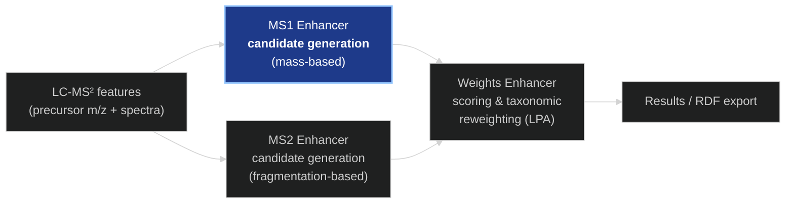
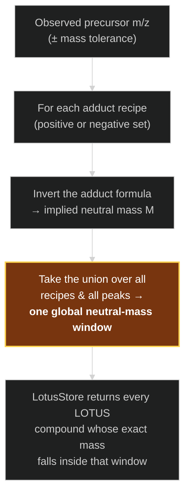
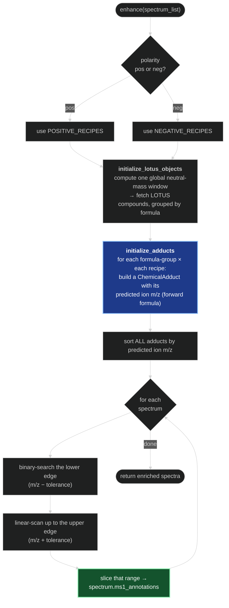
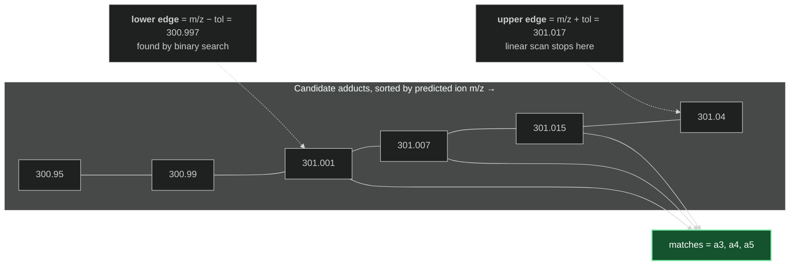
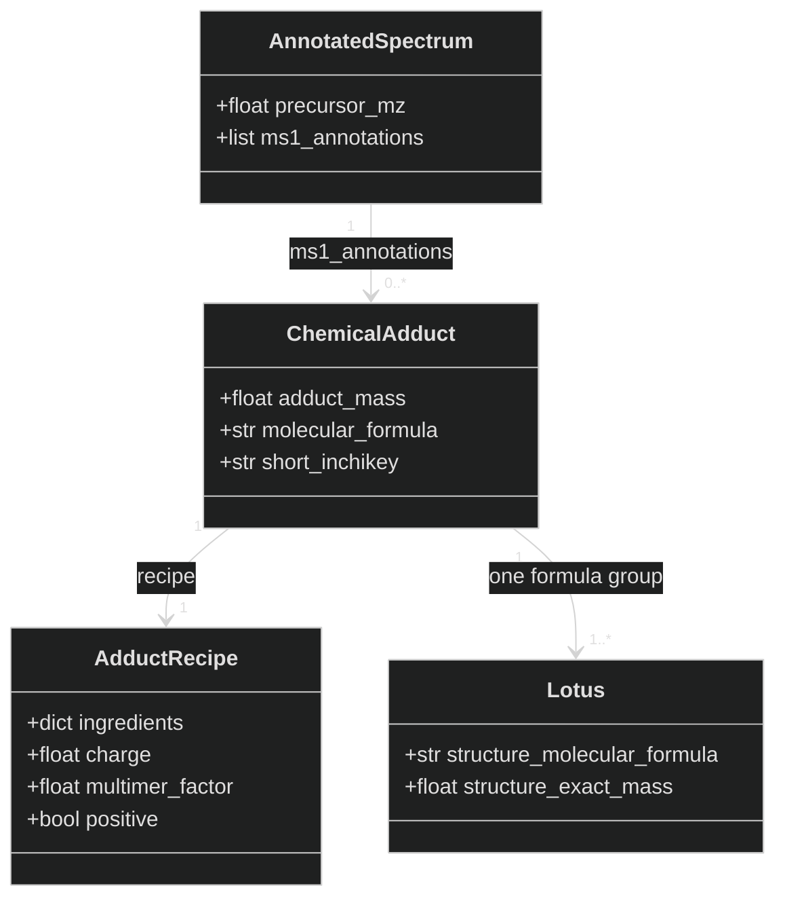
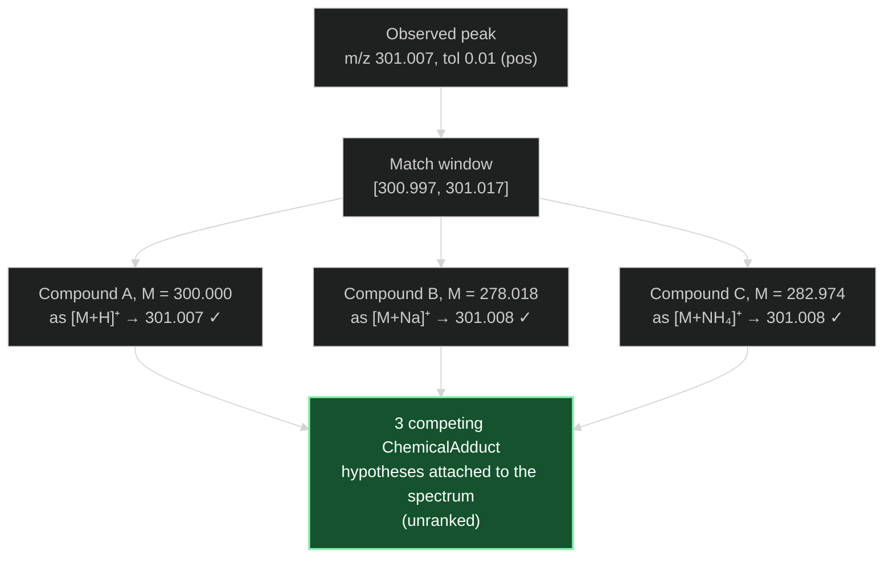

# The MS1 Enhancer — How It Works

*A conceptual walkthrough for presentations and onboarding.*

---

## 1. What problem does it solve?

When an LC-MS² instrument analyses a sample, it reports thousands of **features**. Each
feature is, in essence, a peak observed at a particular **precursor mass-to-charge ratio
(m/z)** together with a fragmentation spectrum. The instrument tells us *how heavy the
detected ion was*, but it does **not** tell us *which molecule* produced it.

The **MS1 enhancer** answers a focused question for every feature:

> *Given only the precursor m/z, which known natural products could plausibly have
> produced this peak?*

It does this by matching each observed precursor mass against a reference library of
natural products (the **LOTUS** database), accounting for every realistic way a molecule
can be turned into a charged ion inside the mass spectrometer. The output is a **shortlist
of candidate molecules** attached to each feature — a set of *competing hypotheses*.

Crucially, the MS1 enhancer **only generates candidates**. It does not decide which one is
correct, and it does not rank them. Ranking and scoring (using taxonomy and fragmentation
evidence) happen in **later** steps of the pipeline.



> **Note on a common misconception.** The module's own docstring claims the MS1 enhancer
> "computes its LPA scores," and the file imports a label-propagation function. That import
> is **not actually used** here. Label propagation and taxonomic reweighting belong to the
> **Weights enhancer**, not to MS1. Everything below describes MS1 as what it really is: a
> pure mass-based candidate generator.

---

## 2. Background: what is an adduct?

A neutral molecule **M** cannot be detected by a mass spectrometer directly — it must first
become an **ion** (carry an electrical charge). It acquires that charge in the ion source by
**gaining or losing small charged species**. Each such recipe is called an **adduct**.

Some everyday examples in **positive** mode:

| Adduct notation | What happens to the molecule | Observed ion mass |
|---|---|---|
| `[M+H]⁺`  | gains one proton (H⁺)              | `M + 1.00728` |
| `[M+Na]⁺` | gains one sodium ion               | `M + 22.98977` |
| `[M+NH₄]⁺`| gains one ammonium ion             | `M + 18.03383` |
| `[M+2H]²⁺`| gains two protons, charge 2        | `(M + 2·1.00728) / 2` |
| `[2M+H]⁺` | two copies of M cluster, gain H⁺   | `(2·M + 1.00728)` |

…and in **negative** mode molecules typically *lose* a proton (`[M−H]⁻`) or pick up an
anion such as chloride (`[M+Cl]⁻`).

Three consequences matter for this module:

1. **One molecule can appear at many different m/z values** — one per adduct form.
2. **The charge divides the mass**, so multiply-charged ions appear at *lower* m/z.
3. **Multimers** (`[2M+H]⁺`, `[3M−H]⁻`, …) cluster several copies of the molecule together,
   *multiplying* the mass.

In the code, each adduct form is an **`AdductRecipe`** — a small record of *which ions are
added/removed* (`ingredients`), the *charge*, and a *multimer factor*. The full menu lives
in [`adducts.py`](enpkg/monolith/enhancers/adducts.py): **40 positive recipes** and
**15 negative recipes**. The exact masses of the building blocks (proton, sodium, ammonium,
chloride, …) are tabulated in `ADDUCT_MASSES` in
[`adduct_class.py`](enpkg/monolith/data/ms1_data_classes/adduct_class.py).

The single formula that turns a neutral mass into an observed ion m/z (the **forward**
direction) is:

```
predicted ion m/z = (multimer_factor × M  +  Σ ingredientᵢ_mass × countᵢ) / charge
```

---

## 3. The core idea: work *backwards* from the peak

Here is the subtlety. We **observe** an m/z; we **want** the neutral molecule. The forward
formula goes the wrong way. So the MS1 enhancer reasons in reverse:

> *If this peak were a `[M+Na]⁺` ion, what neutral mass M would it imply? If it were
> `[M+H]⁺`, what M then? …and so on for every recipe.*

Algebraically inverting the forward formula gives the **inverse** direction:

```
implied neutral mass M = ((observed m/z ± tolerance) × charge − Σ ingredient masses) / multimer_factor
```

Because we don't know in advance which adduct form is correct, **every recipe yields a
different candidate neutral mass** for the same peak. Collecting these across all recipes
and all observed peaks defines the *band of neutral masses worth looking up* in the LOTUS
database.



This windowing is a **pre-filter**: instead of considering the entire LOTUS database, we
only pull the compounds whose neutral mass could *possibly* explain *some* observed peak
under *some* adduct form. The window is computed in
[`initialize_lotus_objects`](enpkg/monolith/enhancers/ms1_enhancer.py), and the database
lookup is `grouped_by_formula_for_mass_range` in
[`lotus_store.py`](enpkg/monolith/loaders/lotus_store.py).

---

## 4. Step-by-step: what `enhance()` actually does

The whole process runs in [`MS1Enhancer.enhance()`](enpkg/monolith/enhancers/ms1_enhancer.py).
It takes the list of spectra for one experiment and returns the same spectra, now carrying
candidate annotations.



**(a) Choose the adduct menu.** Depending on the experiment's polarity (`pos`/`neg`), the
enhancer selects either the positive or the negative recipe set.

**(b) Find the relevant LOTUS compounds.** Using the inverse reasoning from Section 3, it
computes the single neutral-mass window spanning every (recipe × precursor) combination,
then asks the `LotusStore` for all reference compounds in that window — already **grouped by
molecular formula**.

**(c) Build the candidate adducts.** For every formula-group and every recipe, it creates a
**`ChemicalAdduct`** and computes that adduct's **predicted ion m/z** (the forward formula).
A `ChemicalAdduct` is simply the pairing *"this reference compound, ionised this way."* All
of these predicted ions are then **sorted by mass**.

**(d) Match each peak.** For every spectrum, the enhancer defines a tolerance window
`[m/z − tol, m/z + tol]`, uses a **binary search** to jump to the first candidate at or above
the lower edge, then **scans upward** until it passes the upper edge. Everything in between is
copied into `spectrum.ms1_annotations`.



---

## 5. Cluster-aware dispatch (when the adduct graph ran)

If the **[MS1 adduct graph enhancer](MS1_GRAPH_ENHANCER.md)** ran first, every feature carries a
resolved **role** — `anchor` (a molecule's base ion), `satellite` (a non-base adduct of that same
molecule), or `singleton` (no adduct relationships). The MS1 enhancer uses these roles to avoid
redundant work:

- **Anchors and singletons** are the base-ion candidates, so they get the full LOTUS mass-search
  described above.
- **Satellites are not searched.** A `[M+Na]⁺` satellite is, by construction, the same molecule as
  its cluster's anchor — re-deriving candidates from its own mass would just reproduce the anchor's
  molecule under a shifted adduct. Instead each satellite **inherits its anchor's resolved
  molecule**: the anchor's base-form (`[M+H]⁺`/`[M−H]⁻`) formula groups, re-cast as `ChemicalAdduct`s
  under the satellite's own resolved form (`[M+Na]⁺`, `[M+K]⁺`, `[M+H−H₂O]⁺`, …). The anchor's
  *coincidental* non-base hypotheses are **not** propagated — only its resolved molecule.

The result is per-feature candidate sets that are **non-redundant and internally consistent**: an
adduct family points at one molecule, each feature carrying that molecule under the form it was
actually observed as. If the graph enhancer did **not** run (no roles stamped), the MS1 enhancer
falls back to searching every feature independently, exactly as before. See
`inherit_satellite_annotations` in
[`ms1_cluster_dispatch.py`](../enpkg/monolith/utils/ms1_cluster_dispatch.py).

---

## 6. Why is it built this way?

A few deliberate design choices make this both fast and correct:

- **Mass-window pre-filter** (Section 3): the LOTUS database is large. Building adducts for
  *every* compound would be wasteful, so the enhancer first narrows to the neutral-mass band
  that the observed peaks could actually reach.
- **Sort once, search many times.** All candidate adducts are sorted by predicted mass a
  single time. Each of the thousands of per-spectrum lookups is then a fast **binary search**
  plus a short scan, rather than a full pass over the candidate list.
- **Grouping by molecular formula.** Isomers (different molecules with the same formula)
  share the same exact mass, so MS1 — which sees *only* mass — fundamentally cannot tell them
  apart. They are grouped together, and a single match carries the **whole formula group** as
  one hypothesis.
- **Rebuilt every call.** The candidate adducts are regenerated on each `enhance()` call. An
  earlier version cached them, which was a bug in batch mode: a second experiment would reuse
  the first experiment's mass-windowed adducts even though its peaks cover a different m/z
  range. Rebuilding guarantees each experiment's window is honoured.

---

## 7. What comes out

After `enhance()`, each spectrum holds a list of **`ChemicalAdduct`** objects in its
`ms1_annotations` slot (defined on
[`AnnotatedSpectrum`](enpkg/monolith/data/annotated_spectra_class.py)). Each one bundles:

- the **reference compound(s)** — a LOTUS formula group (`lotus`), carrying structure,
  organism, and taxonomy metadata;
- the **adduct recipe** that was assumed (`recipe`);
- the **predicted ion mass** that matched the peak (`adduct_mass`).



*(`adduct_mass` holds the predicted ion m/z; a `ChemicalAdduct`'s `lotus` field is the whole
LOTUS formula group it represents.)*

These are **competing, unranked hypotheses**. A peak may legitimately match many of them at
once. Deciding which is most credible — by combining taxonomic plausibility and MS² evidence
— is the job of the downstream **Weights enhancer**, not of MS1.

---

## 8. A concrete worked example

Suppose we observe a peak at **m/z 301.007** in **positive** mode, with a tolerance of
**0.01 Da**, giving the match window **[300.997, 301.017]**.

Three *different* reference compounds, ionised three *different* ways, all land inside that
window (numbers computed directly from `ADDUCT_MASSES`):

| Reference compound | Neutral mass M | Assumed adduct | Predicted ion m/z |
|---|---|---|---|
| Compound **A** | 300.000 | `[M+H]⁺`  | 300.000 + 1.00728 = **301.007** ✓ |
| Compound **B** | 278.018 | `[M+Na]⁺` | 278.018 + 22.98977 = **301.008** ✓ |
| Compound **C** | 282.974 | `[M+NH₄]⁺`| 282.974 + 18.03383 = **301.008** ✓ |



A single peak, three plausible molecular stories. The MS1 enhancer's job is precisely to
**surface all of them** — never to choose between them. That deliberate restraint is what
keeps the candidate generation honest and lets the later, evidence-richer steps do the
ranking.

---

### One-line summary

> **The MS1 enhancer turns each observed precursor m/z into a shortlist of candidate natural
> products, by inverting every plausible ionisation recipe and matching the implied masses
> against the LOTUS database — generating competing hypotheses, not verdicts.**
