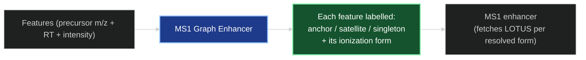
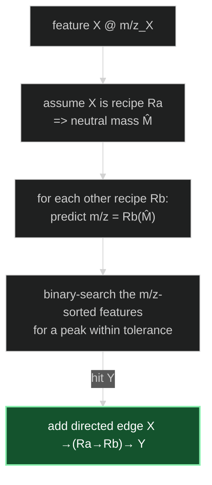
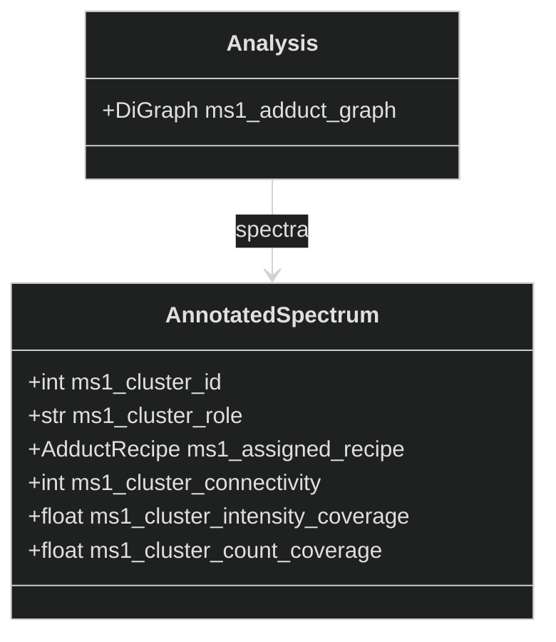

# The MS1 Graph Enhancer — How It Works

*A conceptual walkthrough for presentations and onboarding.*

> New stage that runs **before** [MS1_ENHANCER.md](MS1_ENHANCER.md). Where the MS1
> enhancer asks *"which molecules could this one peak be?"*, this stage first asks
> *"which of my peaks are actually the **same** molecule wearing different ionization
> clothes?"* — and pins down each molecule's true `[M+H]+`/`[M-H]-` form. It is a port
> of the graph algorithm from mzAdan (Stricker et al. 2021). See also
> [MS2_ENHANCER.md](MS2_ENHANCER.md), [SIRIUS_ENHANCER.md](SIRIUS_ENHANCER.md).

---

## 1. What problem does it solve?

A single molecule rarely shows up as one peak. In electrospray it scatters across
several **features** — `[M+H]+`, `[M+Na]+`, `[M+K]+`, a water-loss `[M+H-H2O]+`, a
dimer `[2M+H]+` — each detected as its own retention-time / m/z pair by the upstream
peak picker (MZmine). Treated in isolation, every one of these is handed to the MS1
enhancer as a fresh mystery, and the "true" protonated ion is easy to lose.

Concretely, this caused the bug in
[MS1_ADDUCT_RANKING_ISSUE.md](MS1_ADDUCT_RANKING_ISSUE.md): feature 543 (m/z 181.0495)
was ranked as a chemically absurd `[M+H+2Na]3+` of an unrelated ~496 Da compound,
because ranking leaned on *taxonomy/chemistry-class* similarity and had no notion of
adduct plausibility. The correct `[M+H]+` of C9H8O4 was pushed out.

The fix is structural: **relate the features to each other by mass first**, using no
taxonomy at all — exactly mzAdan's approach.

---

## 2. The core idea: relate peaks by mass, then let intensity vote

Every ionization recipe knows how to turn a neutral mass into an ion m/z
(`AdductRecipe.compute_adduct_mass`) and — now — back again
(`compute_neutral_mass`). So for any pair of features we can ask a purely arithmetic
question: *if feature X were recipe A, would feature Y sit exactly where recipe B of
the same molecule should be?* If yes, they are linked.

Do that across all features and you get a graph. Molecules become **connected
clusters**. Within each cluster, the real base ion is the one that, assumed to be
`[M+H]+`, coherently explains the most surrounding intensity. No organism, no
chemical class — just mass relationships and peak intensity.

The recipe set is deliberately **small** (mzAdan's key insight): three adducts
(NH₄/Na/K), two neutral losses (−H₂O/−NH₃), and low-order multimers, with
multiply-charged ions excluded. A big permissive list would manufacture coincidental
links between unrelated peaks — the very thing we're trying to avoid. See
[`graph_adducts.py`](../enpkg/monolith/enhancers/graph_adducts.py).

---

## 3. Building the graph — the edge test

Each edge remembers the two recipes that justified it (`source_recipe`,
`target_recipe`) and the mass error. Because we test *every* ordered pair of recipes
in both node orders, the paper's "bidirectional arrow" ambiguities and multi-step
chains fall out naturally. The tolerance reuses the MS1 window (0.01 Da ≈ the paper's
10 mmu).

An edge is also kept only if the two features **co-elute** — their retention times fall
within `rt_tolerance_min`. This gating is **always applied** (there is no toggle to
turn it off): mzAdan ran on RT-scoped pseudo-spectra (grouped upstream by CAMERA), but
ENPKG has no such upstream grouping, so relating a whole run's features by mass alone
fuses ~97% of them into one giant component. `rt_tolerance_min` has a sensible default
but is chromatography-dependent and should be tuned to the peak width. See
[MS1_GRAPH_SCALING_ANALYSIS.md](MS1_GRAPH_SCALING_ANALYSIS.md).

---

## 4. Clusters and the anchor — explained intensity

Weakly-connected components of the graph are the candidate clusters. To pick each
cluster's base ion, every member is trialled as `[M+H]+` and we measure how much
cluster intensity that hypothesis can *consistently* explain, via a constrained
graph walk:

> Starting from the candidate (committed to `[M+H]+`), we only follow an edge that
> was derived assuming the recipe we've already committed the current node to, and
> each step commits the neighbour to that edge's target recipe. This enforces one
> self-consistent chain of interpretations — a feature can't be read as `[M+H]+` in
> one step and `[M+H-H2O]+` in another.

A component almost never contains a single molecule, so we **peel** it: the member
that explains the most intensity becomes an **anchor** (`[M+H]+`) and everyone it
explains becomes a **satellite** with its resolved form; that whole molecule is removed
and the next-best anchor is taken from what remains, repeating until the component is
exhausted. One component therefore yields **several** molecules (see the detailed
walkthrough with diagrams in
[MS1_GRAPH_SCALING_ANALYSIS.md](MS1_GRAPH_SCALING_ANALYSIS.md) §6). A feature that ends
up explaining only itself is a **lone anchor** (a base ion with no detected adducts);
a feature with no adduct relationships at all is a **singleton**. Nothing is left in an
"unexplained" limbo.

Validated against the paper's own worked examples (see
[`test_ms1_adduct_graph.py`](../enpkg/tests/test_data/test_ms1_adduct_graph.py)): the
L-proline star (`116 [M+H]+` explains its `[M+K]+` and `[2M+H]+`, which explain only
themselves) and the creatine water-loss/adduct cluster both reproduce, and peeling
splits a multi-molecule component into one anchor per molecule.

> **Coverage note (v1).** The minimal recipe set resolves single-modification forms
> (one adduct swap, one neutral loss) and multimers. *Combination* forms such as
> `[M+Na-H2O]+` or `[M+2Na-H]+` are not in the set, so they surface as their own lone
> anchors/singletons rather than being folded into the cluster. Anchor selection — the
> part that fixes the bug — is unaffected. Extending coverage (mzAdan's "combinations"
> feature) is a documented follow-up.

---

## 5. Confidence indices (mzAdan's CGC / CIC / CCC)

Each cluster carries three descriptive indices, surfaced rather than thresholded:

| index | meaning |
|---|---|
| `cluster_connectivity` (CGC) | number of features in the cluster |
| `cluster_intensity_coverage` (CIC) | cluster intensity ÷ total analysis intensity |
| `cluster_count_coverage` (CCC) | cluster size ÷ total feature count |

Higher values mean a cluster explains more of the run and is more likely to be a real
analyte.

---

## 6. What comes out

The enhancer stamps each spectrum and attaches the graph to the analysis (nothing is
written to the knowledge graph at this stage).

Downstream, the MS1 enhancer reads `ms1_cluster_role` to decide how to fetch LOTUS
candidates: an **anchor** queries LOTUS once at its resolved neutral mass under the
base recipe; **satellites** reuse that same molecule under their own form; **lone
anchors and singletons** (no adduct corroboration) fall back to the broad search. (That
dispatch is the next increment.)

---

## 7. Why it's built this way

- **Mass first, taxonomy never.** Ranking that leaned on organism/chemistry-class
  similarity is exactly what produced the feature-543 bug. This stage uses only mass
  arithmetic and peak intensity, so an implausible high-charge adduct can't win by
  being taxonomically convenient.
- **A small recipe set on purpose.** A large permissive list maximises coincidental
  links; mzAdan (and this port) keep it minimal to keep the graph honest.
- **Explain, don't classify.** The anchor is whichever peak *accounts for* the most of
  its neighbourhood under one coherent story — a self-consistency criterion, not an
  external prior.
- **Pure, testable core.** The algorithm lives in
  [`ms1_adduct_graph.py`](../enpkg/monolith/utils/ms1_adduct_graph.py) with no config
  or database dependency, so it can be pinned to the paper's worked numbers.
- **Reported confidence, not silent cutoffs.** CGC/CIC/CCC describe each cluster's
  weight of evidence instead of hard-truncating candidates.

### One-line summary

> **The MS1 graph enhancer relates a run's features to each other by pure adduct-mass
> arithmetic, groups the ones that are the same molecule, and lets explained intensity
> — not taxonomy — name each molecule's true `[M+H]+`.**
