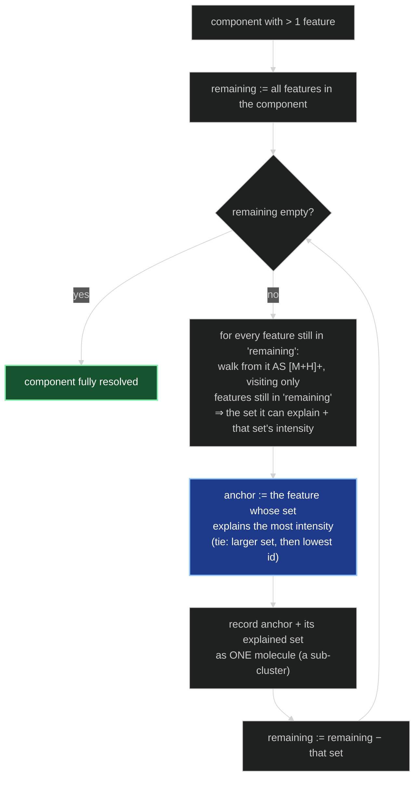
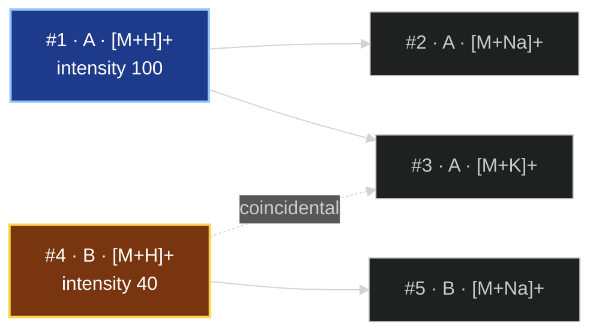

# MS1 adduct graph — scaling & correctness analysis on real data

*Written after a code review raised: "with real datasets this many nested loops
might take forever — what's the time complexity?" This document answers that, but
the benchmark it prompted uncovered two **correctness** problems that matter far
more than speed. Everything here is measured on the six real `*_quant.csv` files in
`gui_workspace/batch_input/`.*

---

## Key terms

A short glossary, since the analysis below leans on all of these. They fall into four
groups: the raw material, the graph built from it, the roles features end up with, and
the controls/measurements.

**The raw material**

- **Feature** — one peak detected by the upstream picker (MZmine): a single
  `(precursor m/z, retention time, intensity)` triple, and the *unit* of everything
  here. A feature is one row of a `*_quant.csv`. Crucially, **one molecule usually
  produces several features**, which is the whole reason this stage exists.
- **Adduct / ionization form / recipe** — the way a neutral molecule becomes a charged
  ion by gaining or losing small charged pieces: `[M+H]+` (a proton), `[M+Na]+`
  (a sodium), `[M+H−H₂O]+` (a proton, minus a water), `[2M+H]+` (a protonated dimer),
  and so on. In the code each is an `AdductRecipe`.
- **Base ion** — the reference form we ultimately want to pin down for each molecule:
  `[M+H]+` in positive mode (`[M−H]−` in negative). Everything else is "some other
  adduct of the same molecule".
- **Recipe set** — the small, fixed list of ionization forms the graph is allowed to
  consider (8 in positive mode). Deliberately minimal, to avoid coincidental matches.

**The graph**

- **Edge** — a directed link `X → Y` meaning *"if X is recipe A, then Y is recipe B of
  the same neutral molecule"*, holding to within the mass tolerance. Purely arithmetic;
  no chemistry-class or taxonomy involved.
- **Component** (weakly-connected component) — a maximal group of features reachable
  from one another through edges when you **ignore edge direction**. *Ideally* a
  component is one molecule and its adducts; in real data it is usually a bag of many
  co-eluting molecules stuck together by real *and* coincidental edges.
- **Constrained walk / (explained) reachability** — starting from one feature assumed to
  be `[M+H]+`, the set of features you can reach by following **only** edges consistent
  with the recipe already committed to each node. This is how a base-ion hypothesis
  decides which other features it "accounts for".
- **Explained intensity** — the summed `intensity` of the features a given hypothesis
  can explain. The main ranking criterion (an abundant real `[M+H]+` explains a lot).

**The roles a feature ends up with**

- **Anchor** — the feature chosen as a molecule's true **base ion**: the one that, taken
  as `[M+H]+`, explains the most intensity in its cluster.
- **Satellite** — a feature resolved as a **non-base adduct of an anchor** (its
  `[M+Na]+`, `[M+K]+`, water-loss, dimer, …). These are the redundant re-detections we
  want to fold in rather than treat as separate compounds.
- **Cluster / sub-cluster** — a **resolved molecule**: one anchor plus its satellites.
  (A *component* is raw connectivity; a *cluster* is what a component resolves into after
  ranking. With peeling, one component can yield many sub-clusters.)
- **Lone anchor** — an anchor that explains only itself: a `[M+H]+` with no detected
  adducts. Epistemically a singleton that merely happened to sit inside a component.
- **Unexplained** — a feature inside a multi-feature component that the chosen anchor(s)
  could not account for. This "limbo" state is the defect §5–§6 are about; peeling
  removes it.
- **Singleton** — a feature with **no** adduct relationships at all (its own size-1
  component). A genuinely isolated peak.

**Controls & measurements**

- **RT gating / co-elution filter** — only allowing an edge between two features whose
  retention times differ by less than `rt_tolerance_min`. The fix for the §4 hairball.
- **Peeling** — extracting **multiple** anchors from one component: take the best anchor
  and its satellites, remove them, repeat on what's left (detailed in §6).
- **CGC / CIC / CCC** — mzAdan's three cluster-confidence indices: **connectivity**
  (features per cluster), **intensity coverage** (cluster intensity ÷ run intensity),
  and **count coverage** (cluster size ÷ run feature count). Reported, not thresholded.

---

## 1. TL;DR

- **Speed is not a problem.** The graph build is `O(n · R² · log n)` with `R` a fixed
  constant (8 recipes), i.e. effectively `O(n log n)`. On the largest file (5,263
  features) it runs in well under a second once retention time is used.
- **But the algorithm as written barely works on real data**, for two reasons the
  benchmark exposed:
  1. Running the graph **globally over the whole run** (our approved "mass-first,
     RT-optional" default) collapses ~97% of every dataset into a single giant
     hairball. Useless.
  2. Even after fixing that with retention-time gating, the current
     **one-anchor-per-component** rule leaves ~25–45% of features stranded as
     "unexplained".
- **Two changes fix both** and are validated below: **(a) make RT gating always-on**
  (the `use_rt_filter` toggle is removed; `rt_tolerance_min` keeps a tunable default),
  and **(b) extract multiple anchors per component by "peeling."** With both, ~18–23%
  of all features get resolved as redundant adducts, adduct families come out at a
  chemically sane 5–9 ions, and nothing is left in limbo.
- **Side finding (data integrity):** `actea_H2O-1_pos_quant.csv` has 3 rows whose
  retention time was silently corrupted by Excel/OneDrive's French locale
  (`6.02` → `"juin.02"`). See §7.

---

## 2. The question: time complexity of `build_adduct_graph`

The reviewed loop nest is, per feature `X`: for each recipe `Ra`, for each recipe
`Rb`, do one binary search into the m/z-sorted feature list and iterate whatever
falls in the tolerance window.

```
cost = n            (features)
     × R            (recipe_a)
     × R            (recipe_b)
     × ( log n      (the bisect)
       + k )        (features inside the ±tol window — the inner loop)
```

- `n` = number of features (2,000–5,000 here).
- `R` = size of the graph recipe set = **8** (positive mode). `R²` = 64 is a **fixed
  constant** — it does not grow with the data.
- `k` = how many features land within ±0.01 Da of a *predicted* partner m/z. For real
  spectra spread over hundreds of Da this is almost always 0 or 1.

So **build = `O(n · R² · log n + E)`**, where `E` is the number of edges actually
created. Because `R` is constant, this is **`O(n log n)`** in practice. The only path
to `O(n²)` is the pathological case where every feature shares one m/z — which never
happens.

There is a second, subtler cost the review didn't ask about but which turns out to
dominate: **ranking**. For each cluster we currently try every member as the base
ion, and each trial walks the cluster's edges. That is `O(Σ_c size_c · edges_c)`. For
a *small* cluster this is nothing; for a **giant** cluster it degenerates toward
`O(n · E)`. This is exactly why the "no RT filter" runs below are not just wrong but
also the *slowest*.

---

## 3. The datasets

Six positive-mode *Actaea* extracts (three solvents × two replicates), taken straight
from `gui_workspace/batch_input/`:

| dataset | features | m/z range (Da) | RT range (min) |
|---|--:|---|---|
| actea_EtOAc-1_pos | 2,315 | 80 – 1,076 | 0.76 – 7.96 |
| actea_EtOAc-2_pos | 2,177 | 80 – 1,076 | 0.76 – 7.96 |
| actea_H2O-1_pos | 3,810¹ | 80 – 1,170 | 0.75 – 7.96 |
| actea_H2O-2_pos | 3,585 | 80 – 1,170 | 0.75 – 7.96 |
| actea_MeOH-1_pos | 5,263 | 80 – 1,188 | 0.33 – 7.97 |
| actea_MeOH-2_pos | 4,906 | 80 – 1,148 | 0.75 – 7.95 |

¹ 3 rows skipped as unparseable — see §7.

These are realistic sizes: a few thousand features per run, each a single precursor
m/z. Exactly the regime the reviewer worried about.

---

## 4. Finding 1 — running the graph *globally* is a hairball

Our approved scoping ran one mass-only graph over **all** features in a run, with RT
as an optional filter that defaults **off**. Here is what that produces (no RT
filter, ±0.01 Da):

| dataset | time | edges | components | **biggest component** | **% unexplained** |
|---|--:|--:|--:|--:|--:|
| EtOAc-1 | 0.66 s | 32,048 | 9 | 2,255 / 2,315 | 96% |
| EtOAc-2 | 0.63 s | 28,614 | 8 | 2,125 / 2,177 | 96% |
| H2O-1 | 2.16 s | 82,423 | 12 | 3,706 / 3,810 | 96% |
| H2O-2 | 1.69 s | 72,360 | 6 | 3,498 / 3,585 | 97% |
| MeOH-1 | 4.82 s | 150,292 | 21 | 5,125 / 5,263 | 97% |
| MeOH-2 | 4.02 s | 132,740 | 15 | 4,791 / 4,906 | 97% |

**Why this happens.** With thousands of features spread over ~1,000 Da and a ±0.01 Da
window, the chance that *some* pair of unrelated features differs by *some* adduct
delta (Na–H = 21.98, K–H = 37.96, −H₂O = 18.01, a dimer gap, …) becomes near-certain.
Every such coincidence adds an edge, and the edges chain: the entire run fuses into
**one connected blob** of ~97% of the features. The constrained walk then correctly
refuses to invent identities inside that blob (good — no false anchors), so almost
everything is labelled "unexplained." The graph has told us nothing.

This is *not* a bug in the walk; it is the direct consequence of relating peaks that
never co-eluted. mzAdan never hit this because it ran on **one RT-scoped
pseudo-spectrum at a time** (CAMERA grouped features by retention time upstream); it
never related an entire run's peak list at once. We have no such upstream grouping,
so we must supply the retention-time constraint ourselves.

**Implication:** the "mass-first, RT-optional (off)" default from the plan
([open question #1](../.claude/plans/ok-now-let-s-build-immutable-pancake.md)) is
wrong for real data. RT gating has to be **on**.

---

## 5. Finding 2 — RT gating helps, but one-anchor-per-component still strands molecules

Turning the RT co-elution filter on (an edge survives only if the two features elute
within a tolerance) breaks the blob apart. Current algorithm, `rt_tol = 0.05` min:

| dataset | time | edges | clusters | biggest | anchors | satellites | **unexplained** | singletons |
|---|--:|--:|--:|--:|--:|--:|--:|--:|
| EtOAc-1 | 0.37 s | 2,280 | 403 | 114 | 403 | 371 | 579 | 962 |
| EtOAc-2 | 0.32 s | 2,125 | 383 | 95 | 383 | 346 | 530 | 918 |
| H2O-1 | 0.54 s | 6,189 | 428 | 1,101 | 428 | 355 | 1,674 | 1,353 |
| H2O-2 | 0.50 s | 5,648 | 403 | 966 | 403 | 350 | 1,524 | 1,308 |
| MeOH-1 | 0.94 s | 7,027 | 764 | 671 | 764 | 602 | 1,920 | 1,977 |
| MeOH-2 | 0.67 s | 6,430 | 729 | 437 | 729 | 575 | 1,758 | 1,844 |

Better — real clusters appear — but two problems remain:

1. **Big components persist**, especially for the water extracts, whose early
   ("void-volume") region has hundreds of genuinely co-eluting compounds. H2O-1 still
   has a 1,101-feature component at `rt_tol = 0.05`.
2. **`unexplained` is huge** (579–1,920). This is the real defect: **each connected
   component yields exactly one anchor.** A 114-feature co-elution component almost
   never contains one molecule — it contains *dozens* of co-eluting molecules, each
   with its own `[M+H]+`. Picking a single anchor and abandoning the other ~110 to
   "unexplained" throws away most of the answer.

mzAdan does not do this — it extracts *multiple* `[M+H]+` candidates per cluster. We
need to as well.

---

## 6. The fix — RT gating + multi-anchor "peeling"

**Peeling:** within a component, pick the best anchor (most explained intensity),
record it and the ions it explains as one molecule, **remove them**, then pick the
next-best anchor from what remains, and repeat until the component is exhausted. Each
pass pulls out one molecule; spurious cross-molecule edges are ignored because the
constrained walk only follows recipe-consistent chains.

### How peeling works, step by step

Recall the starting point: after RT-gated graph building, one connected **component**
usually bundles *several* co-eluting molecules — linked partly by real adduct edges and
partly by coincidental ones. Peeling extracts them one at a time, strongest first.



In words, per component:

1. `remaining` starts as every feature in the component.
2. **Score every remaining feature** as a base-ion hypothesis: run the constrained
   walk from it (as `[M+H]+`), but allow the walk to step **only onto features that are
   still in `remaining`**. That yields the set of ions it would explain and their summed
   intensity.
3. **The highest-explained-intensity feature wins** this pass and becomes an **anchor**;
   it plus everything it explained is emitted as one molecule (a sub-cluster). Ties break
   on set size, then lowest feature id (deterministic).
4. **Remove that whole set from `remaining`** and loop. The next pass finds the next
   molecule's base ion among the leftovers.
5. When a feature's turn comes and it can explain only itself, it becomes a **lone
   anchor** (a `[M+H]+` with no detected adducts — effectively a singleton inside the
   component).

### Worked example — two molecules in one component

Two co-eluting compounds A and B, plus one **coincidental** edge that (via undirected
connectivity) dragged them into the same component:



- **Current one-anchor rule:** picks `#1` (most intensity), explains `{1,2,3}`. Features
  `#4, #5` are dropped as **unexplained**. → 1 molecule found, 2 features stranded.
- **Peeling:**
  - *Pass 1* — every feature is trialled; `#1` explains `{1,2,3}` with the most
    intensity, so it anchors molecule **A**. `remaining` becomes `{4,5}`.
  - *Pass 2* — among `{4,5}`, `#4` as `[M+H]+` explains `{4,5}`, anchoring molecule
    **B**. `remaining` becomes empty.
  - → **both** molecules resolved, nothing stranded.

Notice the coincidental edge `#4 ⇢ #3` never caused a false merge. During pass 1, the
walk from `#1` reaches `#3` and commits it to `[M+K]+`; the coincidental edge points
*into* `#3`, not out of it, so it is never traversed, and `#4` stays untouched for
pass 2.

### Three things that keep peeling honest

- **Restricting the walk to `remaining`** is what prevents double-counting: once
  molecule A has claimed `#2 [M+Na]+`, no later anchor can also claim it.
- **Greedy, highest-intensity-first** is mzAdan's own disambiguation rule — the true
  `[M+H]+` of an abundant compound explains the most intensity, so it claims its own
  adducts before any weaker or spurious hypothesis can.
- **Recipe-consistency does most of the filtering.** A coincidental edge is only ever
  followed if its `source_recipe` happens to match the recipe the walk has already
  committed the current node to. That is why, even inside a hairy component, the adduct
  families that come out stay at a chemically sane **5–9 ions** (measured, §6 table)
  rather than ballooning. It is a strong heuristic, **not a guarantee**: if a
  coincidental edge's source recipe *does* line up mid-walk, a wrong ion can be pulled
  in — the same "convolved-spectrum" ambiguity mzAdan flags and resolves
  chromatographically "if needed."

### Cost

Per component of `m` features and `e` edges, the worst case is `O(m² · e)`: up to `m`
peel passes, each re-scoring up to `m` features with an `O(e)` walk. This is exactly
why **retention-time gating matters twice** — it not only improves the result but keeps
`m` (component size) small, so peeling stays fast. The measured worst case across all
six real files was **2.4 s** (H2O-1 at the wide `rt_tol = 0.05`); tightening to `0.02`
dropped it to `0.35 s`.

I prototyped peeling and measured the **meaningful** outcome — not raw "anchor"
counts (a lone `[M+H]+` with no detected adducts is really a singleton), but how many
sub-clusters are genuine **multi-ion adduct families** and how many features are
thereby resolved as **redundant adducts**. `rt_tol = 0.05` min:

| dataset | multi-ion molecules | **features resolved as adducts** | biggest family | lone `[M+H]+` | true singletons | % of run resolved as adduct | time |
|---|--:|--:|--:|--:|--:|--:|--:|
| EtOAc-1 | 385 | 481 | 5 | 487 | 962 | 20.8% | 0.05 s |
| EtOAc-2 | 357 | 444 | 5 | 458 | 918 | 20.4% | 0.04 s |
| H2O-1 | 583 | 882 | 9 | 992 | 1,353 | 23.1% | 2.44 s |
| H2O-2 | 539 | 834 | 9 | 904 | 1,308 | 23.3% | 1.82 s |
| MeOH-1 | 754 | 1,074 | 7 | 1,458 | 1,977 | 20.4% | 1.00 s |
| MeOH-2 | 711 | 1,010 | 8 | 1,341 | 1,844 | 20.6% | 0.57 s |

What this says, and why it matters:

- **`unexplained` goes to zero.** Every feature is now either the base ion of a
  molecule, a resolved adduct of one, a lone `[M+H]+`, or a true singleton. Nothing is
  stranded.
- **~1 in 5 features is a redundant adduct** of another feature. That is a large
  **de-duplication** win: those ~20% would otherwise each be handed to LOTUS as a
  separate mystery compound and inflate the annotation count. This is precisely the
  problem the whole exercise set out to solve.
- **Adduct families come out at 5–9 ions** — chemically sane (`[M+H]+`, `[M+Na]+`,
  `[M+K]+`, `[M+NH4]+`, `[M+H−H₂O]+`, `[2M+H]+`, …). Peeling did **not** explode into
  giant false families; the recipe-consistency constraint keeps them honest.
- Compared with the current one-anchor rule (§5), peeling resolves **~30% more
  adducts** (e.g. EtOAc-1: 481 vs 371) *and* eliminates the unexplained pile.

### The retention-time tolerance is a real knob

Tightening to `rt_tol = 0.02` min trades resolution for speed and safety:

| dataset | features resolved as adducts @0.05 | @0.02 | peeling time @0.05 | @0.02 |
|---|--:|--:|--:|--:|
| EtOAc-1 | 481 (20.8%) | 428 (18.5%) | 0.05 s | 0.03 s |
| H2O-1 | 882 (23.1%) | 707 (18.6%) | **2.44 s** | 0.35 s |
| H2O-2 | 834 (23.3%) | 666 (18.6%) | 1.82 s | 0.29 s |
| MeOH-1 | 1,074 (20.4%) | 881 (16.7%) | 1.00 s | 0.33 s |
| MeOH-2 | 1,010 (20.6%) | 822 (16.8%) | 0.57 s | 0.20 s |

- A **wider** window (0.05) relates more true adducts (real adducts can drift slightly
  in RT) but risks merging co-eluting neighbours and makes peeling slower on
  void-volume components (H2O-1: 2.4 s — still fine, but it's the worst case).
- A **tighter** window (0.02) is uniformly fast and safer against false merges, at the
  cost of missing ~15–25% of the adduct relationships.
- `0.02–0.05 min` (≈1–3 s) is the sensible range; it should be **configurable**, and
  the right default depends on the chromatography (peak width). For these ~8-minute
  gradients, something around **0.03 min** looks like a good balance.

---

## 7. Side finding — locale corruption in a source CSV

While loading the files, three rows of **`actea_H2O-1_pos_quant.csv`** (rows 3306–3308,
feature ids 3425–3427) failed to parse: their **retention-time** cell held the string
`"juin.02"` instead of a number. This is Excel/OneDrive's French locale
auto-converting `6.02` into the date "2 June" and re-serialising it as a month name.

Implications:
- These three features would be **silently dropped or crash** the loader depending on
  how robust it is. The current production loader path should be checked.
- More importantly, it means at least one quant file **has been opened and re-saved by
  a spreadsheet**, which can also silently alter m/z precision, strip trailing
  columns, or reformat numbers. Worth verifying the pipeline reads the **original
  MZmine export**, not a spreadsheet round-trip, and/or adding a numeric-validation
  guard on load.

---

## 8. Implications & recommended changes

1. **Make RT gating always-on** in `MS1GraphEnhancerConfig` — the `use_rt_filter`
   toggle is removed and `rt_tolerance_min` is always applied (keeping a tunable
   default). Global mass-only is not viable at real feature counts (§4). *(Revises the
   plan's open question #1.)* **[done]**
2. **Add multi-anchor peeling** so a component yields one molecule per real base ion
   instead of one anchor total (§6). Implemented in `resolve_clusters` / `_peel_component`
   (with an `allowed`-restricted walk); this is the change that makes the graph actually
   resolve adducts. Re-run on all six files with the production code confirms the
   prototype numbers: **unexplained → 0**, ~18–23% of features resolved as adducts,
   families a sane 5–9 ions. **[done]**
3. **Expose `rt_tolerance_min`** (already a config field) prominently; default around
   **0.02–0.03 min**, documented as chromatography-dependent.
4. **Optional safety valve:** cap or specially handle very large components (the
   void-volume blob) so peeling's worst case stays bounded even at a wide RT window.
5. **Harden CSV loading** against the locale corruption in §7 (skip-with-warning or
   validate), and check whether the real quant exports are being spreadsheet-mangled
   upstream.

None of these change the asymptotic complexity. Build stays `O(n log n)`; peeling adds
`O(Σ_c size_c² · edges_c)` per component, which RT gating keeps small — the measured
worst case across all six real files was 2.4 s.

### One-line takeaway

> The nested loops are cheap; the real lesson is that relating a whole run's peaks by
> mass alone fuses everything into one blob, and picking a single anchor per cluster
> throws most of the answer away — **retention-time gating plus multi-anchor peeling**
> turns the graph into something that resolves ~1-in-5 features as redundant adducts
> with chemically sensible families, in ~1 second.
