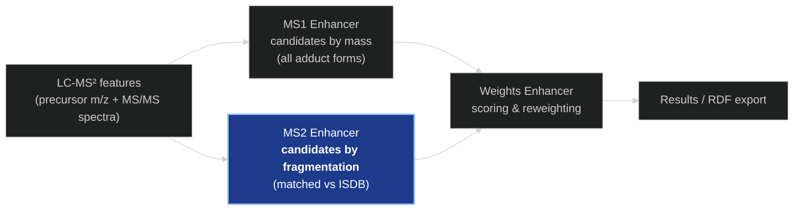
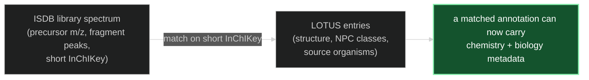
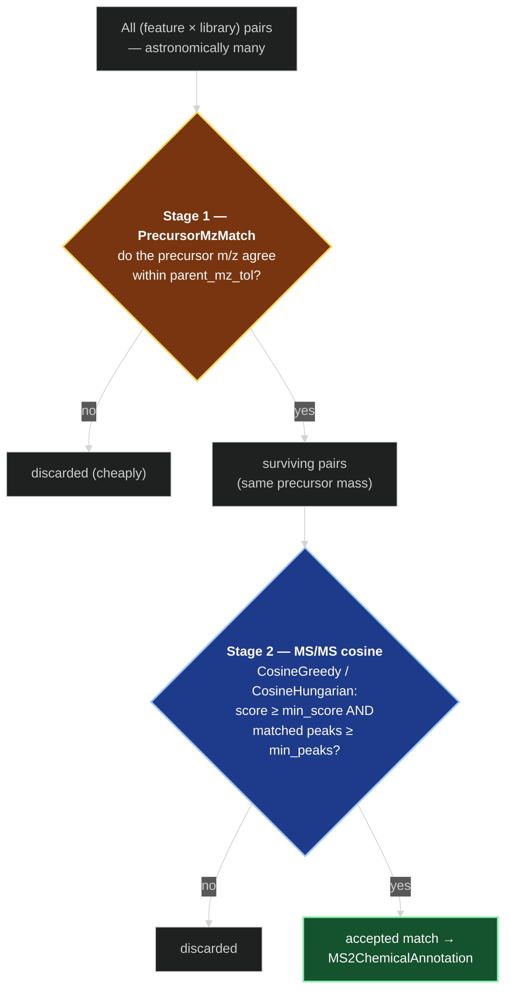
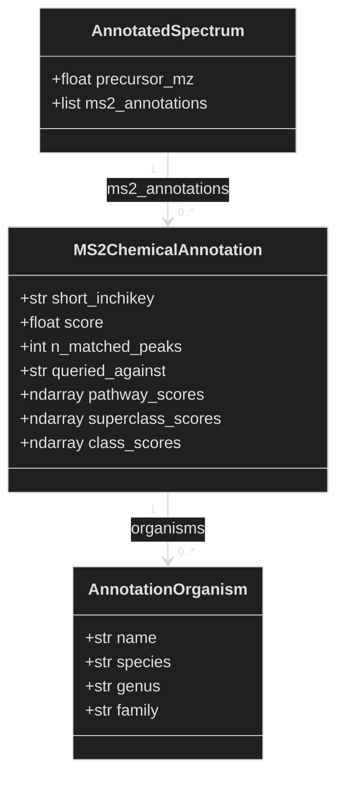
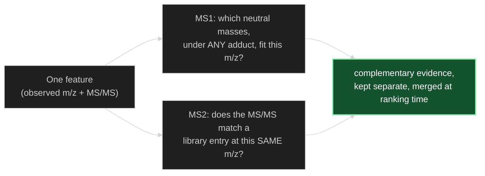

# The MS2 Enhancer — How It Works

*A conceptual walkthrough for presentations and onboarding.*

> Companion to [MS1_ENHANCER.md](MS1_ENHANCER.md). Where the MS1 enhancer generates
> candidates from **mass alone**, the MS2 enhancer asks a stricter question using the
> molecule's **fragmentation fingerprint**.

---

## 1. What problem does it solve?

A precursor mass narrows down *what a molecule could be*, but many different molecules share
the same mass. To actually **identify** a compound, mass spectrometrists look at how it
**fragments**: when the molecule is broken apart in the instrument (MS/MS), the pattern of
fragment masses and intensities is a structural fingerprint.

The **MS2 enhancer** answers:

> *Does this feature's fragmentation spectrum match the (predicted) spectrum of a known
> natural product?*

It compares every experimental MS/MS spectrum against a large reference library of
**in-silico predicted spectra** — the **ISDB** (In-Silico DataBase) built from the LOTUS
natural-products collection — and records the good matches as candidate identifications.

Like MS1, this is still **candidate generation** — it proposes identities and a match score,
but it does not produce the final ranking. The difference is the *evidence*: MS2 candidates
are backed by fragmentation agreement, making them higher-confidence than mass-only matches.

---

## 2. The reference library: ISDB

The [**ISDB**](https://oolonek.github.io/ISDB/) is a library of MS/MS spectra that were
**predicted computationally** for known natural-product structures (rather than measured on
standards). Each library entry carries:

- a **precursor m/z** and the **adduct form** it was predicted for (typically `[M+H]⁺` in
  positive mode, `[M-H]⁻` in negative mode);
- the predicted **fragment peaks** (m/z + intensities);
- a **short InChIKey** identifying the structure.

In this pipeline the library lives in a DuckDB table (`spectral_library`) and is loaded as a
list of `matchms.Spectrum` objects. Crucially, each library spectrum is **linked back to
LOTUS** by its short InChIKey, so a match can inherit the structure's chemical classification
and its source organisms:

---

## 3. The heart of it: two-stage matching

Comparing every experimental spectrum against every library spectrum with a full
fragmentation comparison would be enormously expensive. So the MS2 enhancer uses a **funnel**:
a cheap test first removes almost all pairs, and the expensive test runs only on the few that
survive.

**Stage 1 — precursor m/z agreement (cheap).** The `PrecursorMzMatch` filter keeps only the
(feature, library-entry) pairs whose **precursor masses agree** within the parent tolerance
(`parent_mz_tol`, default 0.01 Da). No fragments are compared yet — this is just a fast
gate that throws away the overwhelming majority of pairs. It runs in batch over a chunk of
features against the whole library at once.

**Stage 2 — fragmentation cosine (expensive).** For each surviving pair, the enhancer computes
the actual **MS/MS cosine similarity** (`CosineGreedy` or `CosineHungarian`), which aligns the
two peak lists within the fragment tolerance (`msms_mz_tol`) and measures how much their
fragmentation patterns overlap. A pair is accepted as a match only if it clears **both**
thresholds:

- cosine score above `min_score` (default 0.20), **and**
- number of matched peaks above `min_peaks` (default 6).

Features are processed in **chunks** (default 1000) against the full library so memory stays
bounded regardless of dataset size.

---

## 4. Adduct gating — only annotate base-ion features

Before the funnel runs, the enhancer decides **which features are even worth matching**, using
the cluster roles the [MS1 graph enhancer](MS1_GRAPH_ENHANCER.md) stamped on each feature.

The reason is the same one §6 spells out: the ISDB stores **base ions** (`[M+H]⁺` in positive
mode, `[M-H]⁻` in negative). A feature the graph resolved as a *non-base* adduct — a
**satellite** like `[M+Na]⁺`/`[M+K]⁺` — has a precursor m/z that will never line up with a
base-ion library entry, so it could only ever be discarded at Stage 1 (or, rarely, produce a
spurious cross-adduct match). Its molecule's base ion is already represented by the cluster's
**anchor**. Skipping satellites up front saves that wasted Stage-1 work and removes the
coincidental-match risk.

Which features pass the gate is controlled by `ms2_adduct_filter` (on the shared
`MSEnhancerConfig`, read only by MS2):

| `ms2_adduct_filter` | annotates | skips | rationale |
|---|---|---|---|
| `"non_satellite"` **(default)** | anchors + singletons | resolved satellites | drop the redundant `[M+Na]⁺`/`[M+K]⁺` re-detections; keep every base-ion candidate |
| `"base_only"` | anchors only | satellites + singletons | strictest — only features *resolved* as the base ion |
| `"all"` | every feature | nothing | legacy behaviour (no gating) |

A **singleton** is a feature with no detected adduct relationships; its ionization form is
unknown, but it may well be an `[M+H]⁺` whose Na/K siblings fell below detection. The default
therefore keeps singletons (they are a large fraction of a run) and skips only features
*positively* resolved as another adduct. `"base_only"` is available when you want to match
strictly the confirmed base ions.

This gate depends on the `ms1_graph` block running **before** `ms2` (it does, by registry
order). If no cluster roles are present — the graph block was not selected — gating is
impossible, so **every feature is annotated** and a warning is logged; MS2 behaves exactly as
it did before this feature existed.

---

## 5. What comes out

Every accepted match becomes an **`MS2ChemicalAnnotation`** appended to the feature's
`ms2_annotations` list. It deliberately carries only what downstream steps need — not the full
matched structure — namely:

- the matched structure's **short InChIKey**,
- the **cosine score** and **number of matched peaks**,
- the structure's **NPC classification arrays** (pathway / superclass / class), and
- the list of **source organisms** (for taxonomic reweighting later).

As with MS1, these are **competing, scored-but-not-yet-ranked** hypotheses. A single feature
may collect several MS2 annotations.

---

## 6. MS1 vs MS2 — the channel boundary

This is the most important conceptual point, and a common source of confusion. The two
enhancers are **independent channels** that never share their candidate machinery:

| | **MS1 enhancer** | **MS2 enhancer** |
|---|---|---|
| Evidence used | precursor **mass only** | precursor mass **+ fragmentation** |
| Matching key | inverts **all adduct recipes** to neutral mass | compares the **stored library precursor m/z** directly |
| Adduct coverage | broad — `[M+H]⁺`, `[M+Na]⁺`, `[M+NH₄]⁺`, multimers, … | restricted to whatever form **ISDB stored** (usually `[M+H]⁺`/`[M-H]⁻`) |
| Confidence | low (many isobaric candidates) | higher (fragmentation must agree) |
| Output slot | `spectrum.ms1_annotations` | `spectrum.ms2_annotations` |

A practical consequence worth stating in a talk: because Stage 1 compares the **observed
precursor m/z** against the **library's stored precursor m/z**, MS2 will only annotate a
feature when it was observed in the **same adduct form the ISDB provides**. A feature seen as
`[M+Na]⁺` will *not* match an ISDB `[M+H]⁺` entry — their precursor m/z differ by ~21.98 Da,
far beyond the tolerance. This is by design, not a defect: the **MS1 channel** is what covers
the broader adduct space, while **MS2** adds fragmentation confidence within the library's
adduct form. The two are complementary.

> **Caveat — MS2 prunes MS1 at export (RDF coupling).** In the RDF serializer the two channels
> are *coupled* on features that carry an MS2 match: only the MS1 adducts whose candidate
> structures include an MS2-identified compound (shared 2D InChIKey) are kept, each linked from
> the MS2 annotation via `enpkg:hasCorrespondingAdduct`; the mass-coincidence adducts are dropped.
> A consequence to expect: **if an MS2 match's compound appears in *none* of the feature's MS1
> adduct groups, that feature is serialized with no MS1 adduct hypotheses at all** — the MS2
> annotation stands alone. This is **intended**, not a data-loss bug: MS1 here is mass-only
> corroboration for the fragmentation-confirmed identity, so an MS1 set with nothing to
> corroborate carries no information worth emitting. Features with **no** MS2 keep their full
> top-k MS1 adducts unchanged. (See [MS2_MS1_ADDUCT_COUPLING_PLAN.md](MS2_MS1_ADDUCT_COUPLING_PLAN.md).)

---

## 7. Why it's built this way

- **Adduct gating first.** Spectral libraries are base-ion only, so matching resolved non-base
  adducts is wasted work; using the MS1 graph's roles to skip them shrinks the candidate set
  before the funnel even starts, with a safe fallback when the graph did not run.
- **Two-stage funnel.** Fragmentation cosine is the dominant cost; gating on precursor mass
  first means it runs on a tiny fraction of pairs instead of the full cross-product.
- **Chunking.** Processing features in fixed-size chunks against the whole library keeps peak
  memory bounded, so the same code scales from a toy dataset to a full campaign.
- **Lazy library + LOTUS linking.** The expensive build (materialising the LOTUS list and
  attaching it to library spectra by short InChIKey) is deferred to the first `enhance()`
  call, so in batch mode only the first experiment pays for it; later experiments reuse it.
- **Slim annotations.** Each `MS2ChemicalAnnotation` keeps just the InChIKey, score, NPC
  arrays, and organisms — not full structure objects — so thousands of them stay light.

---

### One-line summary

> **The MS2 enhancer confirms identities by fragmentation: a cheap precursor-mass gate
> followed by an MS/MS cosine comparison against the ISDB library, yielding scored candidate
> annotations — higher-confidence than MS1, but limited to the adduct form the library
> stores.**
