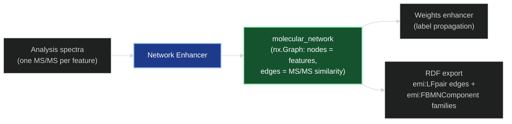
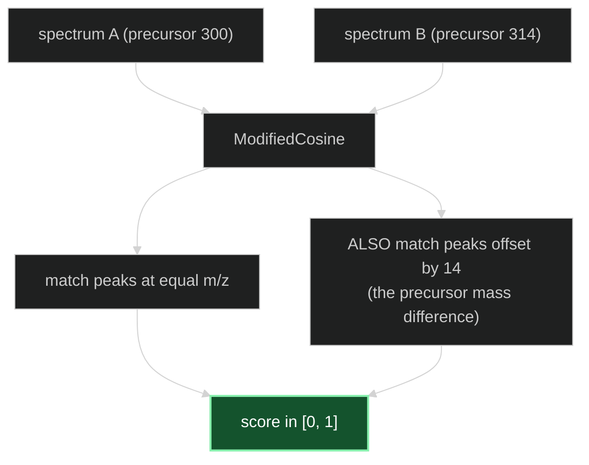
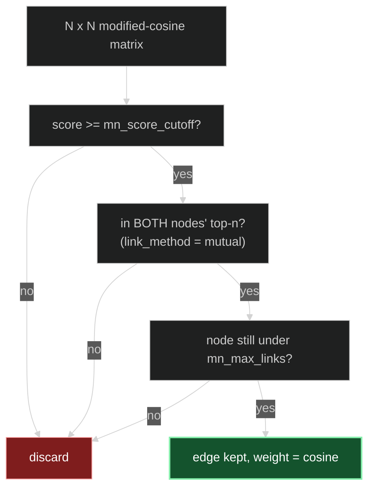
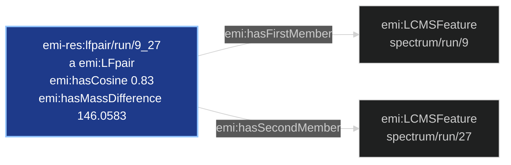
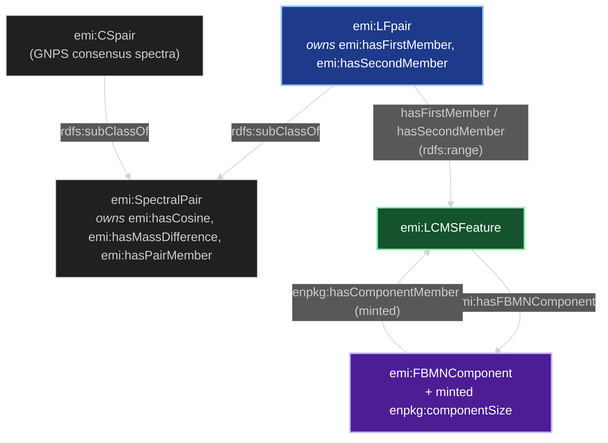

# The Network Enhancer — How It Works

*A conceptual walkthrough for presentations and onboarding.*

> Structural companion to [MS1_ENHANCER.md](MS1_ENHANCER.md),
> [MS2_ENHANCER.md](MS2_ENHANCER.md) and [SIRIUS_ENHANCER.md](SIRIUS_ENHANCER.md). Those
> stages **annotate** features one at a time. This one annotates nothing — it builds the
> **map of which features resemble which**, so that later stages can reason about a feature
> in the company of its structural relatives. It is the substrate the
> [Weights enhancer](WEIGHTS_ENHANCER.md) propagates over.

---

## 1. What problem does it solve?

Every other enhancer treats a feature as an island: *given this one spectrum, what molecule
is it?* That framing throws away a strong signal. In a real extract, molecules come in
**families** — a scaffold and its methylated, hydroxylated, glycosylated relatives. Those
relatives fragment in similar ways, because they share the substructure that breaks.

So a feature that matched nothing is not actually uninformative: if it sits between two
features that both confidently matched alkaloids, it is probably an alkaloid too.

The **Network enhancer** makes that reasoning possible by answering one question for the
whole run at once:

> *Which pairs of features have similar enough fragmentation to be plausibly related
> molecules?*

The answer is a graph — the **molecular network** — with one node per feature and an edge
wherever the MS/MS similarity is high enough. It carries no chemistry of its own; its value
is entirely in what downstream stages do with the topology.



---

## 2. The similarity measure: modified cosine

Two spectra are compared with **`ModifiedCosine`** (matchms). A plain cosine score only
credits fragment peaks that land at the *same* m/z — which fails exactly when it matters
most, because a molecule and its methylated analogue produce the same fragments **shifted by
the mass difference of the modification**.

Modified cosine fixes this: it matches peaks at equal m/z **and** peaks separated by the
precursor-mass difference between the two spectra. A scaffold and its +14 Da relative
therefore score high despite sharing few literal peak positions.



`mn_msms_mz_tol` (default **0.01 Da**) is the window within which two fragment peaks count
as the same peak.

The comparison is **all-vs-all** (`is_symmetric=True` lets matchms compute only one
triangle). This is the dominant cost of the enhancer and is **quadratic** in the number of
spectra — the one scaling fact to keep in mind when running large analyses.

---

## 3. From a dense score matrix to a sparse graph

All-vs-all similarity gives an N×N matrix in which almost every entry is a small, meaningless
number. Turning it into a useful network means deciding which entries become edges.
`SimilarityNetwork` applies **three filters at once**, and they do genuinely different jobs:

| knob | default | what it enforces |
|---|---|---|
| `mn_score_cutoff` | 0.7 | an **absolute** floor — no edge below this cosine, ever |
| `mn_top_n` | 15 | a **relative** filter — the partner must rank in this node's best 15 |
| `mn_max_links` | 10 | a **degree cap** — at most this many edges added per node |

The absolute cutoff alone is not enough: some spectra are promiscuous (short, low-information
peak lists) and would clear 0.7 against half the run, producing hub nodes that smear
everything together during propagation. The relative filter and the degree cap keep the graph
sparse and locally meaningful.

On top of that, `link_method="mutual"` requires the pairing to be **reciprocal** — the edge
survives only if each spectrum is in the other's top-n, not just one direction. This is the
single most important guard against hub artefacts.



A config validator enforces `mn_top_n > mn_max_links` — you cannot ask to keep more links
than you were willing to consider. (matchms itself only requires `>=`; the config is
deliberately stricter.)

Features that end up with **no** edges are still kept as isolated nodes
(`keep_unconnected_nodes` defaults to True). This is required, not incidental — see §5.

---

## 4. Node identity, and why the graph is rebuilt

Nodes are labelled by `identifier_key="scans"`, i.e. each spectrum's `scans` metadata. That
lines up with `analysis.feature_ids` because MZmine's MGF export writes `FEATURE_ID` and
`SCANS` to the same value, and matchms surfaces both as the same string:

```
BEGIN IONS
FEATURE_ID=9
SCANS=9
```

> **Coupling worth knowing.** This is an undocumented dependency on the exporter's
> convention. If an input ever carried `SCANS` ≠ `FEATURE_ID`, the network would key on
> acquisition scan numbers while everything else keys on feature ids, and the two would
> silently fail to line up.

The enhancer then **discards matchms' graph object and rebuilds it**:

```python
corrected_graph = nx.Graph()
corrected_graph.add_nodes_from(analysis.feature_ids)
corrected_graph.add_edges_from(ms_network.graph.edges(data=True))
```

This is not cosmetic. matchms seeds its node set from a Python **set**
(`unique_ids = list({...})`), so node *insertion order is arbitrary and varies between runs*.
The rebuild re-seeds the nodes in `analysis.feature_ids` order and only then replays the
edges.

Node order is a **load-bearing invariant**, enforced by `Analysis.validate_network_integrity`,
which rejects any network that doesn't have the same node count, the same id set, **and the
same order** as the analysis' spectra. The reason is in §5.

---

## 5. What consumes the network

The [Weights enhancer](WEIGHTS_ENHANCER.md) runs label propagation over this graph, diffusing
NPC class-score vectors from annotated features to their neighbours. To do that it converts
the graph to a matrix:

```python
nx.to_scipy_sparse_array(graph, nodelist=node_names, weight="weight")
```

Row *i* of the adjacency matrix must correspond to row *i* of the score matrix, which is
built by iterating `analysis.spectra`. Hence the two invariants:

- **Order** — misaligned rows would propagate each feature's evidence to the wrong
  neighbourhood, silently and without error.
- **Completeness** — every feature must be a node, including isolated ones, or the matrix
  would have fewer rows than there are spectra. This is why `keep_unconnected_nodes` stays
  at its default.

Edge weights are the modified-cosine scores, so during propagation a feature is influenced
more by its closest structural relatives than by borderline ones.

---

## 6. Serializing the network to RDF

The network is exported as **two layers**:

| layer | flag | default | cost |
|---|---|---|---|
| `emi:LFpair` — the pairwise edges | — always emitted | — | worst-case O(features²) |
| `emi:FBMNComponent` — the families those edges form | `include_fbmn_components` | **on** | O(features) |

Whether the edges belong in the graph is answered by whether the networking block is part of
the run, so there is no second switch for them. Note that `weights` declares
`depends_on=("network",)`, so selecting reranking pulls the networking block — and therefore
the edge set — in with it.

Neither emits feature nodes: those already exist from the analysis spine. Both are no-ops
when the analysis carries no network.

### 6.1 Edges — `emi:LFpair`

An RDF triple cannot carry attributes, so `featureA —similar→ featureB` has nowhere to put
the cosine score. The edge is therefore **reified**: promoted from a relationship into a
node that *represents* the pair and carries the measurements.

```turtle
emi-res:lfpair/VGF151_E05_pos/9_27
      a                      emi:LFpair ;
      emi:hasFirstMember     emi-res:spectrum/VGF151_E05_pos/9 ;
      emi:hasSecondMember    emi-res:spectrum/VGF151_E05_pos/27 ;
      emi:hasCosine          "0.83"^^xsd:double ;
      emi:hasMassDifference  "146.0583"^^xsd:double .
```



**The URI is keyed on the numerically-sorted feature-id pair.** Sorting is what makes it
orientation-independent — the graph is undirected, so `(u, v)` comes out of networkx either
way round — and sorting *numerically* rather than lexicographically is what keeps 9 below 10,
since node ids reach the serializer as strings. The practical payoff is that re-serializing
the same analysis is a **no-op** rather than a duplication.

**`emi:hasMassDifference` is the modification separating the two features** — the absolute
precursor-mass difference, which is exactly what modified cosine already aligned the spectra
on. It makes "what modification separates these two features?" answerable directly from the
KG: 146.058 is a deoxyhexose loss, 162.053 a hexose, 14.016 a methylation.

**First/second means lower/higher feature id.** Deterministic, but still nothing chemical. A
consumer asking *"what is feature X similar to?"* should query the `emi:hasPairMember`
superproperty both specialise, rather than checking the two positions separately.

### 6.2 Families — `emi:FBMNComponent`

Each **connected component** of the network is materialised as its own node. In FBMN practice
the component, not the individual edge, is the unit people reason about: a component is a
putative structural family.

```turtle
emi-res:featureset/VGF151_E05_pos
      enpkg:hasNetworkComponent  emi-res:fbmncomponent/VGF151_E05_pos/9 .

emi-res:fbmncomponent/VGF151_E05_pos/9
      a                         emi:FBMNComponent ;
      enpkg:componentSize       3 ;
      enpkg:hasComponentMember  emi-res:spectrum/VGF151_E05_pos/9 ,
                                emi-res:spectrum/VGF151_E05_pos/27 ,
                                emi-res:spectrum/VGF151_E05_pos/41 .

emi-res:spectrum/VGF151_E05_pos/9
      emi:hasFBMNComponent      emi-res:fbmncomponent/VGF151_E05_pos/9 .
```

Three things to note:

- **The component URI is keyed on its smallest member feature id.** A component has no
  identifier of its own (unlike an MS1 adduct cluster, which the graph enhancer numbers), so
  the minimum member is used as a canonical, membership-derived representative that does not
  depend on iteration order.
- **Isolated features get no component.** A feature with no edges is not a family, so
  single-node components are skipped — mirroring how `_add_adduct_clusters` skips MS1
  singletons. Absence of membership *is* "unconnected".
- **The two directions use deliberately different predicates.** The feature side uses EMI's
  own `emi:hasFBMNComponent`, whose `rdfs:domain` is `emi:LCMSFeature` — so the feature must
  be the subject. The feature-set anchor uses a **minted** `enpkg:hasNetworkComponent`
  precisely because EMI's property could not be reused there without entailing that the
  feature set is itself a feature.

This mirrors `enpkg:AdductCluster` exactly, and the two are already declared
`skos:closeMatch`: same modelling pattern, different notion of relatedness — one molecule
ionised several ways versus several structurally related molecules.

---

## 7. What the ontology means

The vocabulary is **EMI** (`https://w3id.org/emi#`), vendored at
[`docs/vocab/EMI-vocab.owl`](vocab/EMI-vocab.owl).



| term | meaning |
|---|---|
| `emi:SpectralPair` | the abstract "two spectra with a measured relationship between them". Owns the properties that *describe* such a relationship: `hasCosine` and `hasMassDifference` |
| `emi:LFpair` | `rdfs:subClassOf SpectralPair` — the specialisation where the paired things are **LCMS features** rather than bare spectra. `emi:CSpair` is the sibling for GNPS consensus spectra |
| `emi:hasFirstMember` / `hasSecondMember` | both `rdfs:subPropertyOf emi:hasPairMember`, both `owl:FunctionalProperty` (exactly one of each per pair), domain `LFpair`, range `LCMSFeature` |
| `emi:hasCosine` | functional `xsd:double`, domain `SpectralPair` |
| `emi:hasMassDifference` | functional `xsd:double`, domain `SpectralPair` — same home as `hasCosine`, so equally valid on an `LFpair` |
| `emi:FBMNComponent` | "feature-based molecular network component" — a connected group of features. Declared with **no superclass** and no properties of its own, which is why `enpkg:componentSize` is minted |
| `emi:hasFBMNComponent` | `rdfs:domain emi:LCMSFeature`, **no declared range**. Feature → component; the domain is what forces the feature to be the subject |

Read as a sentence, the emitted construct says: *"here is a thing that is a pair of two LCMS
features; their modified-cosine similarity is 0.83 and their precursor masses differ by
146.06 — and both belong to the same structural family."*

### `hasCosine` on an `LFpair` is valid

[RDF_DATA_MODEL_mapped.md](RDF_DATA_MODEL_mapped.md) flags this as an open question
(*"declared on SpectralPair — verify it's valid on LFpair"*). It is valid: `LFpair` is a
declared `rdfs:subClassOf SpectralPair`, so every `LFpair` **is** a `SpectralPair`, the domain
is satisfied, and domain inference entails nothing that wasn't already true. No workaround is
needed.

### A range conflict inherited from EMI

One level up, `emi:hasPairMember` declares `rdfs:range emi:MS2Spectrum`, while its
subproperties `hasFirstMember`/`hasSecondMember` declare `rdfs:range emi:LCMSFeature`. RDFS
inherits ranges, so a reasoner will infer that every feature in an `LFpair` is *also* an
`MS2Spectrum`. It is not a logical inconsistency (the classes aren't declared disjoint), but
it is junk entailment. The vocabulary authors appear to have half-noticed — the
`rdfs:comment` on `hasPairMember` is the single word `"LCMSFeature"`.

This is **upstream in EMI**, not something the serializer introduces, and it needs no local
workaround. Worth knowing before anyone runs a reasoner over an export.

---

## 8. Design notes and remaining caveats

> The five gaps this section used to list — no `emi:FBMNComponent`, blank-node edges, a
> hand-built spectrum URI, unused `emi:hasMassDifference`, and swapped config descriptions —
> are all **resolved**. What follows is what a reader still needs to know.

**Component URIs are membership-derived, so they are not stable across parameter changes.** A
component is keyed on its smallest member feature id, which is a function of *which features
happen to be connected*. Re-running the enhancer with a different `mn_score_cutoff` can
therefore put a genuinely different component behind the same URI, with a different
`componentSize` and member list. Merging two differently-parameterised exports of one run is
not meaningful. `enpkg:AdductCluster` carries the same class of caveat, but it bites harder
here because network membership churns more readily. If cross-parameter merging ever matters,
key on a hash of the sorted member ids instead.

**There is no component-size cap, so one component can swallow the run.** GNPS/FBMN splits
oversized components (`maximum_component_size`); this pipeline does not. On the toy dataset a
single component already holds 369 of 902 features. `enpkg:componentSize` makes that visible
but does not prevent it — treat a component whose size approaches the feature count as an
artefact of a too-permissive `mn_score_cutoff` rather than as a structural family.

**The `SCANS == FEATURE_ID` coupling from §4 still stands.** Node identity depends on MZmine
writing both fields to the same value.

**Migration note: pre-existing exports used blank-node `LFpair`s.** Any `.ttl` written before
this change holds `_:bN` edges, which will *not* collapse against the named URIs. Loading an
old and a new export of the same run into one store double-counts every edge. Re-export rather
than merge.

**Naming asymmetry with the adduct clusters.** The two analogous groupings spell "how many
members" differently: `enpkg:componentSize` here, `enpkg:clusterConnectivity` on
`enpkg:AdductCluster` (which follows mzAdan's CGC terminology). Worth knowing when writing
queries that span both.

---

## 9. Why it's built this way

- **Similarity, not identity.** The network deliberately encodes *"these fragment alike"*, not
  *"these are the same molecule"* — that second question belongs to the
  [MS1 graph enhancer](MS1_GRAPH_ENHANCER.md), which relates features by adduct-mass
  arithmetic instead. The two graphs are complementary and intentionally separate.
- **Three filters, not one.** An absolute cutoff alone lets low-information spectra become
  hubs; mutual top-n plus a degree cap keeps the topology locally meaningful, which is what
  label propagation actually depends on.
- **Order is part of the contract.** The graph is consumed as a matrix, so node order is
  validated at the data-model level rather than trusted — a silent misalignment would corrupt
  propagation without raising anything.
- **The block selection decides whether the network reaches the graph.** Edges are the
  largest thing this pipeline could write (quadratic in the worst case), and they are emitted
  whenever the networking block ran — a serializer switch could only contradict what the
  selection already said. The components derived from them are O(features) and are what
  consumers actually query, so `include_fbmn_components` defaults **on** and can be turned off
  independently.
- **Named URIs everywhere, no blank nodes.** Every emitted node is addressable and derived
  from stable keys, so re-serializing is a no-op and GraphDB's browser can show it. The URIs
  are sorted/minimum-keyed so they never depend on iteration order.

---

### One-line summary

> **The Network enhancer compares every MS/MS spectrum against every other with modified
> cosine, keeps only the mutually-top, above-threshold pairs as edges, and hands the pipeline
> a feature-ordered graph whose topology lets chemical evidence flow between structurally
> similar features — serialized as reified `emi:LFpair` nodes carrying the cosine and the mass
> difference, and as `emi:FBMNComponent` nodes for the structural families those edges form.**
