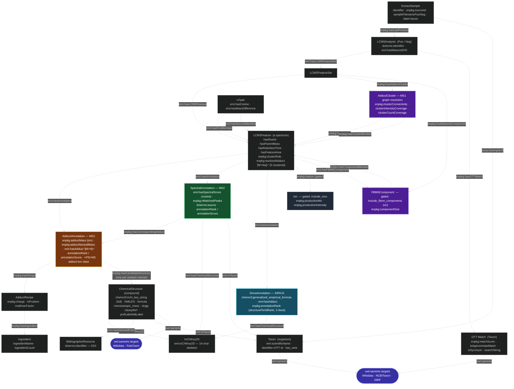

# RDF Knowledge-Graph Data Model

> **Role: the as-built model** — what the serializer emits *today*. Every box and edge below is
> live in [serializer.py](../enpkg/monolith/rdf/serializer.py). Its companion,
> [`_static/MAIN_SCHEMA.mmd`](_static/MAIN_SCHEMA.mmd), is the **target model** — where the schema
> is going, including terms not yet emitted. Neither supersedes the other; they answer different
> questions ("what will I find in my export?" vs. "what is this heading toward?").
>
> For what any `enpkg:` term *means* — its domain, range, and the reasoning behind minting it —
> the authority is [`vocab/enpkg.ttl`](vocab/enpkg.ttl), not this diagram. Its `[live]` / `[target]`
> tags encode exactly the split between these two documents. See
> [VOCABULARY.md](VOCABULARY.md) for the walkthrough.

The node types and relationships emitted by the `AnalysisSerializer`
([enpkg/monolith/rdf/serializer.py](../enpkg/monolith/rdf/serializer.py)). Boxes are
`rdf:type` classes; edge labels are the predicates that connect them; a few key literal
(datatype) properties are listed inside each box. External identifier authorities and
optional ("gated") layers are included for completeness.

## Legend & key points

- **Spine:** `ExtractSample → LCMSAnalysis` (the sample/metadata, via `enpkg:hasLabProcess` —
  `emi:hasSample` doesn't actually exist in EMI) and `LCMSAnalysis → LCMSFeatureSet →
  LCMSFeature`. One `LCMSFeature` per spectrum.
- **Adduct clusters (MS1 graph):** each resolved molecule is one `enpkg:AdductCluster`
  (`enpkg:hasAdductCluster` off the `LCMSFeatureSet`), carrying the mzAdan indices
  (`clusterConnectivity`/`clusterIntensityCoverage`/`clusterCountCoverage`). It names its base ion
  via `enpkg:hasAnchor` and every member via `enpkg:hasClusterMember`; each member feature carries
  `enpkg:clusterRole` (`anchor`/`satellite`) and its resolved form as a literal
  `enpkg:resolvedAdduct "[M+Na]+"` (not a parallel edge — the form is already on the feature's
  `emi:hasAnnotation` hypotheses). Singletons (no adduct relationships) get no cluster.
- **Network components (FBMN):** each connected component of the molecular network is one
  `emi:FBMNComponent` — a putative *structural family*, the network counterpart of the
  adduct cluster above (the two are declared `skos:closeMatch`). Keyed on its smallest member
  feature id, carrying `enpkg:componentSize`. Note the deliberate **predicate asymmetry**: the
  feature set anchors components with a *minted* `enpkg:hasNetworkComponent`, while each
  member feature points back with EMI's own `emi:hasFBMNComponent` — EMI declares the latter's
  `rdfs:domain` as `emi:LCMSFeature`, so using it off the feature set would entail that the
  feature set is a feature. Isolated features (no edges) get no component. Beware the naming
  asymmetry with the clusters: `enpkg:componentSize` here vs `enpkg:clusterConnectivity` there.
- **Three annotation channels** hang off every feature, all through the same `emi:hasAnnotation`
  predicate (SIRIUS used to attach via its own minted `enpkg:hasSiriusAnnotation`; unified since
  all three already subclass `emi:StructuralAnnotation` — a consumer tells them apart by
  `rdf:type`, not by predicate):
  - **MS1 — `AdductAnnotation`** (amber): mass-based adduct hypotheses. Links to an
    `AdductRecipe` (which decomposes into `Ingredient`s) and to **full-InChIKey** `ChemicalStructure`
    compounds — **one edge per isobaric isomer** in the formula group. Note the predicate:
    MS1 uses **`enpkg:hasCandidateStructure`**, *not* the `emi:hasChemicalStructure` that MS2 and
    SIRIUS use. Deliberately a sibling and not a subproperty — an MS1 hit is a mass coincidence,
    not a confirmed identification, and keeping the two unlinked is what lets a consumer query
    "candidate" and "confirmed" apart. It carries both masses of the hypothesis:
    `enpkg:adductMass` (the observed ion) and `enpkg:adductNeutralMass` (the candidate's own
    neutral mass, from which the first is derived via the recipe).
  - **MS2 — `SpectralAnnotation`** (green): fragmentation matches. Attaches **directly** to the
    `InChIKey2D` node, because MS2 only resolves the 2D skeleton (short InChIKey).
  - **SIRIUS — `SiriusAnnotation`** (cyan): in-silico structure identifications. Carries the
    predicted `generalized_empirical_formula` and `emi:hasAdduct`, and attaches **directly** to the
    `InChIKey2D` node (2D skeleton). Candidates arrive pre-ranked by SIRIUS's `structurePerIdRank`
    (1=best), stamped as `enpkg:annotationRank` — no NPC reweighting (unlike MS1/MS2).
  - All three subclass `emi:StructuralAnnotation`, so a consumer can query them uniformly or split
    them by the `enpkg:AdductAnnotation` / `SpectralAnnotation` / `SiriusAnnotation` subclass.
- **MS2 ↔ MS1 coupling (`enpkg:hasCorrespondingAdduct`):** on a feature with an MS2 match, the two
  channels are joined — only the MS1 adducts whose candidate structures include the MS2-identified
  compound (shared 2D short InChIKey) are emitted, and each MS2 annotation links to its corresponding
  adduct(s). Every matching adduct *form* is kept (the MS1 `top_k` cap is bypassed); the
  mass-coincidence adducts are dropped. A feature whose MS2 compound is in no MS1 group ends up with
  no MS1 adduct at all (intended). Features with **no** MS2 keep their full top-k MS1 hypotheses.
- **`InChIKey2D` is the bridge** between the channels: MS1 reaches it via the compound's
  `emi:hasInChIKey2D`; MS2 and SIRIUS point at it directly. This is the node to join on when asking
  "did MS1, MS2 and SIRIUS agree on the same structure?".
- **Adduct identity:** an `AdductAnnotation` IRI is
  `emi-res:adduct/{run}/{feature}/{recipe hash}/{formula}` — one node per *(candidate formula
  group, adduct recipe)* on a feature, because that pair is exactly what a `ChemicalAdduct` is.
  Two molecules proposed for the same feature under the same ionization form are two nodes, each
  with its own rank, masses and candidate structures. The formula is a readable segment rather
  than a second hash so a hypothesis can be identified by eye in the Turtle.
- **Compound identity:** the `ChemicalStructure` IRI is `identifiers.org/inchikey/<full key>`
  (the full 27-char InChIKey); the full key is also a literal `chemrof:inchi_key_string`.
- **Taxonomy:** `Taxon` nodes are shared (deduplicated) across the sample source
  (`sosa:isSampleOf`), each compound's source organism (`emi:inTaxon`), and the MS2 match's
  source organisms (`emi:inTaxon`). The `OTT Match` node carries match-quality literals and is
  also typed `emi:Taxon`.
- **External authorities** are reached with `owl:sameAs` (Wikidata, PubChem, NCBITaxon, GBIF;
  references additionally link to DOIs).
- **Gated layers:** product `Ion` nodes (`include_ions`, off) are grey. The molecular-network
  `LFpair` edges are emitted whenever the networking block ran. The `FBMNComponent` nodes
  derived from those edges are gated by `include_fbmn_components` and default **on** — they
  are O(features) where the edges are O(features²), and the component is the unit consumers
  query. All are no-ops when the upstream enhancer did not run.
- **Ranking note:** `annotationRank` / `annotationScore` are stamped **per channel** — MS1
  adducts and MS2 matches are each ranked by the reweighted NPC-alignment score among themselves;
  SIRIUS keeps its own `structurePerIdRank` as `annotationRank`. There is no merged cross-channel rank.
