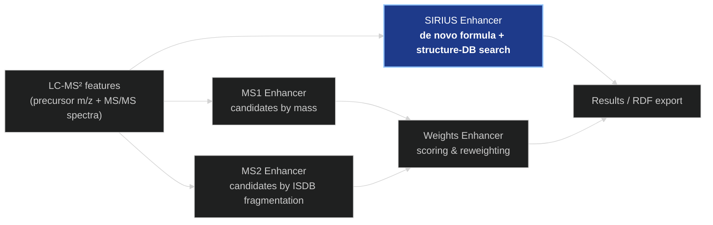
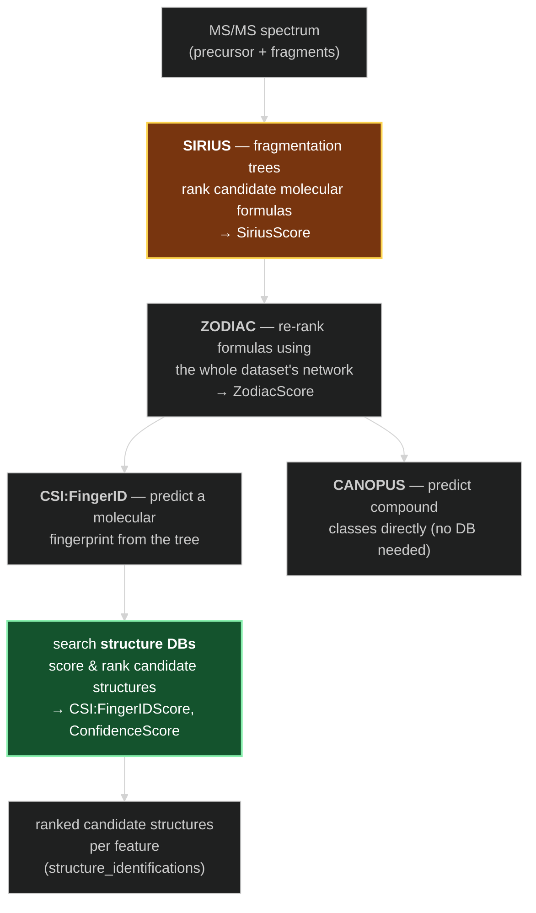
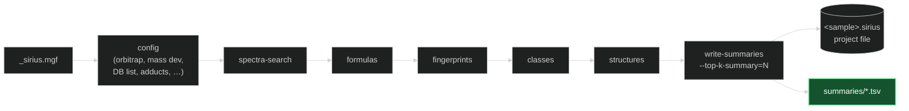
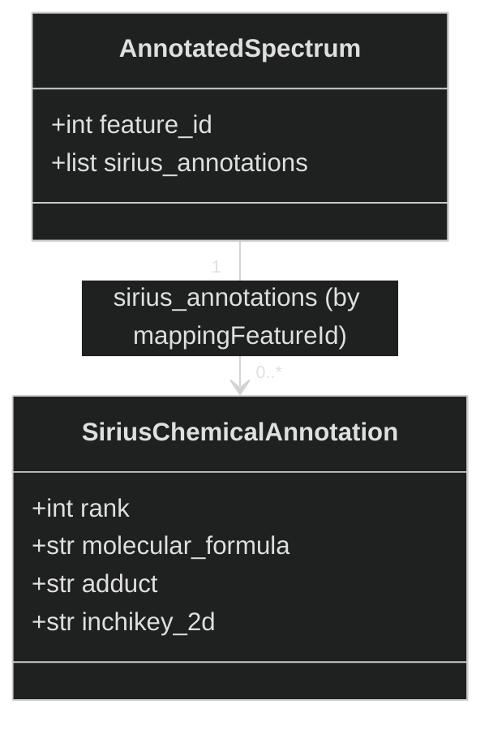
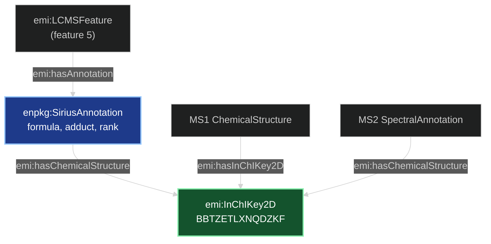

# The SIRIUS Enhancer — How It Works

*A conceptual walkthrough for presentations and onboarding.*

> Third companion to [MS1_ENHANCER.md](MS1_ENHANCER.md) and
> [MS2_ENHANCER.md](MS2_ENHANCER.md). Where **MS1** proposes candidates from *mass
> alone* and **MS2** confirms them against a *spectral library*, **SIRIUS** works out
> a structure *from first principles* — it computes the molecular formula and searches
> structure databases using a fragmentation model, rather than looking the spectrum up
> in a library of pre-measured (or pre-predicted) spectra.

---

## 1. What problem does it solve?

MS1 and MS2 both answer "*which known compound does this look like?*" — MS1 by mass, MS2
by matching a reference spectrum. But a feature can be a real, interesting molecule that
is **not in any spectral library**. For those, we need to reason about the fragmentation
*itself*.

**SIRIUS** answers a deeper question for every feature:

> *From this feature's precursor mass and fragmentation pattern, what is the most likely
> molecular formula — and which database structures are most consistent with it?*

It is an external tool (the [SIRIUS](https://bio.informatik.uni-jena.de/software/sirius/)
suite) that the pipeline runs as a subprocess. It computes a **molecular formula**, then
predicts a **molecular fingerprint** and searches **structure databases** for matching
structures, producing a **ranked list of candidate structures per feature**.

Like MS1 and MS2, SIRIUS is still **candidate generation with a score** — it proposes
ranked structures, but the pipeline treats those ranks as SIRIUS's own verdict and does
not re-rank them.



*(SIRIUS candidates are serialized straight into the knowledge graph carrying SIRIUS's own
rank; they do not currently flow through the Weights reranking that MS1/MS2 use.)*

---

## 2. What SIRIUS actually computes

Inside the tool, a feature passes through a chain of models. Each stage produces one of the
score columns that later appear in the summary TSVs:



- **SIRIUS (formula):** builds *fragmentation trees* that explain the fragment peaks and
  ranks candidate **molecular formulas** (`SiriusScore`, `SiriusScoreNormalized`).
- **ZODIAC:** re-ranks those formulas jointly across the whole dataset — features that
  fragment similarly should have consistent formulas (`ZodiacScore`).
- **CSI:FingerID:** predicts a **molecular fingerprint** from the tree, then searches
  **structure databases** and scores each candidate structure (`CSI:FingerIDScore`); the
  `ConfidenceScoreExact` / `ConfidenceScoreApproximate` express how trustworthy the top hit
  is. **This is the stage that produces `structure_identifications`.**
- **CANOPUS:** predicts **compound classes** (NPC / ClassyFire) directly from the spectrum,
  even when no database structure matches (the `canopus_*` summaries).

> Only the **structure identifications** are ingested today (§5). The formula, ZODIAC, and
> CANOPUS frames are parsed into `SiriusResults` but not yet mapped into the graph.

---

## 3. How the enhancer runs it — the subprocess

Unlike MS1/MS2 (pure Python over the DuckDB library), `SiriusEnhancer` shells out to the
SIRIUS executable in
[`sirius_enhancer.py`](../enpkg/monolith/enhancers/sirius_enhancer.py). Two calls:

**(a) Log in.** SIRIUS requires an authenticated account; credentials come from the
environment (`SIRIUS_USERNAME` / `SIRIUS_PASSWORD`):

```
sirius login --user-env SIRIUS_USERNAME --password-env SIRIUS_PASSWORD --show
```

**(b) Run the workflow.** A single invocation sets configuration via the `config`
subcommand, then chains the tool subcommands. Abridged:

```
sirius --input <sample>_sirius.mgf  -o <run>/<stamp>/<sample>.sirius \
  config --AlgorithmProfile=orbitrap \
         --MS2MassDeviation.allowedMassDeviation=5ppm \
         --SpectralSearchDB=<db list>  --StructureSearchDB=<db list> \
         --AdductSettings.fallback=[[M+H]+,[M+Na]+,[M+K]+] \
         --NumberOfCandidates=<n>  --FormulaSettings.enforced=H,C,N,O,P \
         --IdentitySearchSettings.precursorDeviation=20ppm \
  spectra-search  formulas  fingerprints  classes  structures  write-summaries \
         --output <run>/summaries/  --top-k-summary=<N>
```



Two operational notes worth stating in a talk:

- **SIRIUS 6 stores a project as a single `.sirius` file** (a Nitrite database), not a
  SIRIUS-5 directory — the enhancer creates the parent folder and points `-o` at the file.
- Each tool subcommand corresponds to a stage in §2: `formulas` → SIRIUS, `fingerprints` +
  `structures` → CSI:FingerID, `classes` → CANOPUS. `write-summaries --top-k-summary=N`
  is what caps the exported candidates at **top-N per feature** and writes the `_top-N`
  TSVs the pipeline reads.

---

## 4. The output: summary TSVs

SIRIUS writes a `summaries/` directory of tab-separated files. `_get_results` collects them
into a [`SiriusResults`](../enpkg/monolith/enhancers/sirius_parser.py) dataclass — one field
per known summary (formula / structure / CANOPUS, each in a plain and a `_top` variant):


The pipeline currently ingests **`structure_identifications_top-X.tsv`** — up to *X* ranked
candidate structures per feature. The columns it consumes:

| Column | Meaning | Used as |
|---|---|---|
| `mappingFeatureId` | the input feature this candidate belongs to | **join key** → `AnnotatedSpectrum.feature_id` |
| `structurePerIdRank` | candidate's rank for its feature (1 = best) | annotation rank |
| `molecularFormula` | neutral formula of the candidate (e.g. `C6H9N3O3S`) | formula literal |
| `adduct` | assumed adduct, written `[M + K]+` (with spaces) | adduct literal (spaces stripped) |
| `InChIkey2D` | 14-char (2D / skeleton) InChIKey of the candidate | link to the shared structure node |

The **join key is the crux**: SIRIUS's `mappingFeatureId` is the same `FEATURE_ID` the MGF
carried, which is the same `feature_id` the pipeline puts on every `AnnotatedSpectrum`. So a
row of the TSV can be matched straight back to the feature it describes.

---

## 5. Ingestion: rows → data model

[`attach_sirius_annotations`](../enpkg/monolith/enhancers/sirius_parser.py) turns each row
into a [`SiriusChemicalAnnotation`](../enpkg/monolith/data/sirius_annotation.py) and attaches
it to the matching spectrum. It groups rows by `mappingFeatureId`, then, for every spectrum,
sets `spectrum.sirius_annotations` to that feature's candidates sorted by rank. Spectra with
no rows are left untouched; rows with no feature/rank/2D-InChIKey are skipped. The
`SiriusEnhancer` calls it right after the run, so a live pipeline ends with the annotations
on the model (and `_log_sirius` reports the counts).



A light `slots` dataclass on purpose: a full run yields thousands of candidates, and — like
`AnnotationOrganism` — the annotation keeps only what the graph needs.

The same helper works **offline**: point `SiriusOutputParser.digest_paths` at an existing
`structure_identifications_top-X.tsv` and call `attach_sirius_annotations(analysis, results)`
to serialize output from a previous SIRIUS run without re-running the tool.

---

## 6. Serialization: data model → knowledge graph

The [serializer](../enpkg/monolith/rdf/serializer.py) links each feature to its SIRIUS
candidates through **`emi:hasAnnotation`** — the same predicate MS1 and MS2 attach through
(unified; SIRIUS used to have its own dedicated `enpkg:hasSiriusAnnotation` predicate, retired
since all three channels already subclass `emi:StructuralAnnotation`). Each candidate becomes a
node typed `emi:StructuralAnnotation` + `enpkg:SiriusAnnotation` (the SIRIUS sibling of the MS1
`AdductAnnotation` and MS2 `SpectralAnnotation` subclasses, and how a consumer tells the channels
apart now that the predicate is shared), carrying the formula, adduct, and SIRIUS rank, and
linking its structure at the **2D-InChIKey** level.



That shared `emi:InChIKey2D` node is the payoff: a SIRIUS candidate, an MS1 compound, and an
MS2 match that all point to the same 2D skeleton become **one connected structure in the
graph**, queryable across the three independent lines of evidence.

Real toy-data output (feature 5, rank-1 candidate):

```turtle
emi-res:sirius/actea_EtOAc-1_pos/5/BBTZETLXNQDZKF
    a emi:StructuralAnnotation, enpkg:SiriusAnnotation ;
    chemrof:generalized_empirical_formula "C6H9N3O3S" ;
    emi:hasAdduct "[M+K]+" ;
    enpkg:annotationRank 1 ;
    emi:hasChemicalStructure emi-res:inchikey2d/BBTZETLXNQDZKF .
```

| Element | Predicate | Value |
|---|---|---|
| rdf:type | `rdf:type` | `emi:StructuralAnnotation`, `enpkg:SiriusAnnotation` |
| molecular formula | `chemrof:generalized_empirical_formula` | `"C6H9N3O3S"` |
| adduct | `emi:hasAdduct` | `"[M+K]+"` |
| rank | `enpkg:annotationRank` | `1` (SIRIUS `structurePerIdRank`) |
| structure | `emi:hasChemicalStructure` | → `emi:InChIKey2D` node |

The URI is keyed on `sirius/{run}/{feature}/{InChIkey2D}`, so re-serializing is idempotent
and per-run candidates never collide across features. A `top_k_sirius` serializer option can
cap candidates per feature; it defaults to `None` (emit all) since the TSV is already
SIRIUS's chosen top-X.

---

## 7. SIRIUS vs MS1 vs MS2 — the three channels

| | **MS1** | **MS2** | **SIRIUS** |
|---|---|---|---|
| Evidence used | precursor **mass** | mass **+ library fragmentation** | mass **+ modelled fragmentation** |
| How it identifies | invert adduct recipes → LOTUS mass lookup | cosine vs **ISDB** spectra | fragmentation trees + **structure-DB** search (CSI:FingerID) |
| Needs a library? | reference masses (LOTUS) | pre-computed spectra (ISDB) | **no reference spectrum** — computes from the data |
| Ranking | reweighted at output (NPC) | reweighted at output (NPC / cosine) | **SIRIUS's own** `structurePerIdRank` (kept as-is) |
| Runs as | in-process Python | in-process Python | **external subprocess** |
| Output slot | `spectrum.ms1_annotations` | `spectrum.ms2_annotations` | `spectrum.sirius_annotations` |
| Structure link | full compound + `hasInChIKey2D` | `hasChemicalStructure` → InChIKey2D | `hasChemicalStructure` → InChIKey2D |

The practical point for a talk: SIRIUS is the channel that can identify **novel** structures
absent from the spectral library, because it never needs a matching reference spectrum — it
reconstructs the formula and searches structure databases from the fragmentation alone.

---

## 8. Why it's built this way

- **External tool, TSV contract.** SIRIUS is a large Java application; running it as a
  subprocess and consuming its **summary TSVs** keeps the coupling to a stable file format
  rather than SIRIUS internals. The parser and the attach step are the whole seam.
- **Join on `mappingFeatureId`.** SIRIUS carries the original `FEATURE_ID` through to its
  output, so annotations reconnect to features by a simple integer key — no fragile
  positional matching.
- **Ranks are preserved, not recomputed.** SIRIUS already ranks candidates with a model far
  richer than a mass or cosine score, so serialization keeps `structurePerIdRank` verbatim
  instead of pushing SIRIUS results through the NPC reweighting used for MS1/MS2.
- **Structure at the 2D level.** Linking to the shared `emi:InChIKey2D` node is what stitches
  SIRIUS, MS1, and MS2 evidence for the same skeleton into one structure in the graph.
- **Offline-friendly.** The attach helper consumes a `SiriusResults` frame, so an existing
  `structure_identifications_top-X.tsv` can be serialized without re-running (and re-paying
  for) SIRIUS.

---

### One-line summary

> **The SIRIUS enhancer runs the SIRIUS tool as a subprocess to identify structures *de
> novo* — computing a molecular formula and searching structure databases from the
> fragmentation itself — then joins its ranked `structure_identifications` back to each
> feature by `mappingFeatureId` and serializes them as `enpkg:SiriusAnnotation` nodes (attached
> via the same `emi:hasAnnotation` predicate MS1 and MS2 use) that share the 2D-InChIKey
> structure with the MS1 and MS2 channels.**
