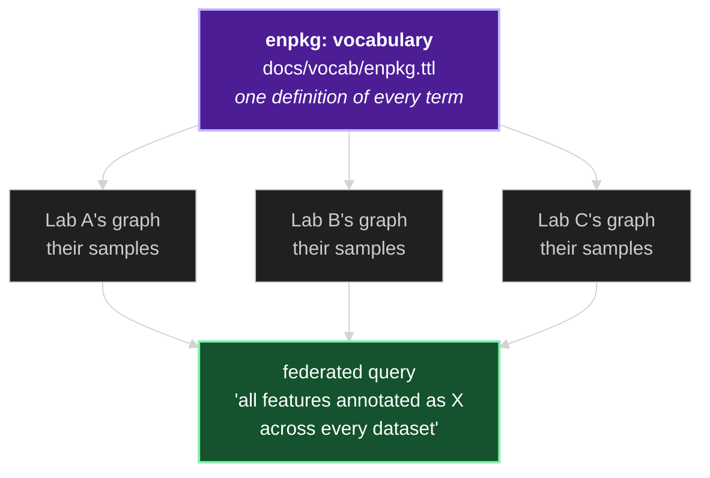
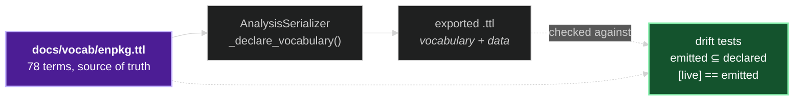

# The ENPKG Vocabulary — How It Works

*A conceptual walkthrough for presentations and onboarding.*

> Companion to [MS1_ENHANCER.md](MS1_ENHANCER.md), [MS2_ENHANCER.md](MS2_ENHANCER.md),
> [SIRIUS_ENHANCER.md](SIRIUS_ENHANCER.md) and [NETWORK_ENHANCER.md](NETWORK_ENHANCER.md). Those
> explain how the pipeline *produces* annotations. This one explains the language those annotations
> are *written in* once they reach the knowledge graph — where each term comes from, and why some
> had to be invented.

---

## 1. What problem does it solve?

The pipeline's output is a knowledge graph. But `enpkg` is not one fixed graph — it is a tool that
lets **any** user build a graph for **their own** project. A lab in Geneva and a lab in São Paulo
each run it on their own samples and each get their own graph.

Those two graphs are only useful together if they say the same thing the same way. If one writes
"this feature has an adduct annotation" as `enpkg:AdductAnnotation` and the other invents
`myproject:MassHypothesis`, the graphs cannot be merged, queried together, or federated — even
though they describe identical experiments.

> **The vocabulary is the one thing that must not vary between users.** Everything else in a
> generated graph — the samples, the features, the compounds — is project-specific by design. The
> terms are the shared contract.

That is why the `enpkg:` prefix is kept even though the name is a legacy artifact of the pipeline's
first version (see [CLAUDE.md](../CLAUDE.md)): renaming a published vocabulary breaks every graph
that already commits to it. The name is inherited; the *stability* is deliberate.



---

## 2. Reuse first — the vocabularies we borrow

Minting a term is a last resort. Every term the graph uses is first looked for in an existing,
published vocabulary. Four of them are **vendored** under [`vocab/`](vocab/) so the check can be
made against the actual file rather than from memory:

| Vocabulary | Namespace | Vendored? | What we take from it |
|---|---|---|---|
| **EMI** (Earth Metabolome) | `https://w3id.org/emi#` | ✅ `EMI-vocab.owl` | The backbone: `LCMSAnalysis`, `LCMSFeature`, `LCMSFeatureSet`, `ExtractSample`, `ChemicalStructure`, `Taxon`, `StructuralAnnotation`, `LFpair`, `FBMNComponent` |
| **PSI-MS** | `obo:MS_` | ✅ `ms-vocab.owl` | Mass-spectrometry quantities: adduct ion mass, charge state, product ion m/z & intensity |
| **ChEBI** | `obo:CHEBI_` | ✅ `chebi-vocab.owl` | Chemistry classes: ion (`CHEBI:24870`), atom (`CHEBI:33250`) |
| **NCBITaxon** | `obo:NCBITaxon_` | ✅ `NCBITaxon_slim-vocab.owl` | Taxon ranks and identifiers |
| **ChemROF** | `w3id.org/chemrof/` | ❌ not vendored | Structure literals: InChI / InChIKey strings, monoisotopic mass |

Plus the usual general-purpose ones: SOSA (sampling), PROV-O (derivation), DCTERMS (identifiers),
SKOS (labels and mappings), OWL/RDFS.

`enpkg.ttl` declares `owl:imports emi:` — EMI is the backbone this vocabulary extends, not a
sibling it merely resembles.

---

## 3. When do we mint?

A term gets minted only when the answer to all three of these is *no*:

1. **Does an existing vocabulary have this term?** — checked against the vendored files.
2. **Can an existing term be used without lying?** — see §4; a term whose `rdfs:domain` doesn't fit
   is not reusable, it is a trap.
3. **Is the distinction real?** — if two things can share a term without losing information, they
   should.

That third question is what retired `enpkg:hasSiriusAnnotation`. SIRIUS results used to hang off a
feature by their own dedicated predicate, while MS1 and MS2 used `emi:hasAnnotation`. But all three
already subclass `emi:StructuralAnnotation`, and a consumer can tell them apart by `rdf:type` — the
separate predicate encoded no information that wasn't already there. It was history, not semantics,
so it was removed.

The opposite call is `enpkg:hasCandidateStructure` (§5) — a distinction that *is* real, and is kept.

---

## 4. Domains and ranges, and the traps they prevent

Most of the value in the vocabulary file is not the term names. It is the `rdfs:domain` and
`rdfs:range` on each one — 68 of the 69 properties carry a domain, all 69 a range.

The reason is that RDF is not a schema language that *validates*; it is a logic that *entails*. A
wrong domain does not raise an error. It silently makes a reasoner deduce something false. Three
real examples from this project:

**Using EMI's `hasFBMNComponent` off a feature set.** EMI declares its `rdfs:domain` as
`emi:LCMSFeature`. Writing `featureSet emi:hasFBMNComponent component` therefore entails *the
feature set is a feature*. This is why `enpkg:hasNetworkComponent` exists — the feature-set-side
property had to be minted, while the feature-side one is EMI's own. The resulting asymmetry looks
untidy but is exactly right.

**Typing a node with a PSI-MS cvParam value class.** `MS:1000866` ("molecular formula") is a
*value* in a controlled vocabulary, not a class of things. Using it as an `rdf:type` puns a value
as a node type. Hence `enpkg:MolecularFormula`, cross-referenced with `skos:exactMatch ms:1000866`
— the mapping is kept, the misuse is not.

**Asserting a domain that is only sometimes true.** `enpkg:hasMolecularFormula` is used from both
`enpkg:AdductAnnotation` and `emi:ChemicalStructure`. Those share no useful common superclass, so
*any* single `rdfs:domain` would be false half the time — and would entail that every subject of
the property belongs to whichever class was picked. It is therefore the one property in the file
deliberately left with a range but **no** domain. Declaring nothing is better than declaring
something wrong.

> The pattern throughout: when an external term is *nearly* right, mint a term and link it with
> `skos:exactMatch` / `skos:closeMatch` rather than bending the original. The graph stays
> interoperable — a consumer follows the mapping — without asserting anything false.

Seven terms carry a `skos:exactMatch` (all to PSI-MS) and three a `skos:closeMatch` — to ChEBI's
atom, ChemROF's monoisotopic mass, and `emi:FBMNComponent` (from `enpkg:AdductCluster`: the same
modelling pattern, a different notion of relatedness).

---

## 5. The one distinction worth the most: candidate vs. confirmed

MS1, MS2 and SIRIUS all end up pointing at a chemical structure. But they do not mean the same
thing by it:

- **MS1** found a compound whose mass matches. That is a *coincidence of mass* — often dozens of
  unrelated molecules share a formula.
- **MS2** matched a measured fragmentation spectrum. **SIRIUS** reasoned a structure from a
  fragmentation model. Both are *identifications*.

If all three used `emi:hasChemicalStructure`, that difference would be unrecoverable from the graph
— a query for "structures identified in this sample" would silently include every mass coincidence.

So MS1 uses **`enpkg:hasCandidateStructure`**, and — the load-bearing detail — it is declared a
**sibling** of `emi:hasChemicalStructure`, *not* a subproperty:

```
AdductAnnotation  --enpkg:hasCandidateStructure-->  ChemicalStructure    (mass coincidence)
SpectralAnnotation --emi:hasChemicalStructure--->   InChIKey2D           (identification)
SiriusAnnotation   --emi:hasChemicalStructure--->   InChIKey2D           (identification)
```

Making it a subproperty would entail that every MS1 candidate *is* a chemical-structure assignment
— re-merging exactly what the split was for. The two predicates stay unlinked so that "candidate"
and "confirmed" remain separately queryable.

The same care shows up in the two masses an `AdductAnnotation` carries: `enpkg:adductMass` is the
observed *ion*, `enpkg:adductNeutralMass` the candidate's own *neutral* mass. They are mutually
derivable through the recipe, and keeping both means a consumer never has to guess which one a
bare "mass" meant.

---

## 6. Two speeds: `[live]` and `[target]`

The vocabulary deliberately runs ahead of the code. Every one of its 78 terms carries exactly one
status tag in its `rdfs:comment`:

| Tag | Count | Meaning |
|---|---|---|
| `[live]` | 54 | The serializer emits this today |
| `[target]` | 24 | Declared and agreed, not yet wired in |

A `[target]` term is not a TODO comment — it is a *decision already made*, recorded so it does not
have to be re-litigated. `enpkg:Atom` and `enpkg:MolecularFormula` have their domains and ranges
settled; when the code is ready to emit them, there is nothing left to argue about.

This split is why the project keeps **two** diagrams, neither superseding the other:

- [`_static/MAIN_SCHEMA.mmd`](_static/MAIN_SCHEMA.mmd) — the **target** model. Where the schema is
  going.
- [RDF_KG_DATA_MODEL.md](RDF_KG_DATA_MODEL.md) — the **as-built** model. What is in your export
  today.

The tags are not maintained by hand and trusted: a test asserts `[live]` marks exactly the terms
the serializer emits, and `[target]` exactly those it does not (§7).

---

## 7. How it reaches the graph, and how it stays honest

**Getting there.** `enpkg.ttl` is the single source of truth. `AnalysisSerializer.__init__` parses
it straight into the output graph:

```python
def _declare_vocabulary(self) -> None:
    self.graph.parse(_VOCAB_PATH, format="turtle")
```

This replaced six hand-written methods that spelled out each term's type, domain and range as
Python string literals — a second copy that could (and did) drift from the file.

Declarations are **inlined** into every export rather than referenced by `owl:imports`. Every
`.ttl` the pipeline writes is therefore self-describing: openable offline in Protégé, safe to
archive next to a paper, interpretable without fetching anything. The cost is ~341 extra triples
per file, including the `[target]` terms that export did not use. That is the deliberate trade —
the graphs are research output that must still make sense in ten years.

**Staying honest.** Two tests in
[test_vocabulary_drift.py](../enpkg/tests/test_data/test_vocabulary_drift.py) serialize a fixture
built to exercise every `enpkg:`-emitting code path at once, then check:

1. **Nothing is emitted that isn't declared.** The direction that matters — an undeclared term in a
   published graph is a term nobody else can interpret.
2. **The `[live]`/`[target]` tags are accurate**, in both directions. Stronger than (1), and the
   reason the two diagrams above can be trusted.

Note what is deliberately *not* enforced: a declared term that is never emitted is fine. That is
what `[target]` means.



---

## 8. Why it's built this way

- **The vocabulary is a file, not code.** A `.ttl` is what an ontology consumer, a reasoner, or a
  registry expects. Python literals are readable only by this pipeline.
- **Reuse beats minting, but not at the cost of truth.** A term with the wrong domain is worse than
  a minted one — it entails something false, silently. `skos:exactMatch` gets the interoperability
  without the lie.
- **Distinctions are kept only when they carry information.** `hasSiriusAnnotation` was dropped
  because `rdf:type` already said it; `hasCandidateStructure` was kept because nothing else says
  it.
- **The vocabulary may run ahead of the code.** Deciding a term's meaning and implementing it are
  different jobs; `[target]` lets the first finish without waiting on the second.
- **Exports are self-contained.** Research output outlives the infrastructure that produced it.
- **Nothing here is maintained by discipline alone.** Every claim this document makes about what is
  live, what is declared, and what matches — is asserted by a test.

---

## 9. Where to look

| Question | File |
|---|---|
| What does `enpkg:X` mean? | [`vocab/enpkg.ttl`](vocab/enpkg.ttl) — authoritative |
| What will my export contain? | [RDF_KG_DATA_MODEL.md](RDF_KG_DATA_MODEL.md) |
| Where is the schema going? | [`_static/MAIN_SCHEMA.mmd`](_static/MAIN_SCHEMA.mmd) |
| Why was this term chosen? | the term's `rdfs:comment`, then [SCHEMA_REVIEW_AND_VOCABULARY_PLAN.md](SCHEMA_REVIEW_AND_VOCABULARY_PLAN.md) |
| What emits it? | [serializer.py](../enpkg/monolith/rdf/serializer.py) |
