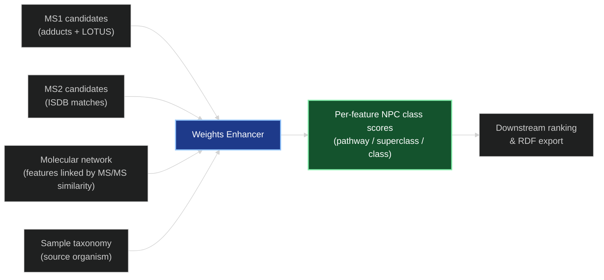
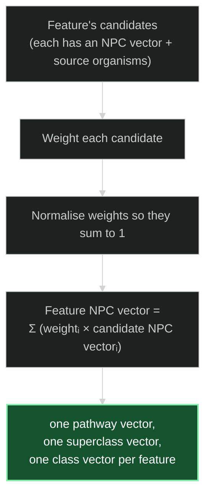
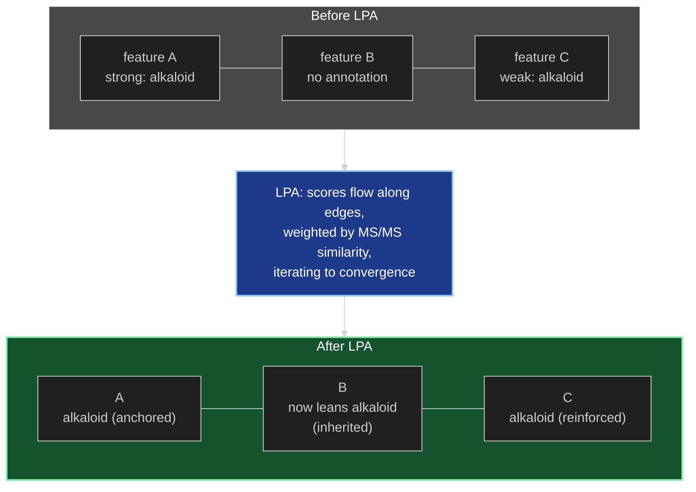
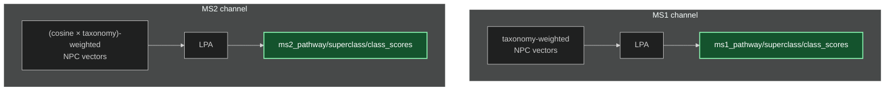

# The Weights Enhancer — How It Works

*A conceptual walkthrough for presentations and onboarding.*

> Third in the series, after [MS1_ENHANCER.md](MS1_ENHANCER.md) and
> [MS2_ENHANCER.md](MS2_ENHANCER.md). Those two **generate** candidate identities; this stage
> **weighs** them using biology and network structure.

---

## 1. What problem does it solve?

After MS1 and MS2, every feature carries a pile of **competing, unranked candidate
identities**. Many are spurious — an isobaric coincidence here, a weak fragmentation match
there. We need a principled way to ask, for each feature:

> *What chemical class is this feature most likely to belong to, given (a) which organism the
> sample came from, and (b) what its neighbours in the molecular network look like?*

The **Weights enhancer** answers this by turning each feature's candidates into a single
**chemical-classification score vector** — a profile over **NPC** (Natural Product Classifier)
**pathways, superclasses, and classes** — using two ideas in sequence:

1. **Taxonomic reweighting** — candidates whose source organisms are biologically close to the
   sample's organism count for more.
2. **Label propagation** — features that fragment similarly (neighbours in the molecular
   network) reinforce one another's class profiles.

This stage produces *smoothed class-score vectors*, not the final per-candidate ranking — that
last blend happens downstream at output time.

---

## 2. Background: NPC classes and the sample's taxonomy

Two pieces of prior knowledge drive the weighting:

- **NPC classification vectors.** Every reference structure (from LOTUS) carries a set of
  probabilities describing *what kind of natural product it is* at three levels of
  granularity: **pathway** (e.g. alkaloids, terpenoids), **superclass**, and **class**. These
  are the numbers we want to attach to each *feature*.
- **The sample's organism.** A sample isn't random chemistry — it's an extract of a specific
  organism with a known position in the tree of life (its **best OTT taxonomy match**).
  Natural products are phylogenetically constrained: a compound previously reported from a
  plant in the same genus is a far more plausible hit than one only ever seen in an unrelated
  fungus.

**Taxonomic similarity** is scored on a **rank ladder** — how deep two organisms share
lineage — and normalised to `[0, 1]`:

---

## 3. Step 1 — taxonomy-weighted class vectors

For each feature, the enhancer collapses its many candidates into **one** NPC vector (per
level) by taking a **weighted sum** of the candidates' classification vectors. Candidates that
are more credible get a larger weight.

The **weight** differs by channel — that's the only real difference between how MS1 and MS2
candidates are treated here:

- **MS1 candidates** → weight = the candidate's **taxonomic similarity** to the sample's
  organism (its best-matching source organism on the rank ladder above). If the sample has no
  known taxonomy, all candidates get weight 1 (uniform). Features with no MS1 candidates get a
  zero vector.
- **MS2 candidates** → weight = **cosine score × taxonomic similarity**. This rewards
  candidates that are *both* a good fragmentation match *and* taxonomically plausible.

In both cases the weights are normalised to sum to 1 before the weighted sum, so each
feature's resulting vector is a clean convex combination of its candidates' class profiles.

---

## 4. Step 2 — label propagation over the molecular network

A single feature's class vector can be noisy or empty (no good candidates). But features don't
live in isolation: the **molecular network** connects features whose MS/MS spectra are similar
(built with `ModifiedCosine`), and spectral similarity is a strong proxy for **structural
relatedness**. Structurally related molecules tend to share a chemical class.

So the enhancer runs the **Label Propagation Algorithm (LPA)**: it lets each feature's class
vector **diffuse to its network neighbours**, iterating until the whole network settles
(converges). The effect is a denoising — confident, well-supported features anchor their
neighbourhood, and weakly- or un-annotated features **inherit** a class profile from the
company they keep.

A few details that matter conceptually:

- Edges are **weighted** by MS/MS similarity, so a feature is influenced more by its closest
  structural relatives than by distant ones.
- Features that start with an **all-zero** vector (no annotations) are flagged as *unlabeled*
  and are filled purely from their neighbours — the network lets us say something about a
  feature even when its own spectrum matched nothing.
- The process **iterates to convergence** (it stops when the change between iterations drops
  below a small threshold), and is implemented to run fast over the network's adjacency matrix.

---

## 5. Two parallel channels, kept separate

A deliberate architectural choice: MS1 and MS2 evidence are weighted and propagated **in
parallel and independently**, and written to **separate** score slots on each feature
(`ms1_*_scores` and `ms2_*_scores`). They are *not* merged inside this enhancer.

Keeping them separate means a downstream consumer can decide how much to trust mass-only vs
fragmentation-backed evidence, rather than having that decision baked in here.

---

## 6. What comes out, and what's downstream

After `enhance()`, every feature carries six propagated NPC vectors — pathway, superclass, and
class, once for the MS1 channel and once for the MS2 channel. These class profiles are the
Weights enhancer's product.

What this stage does **not** do is produce the final per-candidate ranking. The configurable
blend of **MS/MS weight**, **taxonomic weight**, and **chemical-consistency weight** (in
`ReweightingParams`), along with `top_to_output`, is applied **later**, at the output / top-k
stage — using these propagated class profiles as one of its inputs. The Weights enhancer's job
is to prepare the evidence; the verdict comes after.

---

### One-line summary

> **The Weights enhancer turns piles of raw candidates into smoothed per-feature chemical-class
> profiles: it upweights candidates from taxonomically-related organisms, then lets the
> molecular network share class evidence between structurally-similar features via label
> propagation — keeping the MS1 and MS2 channels separate for downstream ranking.**
