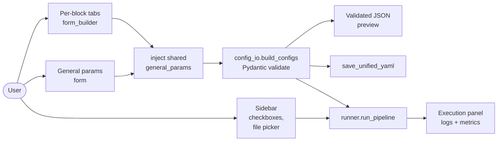
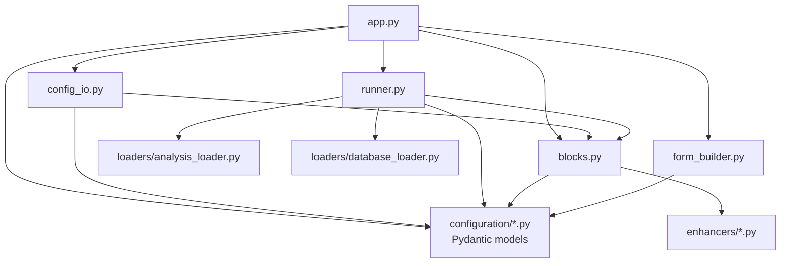
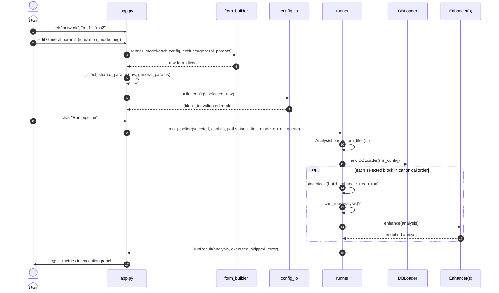

# ENPKG GUI — Architecture

This document explains how the Streamlit GUI under [enpkg/monolith/gui/](.) is
wired together: what each module is responsible for, how data flows from the
user's clicks into a running pipeline, and the small set of conventions that
keep the design from duplicating knowledge that already lives in the Pydantic
configs and pipeline steps.

## 1. Goals

The GUI is a thin shell around the existing pipeline. It must not:

- re-declare any configuration schema (all validation stays in Pydantic),
- hard-code the list of pipeline blocks (one registry, [blocks.py](../pipeline/blocks.py)),
- duplicate orchestration logic (it all lives in [runner.py](../pipeline/runner.py)).

Everything the user sees — the block checkboxes, the tabs, the form fields,
the validated JSON preview, the runner — is derived from three sources of
truth:

1. `BLOCKS` in [blocks.py](../pipeline/blocks.py) — which pipeline blocks exist, and for
   each one, how to build its `Enhancer` (`build_enhancer`) and when it applies
   (`can_run`).
2. `model_cls.model_fields` on each Pydantic config — which fields that block
   takes.
3. Each enhancer's uniform `enhance(analysis) -> Analysis` contract — how the
   block transforms the analysis.

## 2. Module map

```
enpkg/monolith/gui/          ← Streamlit only; imports the pipeline, never the reverse
├── __init__.py
├── app.py            Streamlit entry point (layout, session state, glue)
└── form_builder.py   Pydantic BaseModel → Streamlit widget tree

enpkg/monolith/pipeline/     ← front-end agnostic; usable headlessly
├── __init__.py
├── blocks.py         Block registry (id → enhancer builder, can_run, config,
│                     deps, ordering, required resources) + order_blocks
├── runner.py         Single-analysis execution, resource sharing, log streaming
├── batch_runner.py   Many experiments, resources built once and reused
├── config_io.py      Unified YAML load/save + config instantiation
└── log_utils.py      Helpers shared by the per-block log summaries
```

The split is load-bearing: `streamlit` is an optional dependency group, so
nothing under `pipeline/` may import it. Everything the GUI does is available to
a headless caller through the same entry points.

### 2.1 [blocks.py](../pipeline/blocks.py) — the registry

A single `_BUILTIN_BLOCKS` list of `BlockSpec` frozen dataclasses. Each entry
pins together:

- `id` — short string key used in YAML, session state and widget keys;
- `label` — human-readable name shown in sidebar and tabs;
- `build_enhancer` — `(config, BuildContext) -> Enhancer`: how to construct the
  block's enhancer from the run's shared resources (logger, DBLoader,
  LotusStore);
- `can_run` — `(Analysis) -> bool`: the applicability guard (e.g. taxonomical
  needs a source taxon; weights needs a molecular network);
- `config_cls` — the Pydantic `EnhancerConfig` (or `None` for taxonomical);
- `log_summary` — post-run report function (see the module docstring);
- `description` — tooltip text;
- `depends_on` — block ids that must also be selected (e.g. `weights` →
  `network`);
- `after` / `before` — ordering constraints against other block ids;
- `requires` — shared resources the enhancer reads from its `BuildContext`
  (`"db_loader"`, `"lotus_store"`).

`BLOCKS` is **computed**, not hand-ordered: `order_blocks` topologically sorts
`_BUILTIN_BLOCKS` by the `after`/`before` constraints, falling back to
declaration order for blocks nothing separates, and raises `BlockOrderError` on
a cycle. Ordering constraints naming an absent block are dropped; a block's
position in the source list is only the tie-break.

`BLOCKS_BY_ID` gives O(1) lookup. `required_resources(selected_ids)` returns the
union of the selection's `requires`, which is what the runner builds.
`MS_SHARED_BLOCKS`/`MS_SHARED_KEY` mark the MS1/MS2 pair that shares a single
`MSEnhancerConfig`.

Because every enhancer honours the uniform `enhance(analysis) -> Analysis`
contract, there is **no per-block step class** — the runner wraps
`build_enhancer` + `can_run` into one generic step. Adding a new pipeline block
is therefore *only* adding one `BlockSpec` entry (with a `build_enhancer`
closure and a `can_run` predicate); no new step file and no `_build_step`
branch are needed.

### 2.2 [form_builder.py](form_builder.py) — schema-driven forms

`render_model(model_cls, current, key_prefix, exclude_fields)` walks
`model_cls.model_fields` and renders a Streamlit widget per field. The return
value is a plain dict that can be fed straight into
`model_cls.model_validate(...)`.

Type-to-widget mapping:

| Annotation                  | Widget                             |
|-----------------------------|------------------------------------|
| `bool`                      | `st.checkbox`                      |
| `int` (with `ge`/`le`)      | `st.number_input(step=1)`          |
| `float` (with `ge`/`le`)    | `st.number_input`                  |
| `str` with `^(a\|b)$` regex | `st.selectbox`                     |
| long `str`                  | `st.text_area`                     |
| short `str`                 | `st.text_input`                    |
| `Optional[T]`               | widget for `T`                     |
| `list` / `tuple`            | `text_area`, one value per line    |
| nested `BaseModel`          | `st.expander` + recursive call     |

Field `description` becomes the widget `help=` tooltip. `ge`/`le`/`gt`/`lt`
constraints become widget bounds. The `_pattern_choices` helper picks up the
`^(pos|neg)$` shape used for ionization-mode-style enums.

`exclude_fields` is how the app lifts the shared `general_params` out of every
tab — the field is skipped during rendering and re-injected later.

**Nothing here duplicates Pydantic rules.** The widgets only *pre-filter* what
the user can type; Pydantic still runs the authoritative validation when the
dict is turned back into a model instance.

### 2.3 [config_io.py](../pipeline/config_io.py) — YAML ↔ configs

Five functions:

- `load_unified_yaml(path)` — reads the YAML into a `{block_id: section}`
  dict. No validation.
- `get_section(data, block_id)` — looks up a block's section, mapping the
  MS1/MS2 pair onto the shared `ms_enhancer` key.
- `get_selection(data)` — returns the `selected_blocks` list, or `None` for a
  file written before that key existed.
- `save_unified_yaml(path, validated_configs)` — dumps validated Pydantic
  models back to YAML, deduplicating MS1/MS2 into `ms_enhancer`, and records
  the selection under `selected_blocks`.
- `build_configs(selected_ids, form_state)` — calls
  `config_cls.model_validate(form_state[block_id])` for every selected block
  and returns `{block_id: BaseModel}`. Raises `pydantic.ValidationError` on
  the first invalid section.

The YAML shape is intentionally flat:

```yaml
selected_blocks: [taxonomical, network, ms1, sirius]
network:
  general_params: { recompute: false, ionization_mode: pos }
  mn_msms_mz_tol: 0.01
  mn_score_cutoff: 0.7
  mn_top_n: 15
  mn_max_links: 10
ms_enhancer:
  general_params: { recompute: false, ionization_mode: pos }
  downloader_params: { ... }
  spectral_match_params: { ... }
sirius:
  general_params: { recompute: false, ionization_mode: pos }
  sirius_params: { ... }
weights:
  general_params: { recompute: false, ionization_mode: pos }
  reweighting_params: { ... }
  downloader_params: { ... }
```

`general_params` is written into each section by the app before saving, so
the YAML stays self-contained even though the GUI edits it in one place.

#### 2.3.1 Why `selected_blocks` is stored explicitly

The section keys cannot stand in for the selection. `taxonomical` has no
`config_cls`, so it never produces a section; MS1 and MS2 collapse into one
`ms_enhancer` key, so ms1-only, ms2-only and both are indistinguishable. Three
of the seven blocks are therefore unrecoverable from the section names alone.

This matters because loading is a **full replace** (see 2.5.2): a block absent
from the file resets to its Pydantic defaults. Without a recorded selection, a
file saved with one block ticked would reset the other blocks' parameters while
leaving them ticked — silently arming a run with settings the user never chose.
With it, those blocks are simply unticked, and a config file fully determines
the run it describes.

`save_unified_yaml` derives the list from the keys of `validated_configs`,
which `build_configs` fills for *every* selected block (storing `None` for the
config-less ones) — so no extra argument is needed to thread the selection
through.

### 2.4 [runner.py](../pipeline/runner.py) — execution

`run_pipeline(selected_ids, configs, spectra_path, metadata_path, quant_path,
ionization_mode, database_dir, log_queue) -> RunResult`.

Steps:

1. Attach a `QueueLogHandler` to a named logger so every log record is pushed
   onto a thread-safe queue that the Streamlit app can drain.
2. Call `AnalysisLoader.from_files(...)` to build an `Analysis`.
3. Take the union of the selected blocks' `requires` and build only those
   shared resources — a single `DBLoader` from the `MSEnhancerConfig` with its
   `downloader_params.download_dir` forced to `DATABASE_DIR`, and the
   `LotusStore` reading the DuckDB file that loader manages. Both are built
   once and reused by every block that asked for them.
4. Iterate `BLOCKS` in its computed order. For each selected block:
   - skip if any `depends_on` entry is not also selected,
   - bind the block to its config + shared resources via `_build_step` — a
     generic `_BoundBlock` that wraps the registry's `build_enhancer` /
     `can_run` (there are no per-block step classes),
   - skip if `can_run(analysis)` is False,
   - build the enhancer and call `enhance(analysis)`, replacing the working
     `analysis`.
5. Return a `RunResult` with the final `analysis`, the list of executed
   blocks, skipped blocks, and any error message.

The runner and the `blocks` registry are the only modules that import enhancer
classes; everything upstream works off `BLOCKS`.

### 2.5 [app.py](app.py) — Streamlit glue

Owns layout, session state, and the user-action loop. It is the only module
that touches `st.session_state`. The session-state slots:

| Key                | Purpose                                                |
|--------------------|--------------------------------------------------------|
| `form_state`       | `{block_id: raw dict from render_model}`               |
| `selected_blocks`  | `{block_id: bool}` mirror of the `select.<id>` widgets  |
| `form_rev`         | Form widget key generation; bumped on config load      |
| `general_params`   | Shared `GeneralParams` dict, edited above the tabs     |
| `input_dir`        | Current input folder (user-chosen in sidebar)          |
| `log_buffer`       | Drained log lines from the last run                    |
| `last_result`      | Last `RunResult` for the execution panel               |

The layout:

- **Sidebar**: config YAML load/save, block checkboxes, input-folder picker
  with validation, file dropdowns populated from that folder, databases-dir
  caption, Run button.
- **Main area**: the shared `General parameters` form, then one tab per
  selected block (MS1 and MS2 share a single "MS1 / MS2 (shared)" tab), then
  a validated-JSON preview, then the execution panel.

#### 2.5.1 Shared `general_params` — the key interaction

`GeneralParams` lives on every `EnhancerConfig`. Editing it inside each tab
would force the user to keep six copies in sync and let them silently drift.
Instead:

1. The app renders `GeneralParams` **once**, above the tabs, via
   `_render_general_params()` → writes to `st.session_state.general_params`.
2. When each block's form is rendered, `render_model(..., exclude_fields={
   "general_params"})` skips that field entirely.
3. Before validation, `_inject_shared_params(raw, shared)` folds the shared
   dict back into every block's raw values. Only blocks whose `config_cls`
   actually declares `general_params` receive it.
4. The validated configs therefore all carry **the same** `general_params`,
   and `save_unified_yaml` writes that identical dict under every section.
5. On load, `_load_config_into_state` reads `general_params` out of the first
   section that has one and seeds the shared widget. A file with no
   `general_params` anywhere resets it to the `GeneralParams` defaults, in
   keeping with the full-replace semantics of 2.5.2.

`ionization_mode` lives in `GeneralParams`, so it also drives
`AnalysisLoader.from_files(ionization_mode=...)` — the sidebar no longer has
a separate ionization-mode selector.

#### 2.5.2 Loading a config — `form_rev` and keyed widgets

Streamlit >= 1.50 computes a keyed widget's identity from its `key` alone
(`key_as_main_identity` in `streamlit/elements/widgets/*.py`): once a key has
been registered, a changed `value=` argument is **ignored**. Writing loaded
values into `st.session_state.form_state` therefore has no visible effect on
its own — worse, `_render_forms` then writes the stale widget values straight
back over `form_state`, so the loaded config is discarded within the same
script run.

`form_rev` is the fix. Every form widget's key prefix embeds it
(`f"{tid}#{st.session_state.form_rev}"`, `f"ms_enhancer#{...}"`,
`f"shared.general_params#{...}"`), so bumping the counter moves the entire form
into a fresh key namespace. Those are new widgets, they honour `value=`, and
Streamlit garbage-collects the orphaned keys.

The counter is the general primitive here, not a patch for the load path:
**any** code that writes `form_state` programmatically — a future "reset to
defaults" button, a batch-mode auto-fill — must bump `form_rev` for the change
to reach the screen. It is preferred over deleting individual widget keys
because it cannot miss one, at any nesting depth, for any block added later.

The block checkboxes are handled differently: they pass **no** `value=` and
read `st.session_state["select.<id>"]` (seeded in `_init_state`) as their only
source of truth, so a load can move them by assigning that key directly. Doing
both — passing `value=` *and* assigning the key — triggers a Streamlit warning
about a widget with a default value also being set via the Session State API.

Loading is a full replace of `form_state`, `general_params` and the selection;
see 2.3.1 for why. `_load_config_into_state` must therefore run before the
sidebar checkboxes and the block tabs are rendered, since it writes the widget
keys they read — which is why the Load button sits at the top of the sidebar.

#### 2.5.3 Input-folder picker

`DATABASE_DIR` is still fixed (`gui_workspace/databases/`). The input folder
is user-editable:

1. Sidebar `text_input` holds the current path, defaulted to
   `gui_workspace/input/`.
2. "Use this folder" button validates with `Path.is_dir()` and, on success,
   writes to `st.session_state.input_dir`.
3. The three file dropdowns (`spectra`, `metadata`, `quant`) list files in
   that folder filtered by extension.
4. The runner receives resolved absolute paths built from the stored
   `input_dir` plus the chosen filename.

## 3. Data flow

### 3.1 Top-level flow



### 3.2 Module dependencies



The arrows show import direction. The GUI depends on the pipeline code, not
the other way around.

### 3.3 One run, end-to-end



## 4. Conventions and invariants

- **Registry is the source of truth.** The sidebar, the tabs, the YAML
  sections, and the runner loop all iterate `BLOCKS`. Never add a block by
  touching only one of these sites.
- **Pydantic owns validation.** The form builder never re-implements a
  constraint that exists in a `Field(...)` definition. If Pydantic says it's
  invalid, the app surfaces the `ValidationError` verbatim.
- **Session state is keyed by block id.** Widget keys follow
  `"{block_id}.{field_path}"` so toggling a block off and back on preserves
  its values.
- **Shared sub-configs are rendered once.** Currently only `general_params`;
  the pattern (render out-of-band + `exclude_fields` + `_inject_shared_params`)
  generalizes if more shared sub-models appear.
- **Workspace split.** `gui_workspace/databases/` is fixed and owned by the
  `DBLoader`; `gui_workspace/input/` is the **default** input folder but the
  user can point elsewhere at runtime.
- **The runner is the only orchestrator.** The app never calls enhancers
  directly; that keeps UI concerns (logging, error surfacing) separate from
  pipeline concerns.

## 5. Extending the GUI

- **Add a new pipeline block**: create the enhancer (honouring
  `enhance(analysis) -> Analysis`) + its config, then add one `BlockSpec` entry
  to `_BUILTIN_BLOCKS` with a `build_enhancer` closure, a `can_run` predicate,
  and whatever `after`/`before`/`requires` the block genuinely needs. No step
  file and no `_build_step` branch are needed — the sidebar checkbox, tab, form,
  YAML section, execution slot, resource wiring and place in the run order all
  follow from that entry. Full walkthrough, including the cases the registry
  does *not* cover (extra input files, per-experiment batch config):
  [../../../docs/ADDING_A_BLOCK.md](../../../docs/ADDING_A_BLOCK.md).
- **Add a new shared sub-config**: render it above the tabs like
  `general_params`, store it in session state, add it to the
  `exclude_fields` set of affected tabs, and inject it back in
  `_inject_shared_params`.
- **Add a custom widget**: extend `_render_field` in
  [form_builder.py](form_builder.py) — it's a single function, no plugin
  machinery.
- **Replace the file-picker**: swap `_list_input_files` and the sidebar
  `text_input` block; the rest of the app only touches
  `st.session_state.input_dir`.
